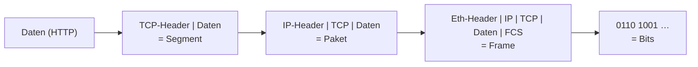
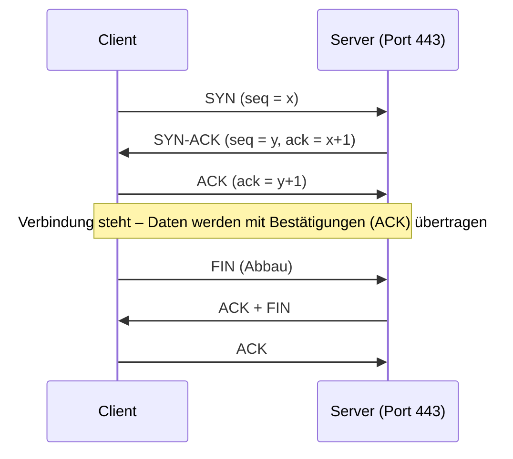

# N1 · Netzwerkgrundlagen und OSI-Modell

> [!abstract] Überblick
> **Bereich:** [[Übersicht Netzwerk]]
> **Dauer:** ca. 90 min · **Prüfungsrelevanz:** ★★★ – Schichten zuordnen und Geräte einordnen kommt in fast jeder AP1 vor
> **Voraussetzungen:** keine · **Danach:** [[N2 IPv4 und Subnetting]]
> **Berufsschule:** Evp-CPS LF3 – LS3.2 (OSI, Kapselung), LS3.3 (Topologien), LS3.4 (Fehlersuche)

## Lernziele
- [ ] Ich kann Netzarten (LAN, WLAN, MAN, WAN) und Topologien unterscheiden und die Stern-Topologie begründen.
- [ ] Ich kann die 7 OSI-Schichten mit Aufgabe, PDU, Protokollen und Geräten nennen.
- [ ] Ich kann die Kapselung beim Senden und Empfangen beschreiben.
- [ ] Ich kann TCP und UDP vergleichen und für einen Dienst begründet auswählen.
- [ ] Ich kann Hex-Werte aus einem Paketheader in IP-Adressen und Ports umrechnen.
- [ ] Ich kann eine Netzwerkstörung systematisch von unten nach oben eingrenzen.

## Worum geht es?
Ein Kunde ruft an: „Das Internet geht nicht.“ Ist das Kabel locker? Hat der PC keine IP-Adresse? Ist der DNS-Server weg? Oder blockt eine Firewall? Wer das **OSI-Modell** verstanden hat, prüft das nicht zufällig, sondern Schicht für Schicht. Und wer weiß, *auf welcher Schicht* ein Gerät arbeitet, kann erklären, warum ein Switch keine Netze verbindet, ein Router aber schon.

---

## 1. Netzarten und Topologien

### Netzarten nach Ausdehnung
| Netz | Ausdehnung | Beispiel |
|---|---|---|
| **PAN** (Personal Area Network) | wenige Meter | Bluetooth-Headset am Smartphone |
| **LAN** (Local Area Network) | Gebäude, Gelände | Firmennetz, Schulnetz |
| **WLAN** (Wireless LAN) | wie LAN, per Funk | Access Points im Büro |
| **MAN** (Metropolitan Area Network) | Stadt | Glasfasernetz der Stadtwerke |
| **WAN** (Wide Area Network) | Länder, weltweit | Internet, Standortvernetzung per VPN |

### Topologien
Die ==🟡Topologie== beschreibt, wie Geräte physisch bzw. logisch verbunden sind.

| Topologie | Aufbau | Vorteile | Nachteile |
|---|---|---|---|
| **Bus** | alle an einem gemeinsamen Kabel | wenig Kabel | Kabelbruch legt alles lahm, Kollisionen, veraltet |
| **Ring** | jedes Gerät mit zwei Nachbarn | deterministisch | Ausfall eines Knotens unterbricht den Ring (ohne Doppelring) |
| **Stern** | alle an einem zentralen Knoten (Switch) | Ausfall eines Endgeräts betrifft nur dieses, leicht erweiterbar, einfache Fehlersuche | zentraler Knoten ist **Single Point of Failure**, viel Kabel |
| **Baum / erweiterter Stern** | mehrere Sterne hierarchisch verbunden | skalierbar, strukturiert (Etagenverteiler) | Ausfall eines Verteilers trennt den Teilbaum |
| **Vermascht** (Mesh) | Knoten mehrfach verbunden | hohe Ausfallsicherheit (redundante Wege) | teuer, komplex |

> [!tip] Merke
> Moderne Ethernet-Netze sind **physisch Stern bzw. Baum** (Switches in Etagen- und Gebäudeverteilern). Vermaschung findet man im Kern (Core) eines Netzes und im Internet.

---

## 2. Das OSI-Modell

Das **OSI-Referenzmodell** (Open Systems Interconnection) teilt Netzwerkkommunikation in ==🔵7 Schichten==. Jede Schicht erledigt eine klar abgegrenzte Aufgabe und nutzt dafür die Dienste der Schicht darunter. Vorteil: Man kann eine Schicht austauschen (z. B. WLAN statt Kabel), ohne die anderen zu ändern.

| Nr. | Schicht | Aufgabe | PDU | Protokolle / Beispiele | Geräte |
|---|---|---|---|---|---|
| 7 | **Anwendung** (Application) | Schnittstelle zu Anwendungen | Daten | HTTP(S), DNS, SMTP, IMAP, FTP, SSH | – |
| 6 | **Darstellung** (Presentation) | Datenformat, Zeichensatz, Verschlüsselung, Kompression | Daten | TLS*, UTF-8, JPEG | – |
| 5 | **Sitzung** (Session) | Sitzung auf-/abbauen, synchronisieren | Daten | RPC, NetBIOS | – |
| 4 | **Transport** | Ende-zu-Ende-Verbindung, **Ports**, Segmentierung, ggf. Zuverlässigkeit | **Segment** (TCP) / Datagramm (UDP) | TCP, UDP | (Firewall) |
| 3 | **Vermittlung** (Network) | **logische Adressierung (IP)**, **Routing** zwischen Netzen | **Paket** | IPv4, IPv6, ICMP | **Router**, Layer-3-Switch |
| 2 | **Sicherung** (Data Link) | **physische Adressierung (MAC)**, Zugriff aufs Medium, Fehlererkennung (FCS) | **Frame** (Rahmen) | Ethernet (IEEE 802.3), WLAN (802.11), ARP\*\* | **Switch**, Bridge, Access Point |
| 1 | **Bitübertragung** (Physical) | Bits als Signale übertragen (Spannung, Licht, Funk), Stecker, Kabel | **Bit** | Kabel, RJ45, Glasfaser, Funk | Hub, Repeater, Medienkonverter |

\* TLS wird je nach Quelle Schicht 5 oder 6 zugeordnet. \*\* ARP arbeitet zwischen Schicht 2 und 3 (es verbindet IP- und MAC-Adresse).

> [!tip] Eselsbrücken
> **von 1 nach 7 (deutsch):** **B**itte **S**ag **V**ati **T**schüss, **S**onst **D**roht **A**ufregung → **B**itübertragung, **S**icherung, **V**ermittlung, **T**ransport, **S**itzung, **D**arstellung, **A**nwendung
> **von 1 nach 7 (englisch):** **P**lease **D**o **N**ot **T**hrow **S**ausage **P**izza **A**way

<!-- abb:osi-modell -->
![[osi-modell.svg]]
*Abb.: OSI- und TCP/IP-Modell mit Dateneinheiten, Protokollen und Geräten*

### Das TCP/IP-Modell
In der Praxis arbeitet das Internet nach dem **TCP/IP-Modell** mit 4 Schichten. Die Prüfung verlangt oft die Zuordnung:

| TCP/IP-Schicht | entspricht OSI | Beispiele |
|---|---|---|
| Anwendung | 5, 6, 7 | HTTP, DNS, SMTP |
| Transport | 4 | TCP, UDP |
| Internet | 3 | IP, ICMP |
| Netzzugang | 1, 2 | Ethernet, WLAN |

### Kapselung (Encapsulation)
Beim **Senden** wandern die Daten von Schicht 7 nach unten. Jede Schicht setzt einen eigenen **Header** davor (Schicht 2 zusätzlich einen **Trailer** mit Prüfsumme). Beim **Empfangen** entfernt jede Schicht „ihren“ Header wieder (**Decapsulation**) und reicht den Rest nach oben.



> [!example] Beispiel: Browser ruft eine Webseite auf
> 1. **Schicht 7:** Browser erzeugt eine HTTP-Anfrage `GET /index.html`.
> 2. **Schicht 4:** TCP setzt Quellport (z. B. 51 234) und Zielport **443** davor.
> 3. **Schicht 3:** IP setzt Quell-IP (eigener PC) und Ziel-IP (Webserver) davor.
> 4. **Schicht 2:** Ethernet setzt Quell-MAC (eigene Netzwerkkarte) und Ziel-MAC (**Router/Gateway!**, weil der Server in einem anderen Netz liegt) davor und hängt die Prüfsumme an.
> 5. **Schicht 1:** Die Netzwerkkarte sendet die Bits als Spannungswechsel über das Kabel.
>
> Wichtig: Die **IP-Adressen bleiben auf dem Weg gleich** (Ende-zu-Ende), die **MAC-Adressen ändern sich an jedem Router** (nur für den nächsten Abschnitt gültig). *Ausnahme: NAT am Internetrouter ändert die Quell-IP – siehe [[N4 Netzwerkdienste und Protokolle]].*

> [!question]- Kurz nachgedacht: Warum braucht man überhaupt beide Adressen – MAC und IP?
> Die **MAC-Adresse** ist fest der Netzwerkkarte zugeordnet und nur im **lokalen Netz** sinnvoll (Switches arbeiten damit). Sie sagt nichts darüber, *wo* ein Gerät steht. Die **IP-Adresse** ist logisch und hierarchisch aufgebaut (Netzanteil + Hostanteil) – nur damit können **Router** entscheiden, in welche Richtung ein Paket weitergeleitet werden muss. Vergleich: MAC = Personalausweisnummer, IP = Postanschrift.

---

## 3. Transportschicht – TCP und UDP

| | **TCP** (Transmission Control Protocol) | **UDP** (User Datagram Protocol) |
|---|---|---|
| Verbindung | **verbindungsorientiert**: Aufbau per 3-Way-Handshake | **verbindungslos**: einfach losschicken |
| Zuverlässigkeit | Bestätigungen (ACK), Neuübertragung, richtige Reihenfolge, Flusskontrolle | keine Garantie, Pakete können fehlen oder vertauscht sein |
| Overhead | höher (Header ≥ 20 Byte, Handshake) | gering (Header 8 Byte) |
| Geschwindigkeit | langsamer, dafür vollständig | schnell, geringe Verzögerung |
| Einsatz | Web (HTTP/S), E-Mail, Dateiübertragung, SSH | DNS-Abfragen, DHCP, VoIP, Videostreaming, Online-Spiele, NTP |

**3-Way-Handshake:** Client → `SYN` · Server → `SYN-ACK` · Client → `ACK` – danach ist die Verbindung aufgebaut.

<!-- abb:tcp-handshake -->

*Abb.: TCP-Verbindungsaufbau (3-Way-Handshake) und -abbau*

> [!question]- Kurz nachgedacht: Warum nutzt eine Videokonferenz UDP, obwohl Pakete verloren gehen können?
> Bei Echtzeit ist **Verzögerung schlimmer als Verlust**. Ein verlorenes Bild-/Tonfragment erneut zu senden, wäre sinnlos – es käme zu spät. Ein kurzes Knacksen ist besser als eine Sekunde Stille, bis TCP das Paket neu geliefert hat.

**Ports** adressieren auf Schicht 4 den **Dienst/die Anwendung** auf einem Gerät (IP = Haus, Port = Wohnungstür). Die wichtigsten Ports: [[N4 Netzwerkdienste und Protokolle]].

---

## 4. Hex-Werte in Paketheadern lesen

In Mitschnitten (z. B. **Wireshark**) stehen Adressen und Ports als **Hex-Bytes**. Die Prüfung und die Berufsschule lassen das gern umrechnen.

**Regel:** Immer ==🟢2 Hex-Ziffern = 1 Byte==. Jedes Byte einzeln umrechnen: `erste Ziffer · 16 + zweite Ziffer`.

> [!example] Beispiel durchgerechnet
> Quell-IP im IP-Header: `c0 a8 0a 2d`
> - `c0` → 12·16 + 0 = **192**
> - `a8` → 10·16 + 8 = **168**
> - `0a` → 0·16 + 10 = **10**
> - `2d` → 2·16 + 13 = **45**
> → **192.168.10.45**
>
> Zielport im TCP-Header (2 Byte = 4 Hex-Ziffern): `01 bb`
> → 0·16³ + 1·16² + 11·16 + 11 = 256 + 176 + 11 = **443** → HTTPS
>
> Header-Feld **IHL = 5** (IP Header Length in 32-Bit-Worten) → 5 × 32 Bit = 160 Bit = **20 Byte** IP-Header.

MAC-Adressen sind ==🔵6 Byte (48 Bit)==, z. B. `00:1a:2b:3c:4d:5e`. Die ersten 3 Byte (**OUI**) kennzeichnen den Hersteller. `ff:ff:ff:ff:ff:ff` ist die **Broadcast**-MAC.

---

## 5. Systematische Fehlersuche

**Bottom-up** (von Schicht 1 nach oben) ist in der Praxis und in der Prüfung die Standardmethode:

| Schicht | Prüfen | Werkzeuge |
|---|---|---|
| 1 | Kabel gesteckt? Link-LED an? Kabel defekt? WLAN verbunden? | Sichtprüfung, Kabeltester, anderes Kabel |
| 2 | Switchport aktiv? richtiges VLAN? MAC in der Switch-Tabelle? | Switch-Oberfläche, `arp -a` |
| 3 | IP-Adresse, Maske, Gateway korrekt? APIPA (169.254.x.x)? Gateway erreichbar? | `ipconfig /all`, `ping <Gateway>`, `tracert` |
| 4–7 | DNS funktioniert? Port offen? Firewall? Dienst läuft? | `nslookup`, `ping 8.8.8.8` vs. `ping google.de`, Browser, Logs |

> [!example] Klassiker: „Internet geht nicht“
> - `ping 8.8.8.8` klappt, `ping www.beispiel.de` nicht → **DNS-Problem** (Namensauflösung), Schicht 7.
> - `ipconfig` zeigt `169.254.12.7` → PC hat **keine Adresse vom DHCP-Server** bekommen (APIPA) → Kabel/VLAN/DHCP-Server prüfen.
> - Gateway nicht pingbar, andere PCs gehen → Problem am eigenen Anschluss (Schicht 1/2).

**Dokumentation:** Fehlersuche und Lösung immer im Ticket festhalten (Symptom, Ursache, Lösung) – siehe [[P3 IT-Service, Support und Qualität]].

<!-- erg:Zugriffsverfahren -->
## 6. Zugriffsverfahren und Netzmodelle
- **CSMA/CD** (Carrier Sense Multiple Access / Collision Detection): klassisches Ethernet mit gemeinsamem Medium (Hub, Halbduplex) – vor dem Senden „hören“, bei einer **Kollision** abbrechen und nach zufälliger Wartezeit neu senden. Mit **Switches im Vollduplex** ==🔴gibt es keine Kollisionen mehr==; CSMA/CD spielt praktisch keine Rolle.
- **CSMA/CA** (Collision Avoidance): im **WLAN**, weil Funkgeräte Kollisionen nicht zuverlässig erkennen – sie versuchen, sie zu vermeiden (Wartezeiten, ggf. RTS/CTS).

| | **Client-Server** | **Peer-to-Peer (P2P)** |
|---|---|---|
| Aufbau | zentrale Server stellen Dienste bereit, Clients nutzen sie | alle Rechner sind gleichberechtigt, geben selbst frei |
| Verwaltung | zentral (Benutzer, Rechte, Backup) | an jedem Rechner einzeln |
| Sicherheit/Skalierung | gut kontrollierbar, skalierbar | unübersichtlich, nur für sehr kleine Netze |
| Kosten | Server und Administration nötig | günstig, kein Server |
| Beispiel | Firmennetz mit Fileserver und Domäne | zwei PCs mit Ordnerfreigabe im Kleinstbüro |

---

> [!warning] Typische Fehler in Prüfungen
> - **Switch auf Schicht 3** einordnen → nein, ein (normaler) Switch arbeitet auf **Schicht 2** mit MAC-Adressen.
> - PDUs verwechseln: **Frame** (2) – **Paket** (3) – **Segment** (4).
> - „TCP ist immer besser“ → für Echtzeit ist UDP die richtige Wahl.
> - Bei Hex vergessen, dass **2 Ziffern ein Byte** sind, oder A–F falsch umrechnen (A = 10 … F = 15).
> - Fehlersuche ohne System („erst mal neu starten“) statt Schicht für Schicht zu begründen.

### Ausdehnung der Netze: PAN bis GAN
| Netzart | Reichweite | Beispiel |
|---|---|---|
| **PAN** | wenige Meter, eine Person | Bluetooth-Headset, Smartphone-Hotspot |
| **LAN** | Gebäude, Gelände | Firmennetz mit Switches und WLAN |
| **MAN** | Stadt, Region | Glasfasernetz einer Stadtverwaltung |
| **WAN** | Länder, Kontinente | Standortvernetzung über Provider |
| **GAN** | weltweit | Internet, Satellitenverbindungen |

> [!tip] Reihenfolge merken
> **P**ersönlich – **L**okal – **M**etropolitan – **W**eit – **G**lobal: PAN < LAN < MAN < WAN < GAN.

## Verwandte Themen
- [[N4 Netzwerkdienste und Protokolle]] – Protokolle und Dienste der einzelnen Schichten
- [[I5 Bedrohungen und Schutzmaßnahmen]] – Firewalls filtern auf Schicht 3 und 4
- [[S1 Zahlensysteme und Codierung]] – Hex-Werte in Paketheadern umrechnen

## Zusammenfassung
- Netze nach Ausdehnung: PAN < LAN < MAN < WAN; heute Stern-/Baumtopologie mit Switches.
- OSI: 7 Schichten, jede mit eigener Aufgabe; ==🟢Switch = 2 (MAC), Router = 3 (IP), Ports = 4==.
- Kapselung: jede Schicht setzt einen Header davor; IP bleibt Ende-zu-Ende, ==🔴MAC gilt nur pro Abschnitt==.
- TCP = zuverlässig, verbindungsorientiert · UDP = schnell, verbindungslos.
- Hex-Header: 2 Ziffern = 1 Byte, einzeln umrechnen.
- Fehlersuche bottom-up und dokumentieren.

## Direkt üben
```dataviewjs
await dv.view("AP1/99 System/views/trainer", { typen: ["hex-header"] })
```

## Selbstcheck
```dataviewjs
await dv.view("AP1/99 System/views/quiz", { modul: "N1" })
```

**Weitere Aufgaben:** [[Aufgaben Netzwerk#N1 Netzwerkgrundlagen und OSI-Modell]] · **Karteikarten:** [[Karten Netzwerk]]

## Einschätzung
```dataviewjs
await dv.view("AP1/99 System/views/selbstcheck")
```

---
← [[Start]] · Weiter: [[N2 IPv4 und Subnetting]] →
