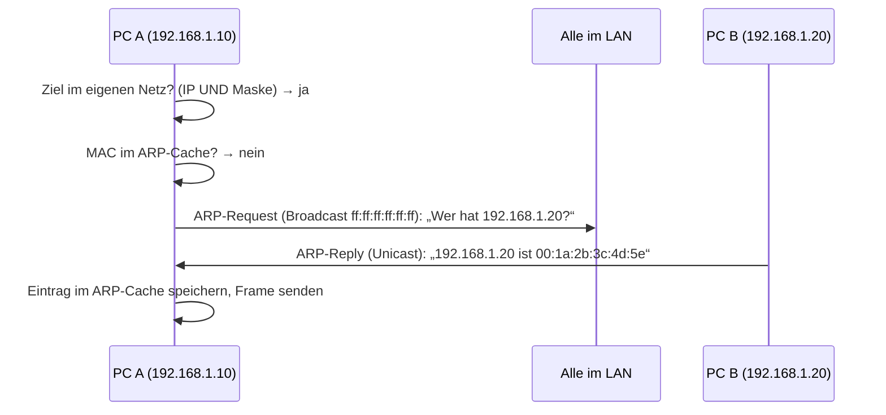
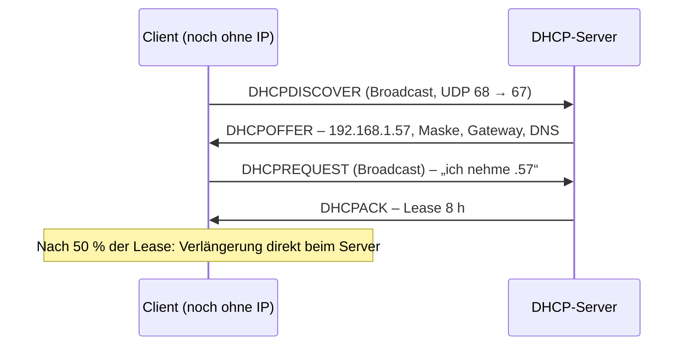
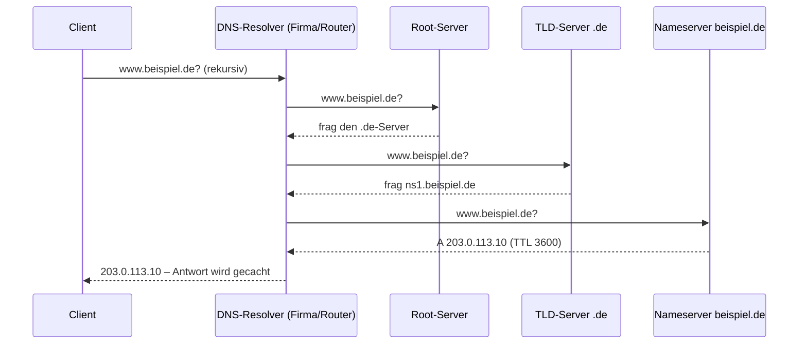

# N4 · Netzwerkdienste und Protokolle

> [!abstract] Überblick
> **Bereich:** [[Übersicht Netzwerk]]
> **Dauer:** ca. 2 h · **Prüfungsrelevanz:** ★★★ – Ports zuordnen, DHCP/DNS erklären, Protokolle auswählen
> **Voraussetzungen:** [[N1 Netzwerkgrundlagen und OSI-Modell]], [[N2 IPv4 und Subnetting]]
> **Berufsschule:** Evp-CPS LF3 LS3.2 (ARP-Mitschnitt, Adresskonflikt)

## Lernziele
- [ ] Ich kann den Ablauf von ARP, DHCP (DORA) und einer DNS-Abfrage beschreiben.
- [ ] Ich kann die wichtigsten DNS-Record-Typen nennen.
- [ ] Ich kann NAT/PAT erklären und begründen, warum es nötig ist.
- [ ] Ich kann die Standardports der wichtigsten Dienste auswendig und weiß, welche verschlüsselt sind.
- [ ] Ich kann E-Mail-Protokolle (SMTP, IMAP, POP3) unterscheiden.
- [ ] Ich kann die wichtigsten Diagnosebefehle einsetzen.

## Worum geht es?
Ein neuer Arbeitsplatz wird eingesteckt – und „einfach so“ bekommt er eine IP-Adresse, findet den Drucker, öffnet `intranet.firma.local` und kann Mails senden. Dahinter stecken Dienste wie **DHCP**, **DNS**, **ARP** und **NAT**. Wenn einer davon streikt, musst du wissen, welcher – und wie du das nachweist.

---

## 1. ARP – von der IP zur MAC

Um einen Frame im LAN zuzustellen, braucht der Sender die **MAC-Adresse** des Ziels (bzw. des Gateways, wenn das Ziel in einem anderen Netz liegt). **ARP** (Address Resolution Protocol) findet sie:



- Liegt das Ziel in einem **fremden Netz**, fragt der PC per ARP nach der MAC des **Gateways**.
- ARP-Einträge verfallen nach einiger Zeit; anzeigen mit `arp -a`.
- **ARP-Spoofing:** Ein Angreifer antwortet mit seiner eigenen MAC und leitet den Verkehr über sich um (Man-in-the-Middle).
- **Adresskonflikt erkennen:** Bevor ein Gerät eine IP nutzt, fragt es per ARP, ob jemand sie schon hat (*Gratuitous ARP*/*ARP-Probe*). Antwortet jemand → Konflikt.
- Bei IPv6 übernimmt **NDP** (Neighbor Discovery) diese Aufgabe per Multicast.

---

## 2. DHCP – automatische Adressvergabe

Ein **DHCP-Server** vergibt aus einem **Pool (Scope)** Adressen für eine begrenzte Zeit (**Lease**). Er liefert: IP-Adresse, Subnetzmaske, Standardgateway, DNS-Server, Lease-Dauer (optional Domain, NTP-Server …).

**Ablauf DORA** (UDP, Server Port 67, Client Port 68):

| Schritt | Nachricht | Richtung |
|---|---|---|
| **D** | **Discover**: „Gibt es einen DHCP-Server?“ | Client → Broadcast |
| **O** | **Offer**: „Du kannst 192.168.1.57 haben.“ | Server → Client |
| **R** | **Request**: „Ich nehme 192.168.1.57.“ | Client → Broadcast (damit andere Server es auch wissen) |
| **A** | **Acknowledge**: „Bestätigt, Lease 8 Stunden.“ | Server → Client |

<!-- abb:dhcp-dora -->

*Abb.: DHCP-Ablauf DORA*

- **Reservierung:** feste IP für eine bestimmte MAC (z. B. Drucker) – zentral verwaltet, trotzdem immer gleich.
- **Lease-Verlängerung:** nach der Hälfte der Lease-Zeit fragt der Client direkt beim Server nach.
- **DHCP-Relay:** Broadcasts gehen nicht über Router; liegt der Server in einem anderen Netz, leitet der Router die Anfragen weiter.
- **Kein Server erreichbar** → Windows vergibt sich eine **APIPA**-Adresse (169.254.x.x).
- **Rogue DHCP:** ein unerlaubter zweiter DHCP-Server (z. B. mitgebrachter Router) verteilt falsche Adressen → Schutz: DHCP-Snooping am Switch.

---

## 3. DNS – Namen in Adressen auflösen

Menschen merken sich `www.beispiel.de`, Rechner brauchen `93.184.216.34`. **DNS** (Domain Name System) ist ein **hierarchisches, verteiltes** Verzeichnis:

`www.beispiel.de.` → Root (`.`) → Top-Level-Domain (`de`) → Domain (`beispiel`) → Host (`www`)

**Ablauf einer Abfrage:**
1. Client prüft seinen **Cache** (und die `hosts`-Datei).
2. Client fragt seinen **DNS-Resolver** (z. B. Router oder Firmen-DNS) – *rekursive* Anfrage.
3. Der Resolver fragt nacheinander Root-, TLD- und zuständigen Nameserver – *iterativ*.
4. Antwort wird für die Dauer der **TTL** zwischengespeichert.

<!-- abb:dns-ablauf -->

*Abb.: DNS-Auflösung: rekursive Anfrage an den Resolver, iterative Anfragen durch die Hierarchie*

| Record | Inhalt | Beispiel |
|---|---|---|
| **A** | Name → IPv4 | `www → 203.0.113.10` |
| **AAAA** | Name → IPv6 | `www → 2001:db8::10` |
| **CNAME** | Alias → anderer Name | `shop → www.beispiel.de` |
| **MX** | Mailserver der Domain (mit Priorität) | `beispiel.de → 10 mail.beispiel.de` |
| **PTR** | IP → Name (Reverse Lookup) | `10.113.0.203.in-addr.arpa → www` |
| **NS** | zuständiger Nameserver | |
| **TXT** | Text, z. B. **SPF**/DKIM/DMARC gegen Mail-Spoofing | |

DNS nutzt **Port 53**, für normale Abfragen **UDP**, für große Antworten und Zonentransfers **TCP**. Verschlüsselte Varianten: **DoT** (DNS over TLS, Port 853) und **DoH** (DNS over HTTPS, 443).

---

## 4. NAT – viele private Adressen, eine öffentliche

Private Adressen (10/8, 172.16/12, 192.168/16) werden im Internet nicht geroutet. Der Router ersetzt deshalb beim Weg nach außen die **private Quell-IP** durch seine **öffentliche** – das ist **NAT** (Network Address Translation).

Da viele interne Geräte sich eine öffentliche IP teilen, merkt sich der Router zusätzlich die **Ports**: **PAT** (Port Address Translation, auch NAT-Overload / Masquerading).

| intern | → extern (nach PAT) |
|---|---|
| 192.168.1.10:51000 → Server:443 | 203.0.113.5:**40001** → Server:443 |
| 192.168.1.11:51000 → Server:443 | 203.0.113.5:**40002** → Server:443 |

- **Vorteil:** spart öffentliche IPv4-Adressen, interne Struktur bleibt verborgen.
- **Nachteil:** Verbindungen *von außen nach innen* gehen nicht ohne weiteres → **Portweiterleitung** (Port Forwarding) nötig, z. B. „extern 443 → intern 192.168.1.50:443“.
- NAT ist **keine Firewall**, wirkt aber als Nebeneffekt ähnlich.

---

## 5. Wichtige Ports

Ports 0–1023 heißen **Well-Known Ports**, 1024–49151 **Registered**, 49152–65535 **dynamisch** (Quellports der Clients).

| Port | Dienst | Transport | Zweck | verschlüsselt |
|---|---|---|---|---|
| 20/21 | FTP | TCP | Dateiübertragung | ❌ |
| 22 | SSH, SFTP, SCP | TCP | Fernzugriff, sichere Dateiübertragung | ✅ |
| 23 | Telnet | TCP | Fernzugriff | ❌ |
| 25 | SMTP | TCP | Mailtransport Server↔Server | ❌ (STARTTLS möglich) |
| 53 | DNS | UDP/TCP | Namensauflösung | ❌ |
| 67/68 | DHCP | UDP | Adressvergabe | – |
| 80 | HTTP | TCP | Web | ❌ |
| 110 | POP3 | TCP | Mail abholen | ❌ |
| 123 | NTP | UDP | Zeitsynchronisation | – |
| 143 | IMAP | TCP | Mail abrufen/synchronisieren | ❌ |
| 161/162 | SNMP | UDP | Überwachung / Traps | v3 nur mit **authPriv** ✅ |
| 389 | LDAP | TCP | Verzeichnisdienst (z. B. Active Directory) | ❌ |
| 443 | HTTPS | TCP; HTTP/3: QUIC über UDP | Web über TLS | ✅ |
| 445 | SMB | TCP | Windows-Dateifreigaben | (SMB3 ✅) |
| 465 | SMTPS | TCP | Mailversand über TLS | ✅ |
| 587 | Submission | TCP | Mailversand Client → Server (mit STARTTLS) | ✅ |
| 636 | LDAPS | TCP | LDAP über TLS | ✅ |
| 993 | IMAPS | TCP | IMAP über TLS | ✅ |
| 995 | POP3S | TCP | POP3 über TLS | ✅ |
| 3389 | RDP | TCP | Remotedesktop | ✅ (nie offen ins Internet!) |
| 5060/5061 | SIP / SIPS | UDP/TCP | VoIP-Signalisierung | 5061 ✅ |

> [!tip] Merkhilfen
> - Verschlüsselte Varianten liegen oft „weiter hinten“: HTTP 80 → **443**, IMAP 143 → **993**, POP3 110 → **995**, LDAP 389 → **636**.
> - **22** = SSH – „zwei Schlüssel“ (Public/Private).
> - **53** = DNS – „fünf drei, Namen frei“.

---

## 6. E-Mail – SMTP, IMAP, POP3


| | **IMAP** | **POP3** |
|---|---|---|
| Mails liegen | **auf dem Server**, Client synchronisiert | werden **heruntergeladen** (meist vom Server gelöscht) |
| Mehrere Geräte | ideal (Handy, Notebook, Webmail zeigen dasselbe) | problematisch |
| Ordner, Gelesen-Status | serverseitig | nur lokal |
| Speicher | am Server nötig | lokal |

**SMTP** ist nur fürs **Senden/Weiterleiten** zuständig. Gegen gefälschte Absender helfen **SPF**, **DKIM** und **DMARC** (DNS-TXT-Einträge).

---

## 7. Weitere Dienste kurz
| Dienst | Aufgabe |
|---|---|
| **ICMP** | Diagnose und Fehlermeldungen (`ping`, `tracert`) – hat **keine Ports** (Schicht 3) |
| **NTP** | Uhrzeit synchronisieren – wichtig für Logs, Kerberos-Anmeldung, Zertifikate |
| **SNMP** | Geräte überwachen (Auslastung, Status); v1/v2c im Klartext mit „Community“, **v3** bietet Sicherheitsstufen: noAuthNoPriv, authNoPriv und **authPriv**; nur authPriv verschlüsselt die Nutzdaten |
| **LDAP / Active Directory** | zentrale Benutzer- und Geräteverwaltung |
| **Syslog** | Logmeldungen zentral sammeln |
| **VPN** (IPsec, WireGuard, OpenVPN) | verschlüsselter Tunnel über unsichere Netze (Homeoffice, Standortkopplung) |

## 8. Diagnosebefehle
| Windows | Linux | Zweck |
|---|---|---|
| `ipconfig /all` | `ip a` / `ip r` | IP, Maske, Gateway, DNS, MAC anzeigen |
| `ipconfig /release` + `/renew` | `dhclient -r` / `dhclient` | DHCP-Adresse neu anfordern |
| `ipconfig /flushdns` | `resolvectl flush-caches` | DNS-Cache leeren |
| `ping <Ziel>` | `ping <Ziel>` | Erreichbarkeit (ICMP Echo) |
| `tracert <Ziel>` | `traceroute <Ziel>` | Weg über die Router (Hops) |
| `nslookup <Name>` | `dig <Name>` | DNS abfragen |
| `arp -a` | `ip neigh` | ARP-Cache |
| `netstat -ano` | `ss -tulpn` | offene Ports und Verbindungen |
| `route print` | `ip route` | Routingtabelle |

> [!question]- Kurz nachgedacht: `ping 8.8.8.8` funktioniert, `ping www.beispiel.de` nicht. Was ist los – und wie prüfst du es?
> Die Internetverbindung (Schicht 1–3) funktioniert, aber die **Namensauflösung** nicht. Prüfen mit `ipconfig /all` (welcher DNS-Server ist eingetragen?) und `nslookup www.beispiel.de` (antwortet der DNS-Server?). Mögliche Ursachen: falscher DNS-Server, DNS-Server ausgefallen, Firewall blockt Port 53.

<!-- erg:Fernzugriff -->
## 9. Fernzugriff und VPN
| Zugang | Eigenschaften | Einsatz |
|---|---|---|
| **SSH** (Port 22) | **verschlüsselt**, Anmeldung per Passwort oder **Schlüsselpaar**, auch für Dateiübertragung (SFTP/SCP) | Standard für die Administration von Servern und Netzwerkgeräten |
| **Telnet** (Port 23) | **unverschlüsselt** – Passwörter im Klartext mitlesbar | nicht mehr einsetzen (höchstens isolierte Testumgebung) |
| **serielle Konsole** | direktes Kabel (Konsolenkabel RJ45/RS-232 bzw. USB) zum Gerät, braucht **kein Netzwerk und keine IP** | **Erstkonfiguration** neuer Switches/Router, Notfallzugang bei Fehlkonfiguration („Out-of-Band“) |
| **RDP** (Port 3389) | grafischer Fernzugriff auf Windows | Administration, Terminalserver – nie direkt ins Internet freigeben |

> [!tip] Begründung in der Prüfung
> „Für die Administration des Servers über das Netz wähle ich **SSH**, weil die Verbindung verschlüsselt ist und Anmeldedaten nicht mitgelesen werden können. Für die Erstkonfiguration des neuen Switches nutze ich die **serielle Konsole**, weil er noch keine IP-Adresse hat.“

**VPN** (Virtual Private Network) baut einen **verschlüsselten Tunnel** durch ein unsicheres Netz:
- **Site-to-Site:** verbindet zwei Standorte dauerhaft über ihre Router/Firewalls.
- **Client-to-Site (Remote Access):** einzelne Mitarbeitende (Homeoffice) verbinden sich mit dem Firmennetz.
- **Technik:** **IPsec** (auf Schicht 3, häufig Site-to-Site) · **SSL/TLS-VPN** (z. B. OpenVPN, gut für Clients, funktioniert meist auch hinter Firewalls) · **WireGuard** (modern, schlank).
- Wichtig: starke Authentifizierung (Zertifikat, **MFA**), aktuelle VPN-Software (häufiges Angriffsziel).

---

> [!warning] Typische Fehler in Prüfungen
> - DHCP-Schritte in falscher Reihenfolge (es ist **D-O-R-A**).
> - „DNS nutzt nur TCP“ – normale Abfragen laufen über **UDP**.
> - POP3 und IMAP verwechseln oder SMTP zum *Abrufen* nennen.
> - ICMP einen Port zuordnen.
> - NAT als Sicherheitsfunktion „verkaufen“ – es ist eine Adressübersetzung, Sicherheit macht die Firewall.

## Verwandte Themen
- [[N1 Netzwerkgrundlagen und OSI-Modell]] – Einordnung ins Schichtenmodell
- [[I5 Bedrohungen und Schutzmaßnahmen]] – Ports in Firewall-Regeln
- [[I4 Kryptografie]] – TLS hinter HTTPS, IMAPS, SMTPS

## Zusammenfassung
- ARP: IP → MAC per Broadcast-Anfrage, Antwort per Unicast, ARP-Cache.
- DHCP: DORA, Lease, Reservierung, Relay; ohne Server → APIPA.
- DNS: hierarchisch, Records A/AAAA/CNAME/MX/PTR/TXT, Port 53 (UDP).
- NAT/PAT: private → öffentliche IP, Unterscheidung über Ports; Portweiterleitung für eingehende Dienste.
- Ports auswendig; verschlüsselte Varianten kennen.
- IMAP synchronisiert, POP3 lädt herunter, SMTP sendet.

## Direkt üben
```dataviewjs
await dv.view("AP1/99 System/views/trainer", { typen: ["ports"] })
```

## Selbstcheck
```dataviewjs
await dv.view("AP1/99 System/views/quiz", { modul: "N4" })
```

**Weitere Aufgaben:** [[Aufgaben Netzwerk#N4 Netzwerkdienste und Protokolle]] · **Karteikarten:** [[Karten Netzwerk]]

## Einschätzung
```dataviewjs
await dv.view("AP1/99 System/views/selbstcheck")
```

---
← [[N3 IPv6]] · Weiter: [[N5 Verkabelung und Netzwerkkomponenten]] →
