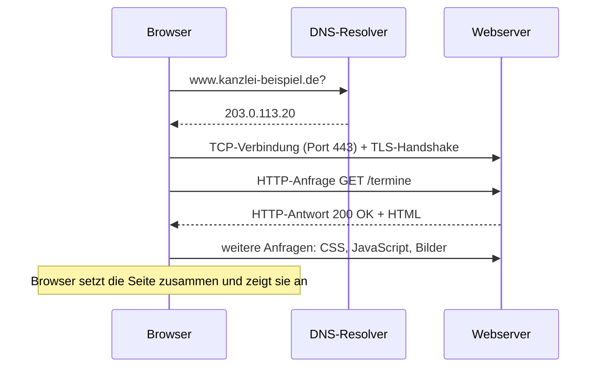

# N7 · Internet und Webanwendungen

> [!abstract] Überblick
> **Bereich:** [[Übersicht Netzwerk]]
> **Dauer:** ca. 75 min · **Prüfungsrelevanz:** ★★☆ – seit dem Prüfungskatalog 2025 ausdrücklich enthalten (z. B. statische vs. dynamische Websites, Websprachen)
> **Voraussetzungen:** [[N4 Netzwerkdienste und Protokolle]] (HTTP, DNS, Ports)

## Lernziele
- [ ] Ich kann den Aufbau einer URL erklären und die Bestandteile benennen.
- [ ] Ich kann den Ablauf eines Webseitenaufrufs vom Browser bis zum Webserver beschreiben.
- [ ] Ich kann statische und dynamische Websites unterscheiden und passende Technologien nennen.
- [ ] Ich kann HTML, CSS, JavaScript und serverseitige Sprachen einordnen.
- [ ] Ich kann Anforderungen an eine Firmenwebsite nennen: Responsive Design, Barrierefreiheit, Impressum, Datenschutz.
- [ ] Ich kann Vor- und Nachteile eines Content-Management-Systems begründen.

## Worum geht es?
Eine Anwaltskanzlei will ihre veraltete Website erneuern: Die Öffnungszeiten ändert bisher nur ein externer Programmierer, auf dem Smartphone ist die Seite kaum lesbar, und ein Terminformular fehlt. Du sollst erklären, was eine moderne Website braucht und wie sie technisch funktioniert.

---

## 1. Aufbau einer URL
Eine **URL** (Uniform Resource Locator) gibt an, **wo** eine Ressource liegt und **wie** man sie abruft.

`https://www.kanzlei-beispiel.de:443/termine/buchen.php?anwalt=3#formular`

| Teil | Beispiel | Bedeutung |
|---|---|---|
| **Schema/Protokoll** | `https` | wie abgerufen wird (HTTP über TLS) |
| **Host** (Subdomain + Domain + TLD) | `www` · `kanzlei-beispiel` · `de` | welcher Server – wird per **DNS** aufgelöst |
| **Port** | `:443` | meist weggelassen (Standard: 80 für HTTP, 443 für HTTPS) |
| **Pfad** | `/termine/buchen.php` | Ressource auf dem Server |
| **Query-String** | `?anwalt=3` | Parameter für dynamische Seiten (Name=Wert, mehrere mit `&`) |
| **Fragment** | `#formular` | Sprungmarke innerhalb der Seite – wird nicht an den Server geschickt |

**URI** ist der Oberbegriff für Bezeichner von Ressourcen; eine URL ist eine URI mit Ortsangabe. (Eine **URN** benennt eine Ressource dauerhaft ohne Ort, z. B. `urn:isbn:…`.)

## 2. Was passiert beim Aufruf einer Website

*Abb.: Ablauf eines Webseitenaufrufs*

**HTTP-Methoden:** `GET` (Daten abrufen) · `POST` (Daten senden, z. B. Formular) · `PUT`/`DELETE` (vor allem bei Web-APIs).
**Statuscodes:** 200 OK · 301/302 Weiterleitung · **404** nicht gefunden · 403 verboten · **500** Serverfehler.
**HTTP ist zustandslos** – damit der Server einen Nutzer wiedererkennt (Login, Warenkorb), nutzt er **Cookies** bzw. Sitzungs-IDs.

## 3. Statische und dynamische Websites
| | **statisch** | **dynamisch** |
|---|---|---|
| Inhalt | fertige HTML-Dateien, für alle Besucher gleich | wird **bei jedem Aufruf** auf dem Server erzeugt – oft aus einer **Datenbank** |
| Technik | HTML, CSS, ggf. JavaScript im Browser | serverseitige Sprache (PHP, Python, Java, C#, JavaScript mit Node.js) + Datenbank |
| Beispiele | Visitenkarten-Seite, Dokumentation | Onlineshop, Terminbuchung, Webmail, Kundenportal |
| Vorteile | schnell, sicher (wenig Angriffsfläche), günstig zu hosten | aktuelle, personalisierte Inhalte, Formulare, Logins, Pflege ohne Programmierkenntnisse (CMS) |
| Nachteile | Änderungen nur durch Bearbeiten der Dateien, keine Interaktion mit Daten | aufwendiger, mehr Serverlast, regelmäßige Updates nötig (Sicherheitslücken) |

> [!tip] Client- und serverseitig unterscheiden
> **Clientseitig** läuft Code im **Browser** (JavaScript: Menüs aufklappen, Formular vorab prüfen). **Serverseitig** läuft Code auf dem **Webserver** (PHP liest Termine aus der Datenbank und erzeugt HTML). Eine Website mit viel JavaScript ist nicht automatisch „dynamisch“ im Sinne der Prüfung – entscheidend ist, ob der **Server** die Inhalte erzeugt.

## 4. Die Sprachen des Webs
| Sprache | Art | Aufgabe |
|---|---|---|
| **HTML** | Auszeichnungssprache (keine Programmiersprache) | **Struktur und Inhalt**: Überschriften, Absätze, Links, Bilder, Formulare |
| **CSS** | Stylesheet-Sprache | **Gestaltung**: Farben, Schriften, Layout, Anpassung an Bildschirmgrößen |
| **JavaScript** | Programmiersprache (clientseitig, mit Node.js auch serverseitig) | **Verhalten** im Browser: Interaktion, Inhalte nachladen |
| **PHP, Python, Java, C#, Ruby** | serverseitige Programmiersprachen | Seiten dynamisch erzeugen, Datenbanken abfragen |
| **SQL** | Datenbanksprache | Daten der dynamischen Seite speichern und abfragen ([[S7 Datenbanken]]) |
| **JSON/XML** | Datenformate | Datenaustausch mit Web-APIs |

```html
<!-- Minimalbeispiel: Struktur (HTML) mit eingebundener Gestaltung (CSS) -->
<!DOCTYPE html>
<html lang="de">
<head>
  <meta charset="utf-8">
  <meta name="viewport" content="width=device-width, initial-scale=1">
  <title>Kanzlei Beispiel</title>
  <link rel="stylesheet" href="stil.css">
</head>
<body>
  <h1>Termin vereinbaren</h1>
  
  <a href="/termine">Zur Terminbuchung</a>
</body>
</html>
```
Das `alt`-Attribut beschreibt das Bild für Screenreader (Barrierefreiheit), die `viewport`-Angabe ist die Grundlage für Responsive Design.

## 5. Webserver, Hosting und CMS
- **Webserver-Software:** Apache, nginx, Microsoft IIS – liefert Dateien aus bzw. übergibt Anfragen an PHP/Anwendungen.
- **Virtuelle Hosts:** ein Server beantwortet Anfragen für **mehrere Domains** – unterschieden anhand des Hostnamens in der HTTP-Anfrage.
- **Hosting-Varianten:** eigener Server (volle Kontrolle, viel Aufwand) · **Webhosting/Shared Hosting** (günstig, wenig Aufwand) · Cloud/PaaS ([[S5 Virtualisierung und Cloud]]).
- **Content-Management-System (CMS)** wie WordPress, TYPO3, Joomla: Inhalte werden über eine **Weboberfläche** gepflegt, Layout und Inhalt sind getrennt.

| CMS – Vorteile | CMS – Nachteile |
|---|---|
| Mitarbeitende pflegen Inhalte ohne HTML-Kenntnisse | regelmäßige **Updates** von Kern und Plugins nötig (häufiges Angriffsziel) |
| Rollen und Rechte (Redakteur, Admin) | Performance und Abhängigkeit von Plugins |
| viele fertige Erweiterungen (Formulare, Mehrsprachigkeit) | Einarbeitung, bei Individualwünschen Grenzen |
| einheitliches Layout über Vorlagen (Themes) | |

## 6. Anforderungen an eine Firmenwebsite
| Anforderung | Umsetzung |
|---|---|
| **Responsive Webdesign** | Layout passt sich per CSS (Media Queries, flexible Raster) an Smartphone, Tablet und Desktop an – „Mobile First“ |
| **Barrierefreiheit** (WCAG, BFSG) | Alternativtexte, ausreichender Kontrast, Bedienung per Tastatur, klare Überschriftenstruktur, skalierbare Schrift ([[P5 Arbeitsplatz, Ergonomie und Umwelt]]) |
| **Ergonomie/Usability** | klare Navigation, kurze Ladezeiten, verständliche Formulare mit Fehlermeldungen |
| **Impressum** (Anbieterkennzeichnung, § 5 DDG) | Name, Anschrift, Kontakt (E-Mail, Telefon), Vertretungsberechtigte, Registereintrag, USt-IdNr., bei Kanzleien Kammer und Berufsbezeichnung – **leicht erkennbar, unmittelbar erreichbar** |
| **Datenschutzerklärung** (Art. 13 DSGVO) | welche Daten (Formular, Server-Logs, Cookies) zu welchem Zweck verarbeitet werden |
| **Cookie-Einwilligung** | für nicht notwendige Cookies (Statistik, Werbung) vorher Einwilligung einholen |
| **Sicherheit** | HTTPS mit gültigem Zertifikat, Updates, sichere Formulare (Schutz vor SQL-Injection und XSS, [[I5 Bedrohungen und Schutzmaßnahmen]]) |

> [!info] Barrierefreiheitsstärkungsgesetz (BFSG)
> Seit dem **28.06.2025** müssen u. a. Online-Shops, Online-Terminbuchungen, Banking-Apps und andere digitale Dienstleistungen für Verbraucher barrierefrei sein. Maßstab ist in der Praxis **WCAG 2.1 Stufe AA** (EN 301 549). Ausgenommen sind bei Dienstleistungen **Kleinstunternehmen** mit weniger als 10 Beschäftigten und höchstens 2 Mio. € Jahresumsatz. Prüfen: Tastaturbedienung, Screenreader, Kontrastmessung, automatisierte Tools (z. B. Lighthouse, WAVE).

> [!question]- Kurz nachgedacht: Die Kanzlei will ihre Öffnungszeiten künftig selbst ändern und Termine online vergeben. Statisch oder dynamisch?
> **Dynamisch mit CMS:** Die Mitarbeitenden pflegen Inhalte über die Weboberfläche; die Terminbuchung braucht serverseitige Verarbeitung und eine Datenbank. Dafür müssen Updates eingeplant und die Formulardaten datenschutzkonform verarbeitet werden (Datenschutzerklärung, TLS, Auftragsverarbeitung mit dem Hoster).

---

> [!warning] Typische Fehler in Prüfungen
> - HTML als Programmiersprache bezeichnen (es ist eine **Auszeichnungssprache**).
> - „Dynamisch“ mit „bewegt/animiert“ verwechseln – gemeint ist **serverseitige Erzeugung** der Inhalte.
> - Bei den Websprachen nur clientseitige Techniken nennen, wenn nach **dynamischen** Websites gefragt ist (PHP, Python, Java, C#, Node.js).
> - Das Fragment `#…` als Teil der Serveranfrage ansehen.
> - Beim Impressum nur „Name und Adresse“ nennen – E-Mail/Telefon und Registerangaben gehören dazu.

## Verwandte Themen
- [[N4 Netzwerkdienste und Protokolle]] – HTTP, HTTPS, DNS und Ports
- [[I5 Bedrohungen und Schutzmaßnahmen]] – SQL-Injection und XSS bei Formularen
- [[S7 Datenbanken]] – die Datenbank hinter der dynamischen Seite

## Zusammenfassung
- ==🟡URL = Schema · Host · (Port) · Pfad · Query-String · Fragment==; der Host wird per DNS aufgelöst.
- Aufruf: DNS → TCP/TLS → HTTP-Anfrage → Antwort (Statuscode) → weitere Ressourcen; ==🔴HTTP ist zustandslos== (Cookies).
- Statisch: fertige Dateien, schnell und sicher · dynamisch: serverseitig aus Datenbank erzeugt, aktuell und interaktiv.
- HTML = Struktur, CSS = Gestaltung, JavaScript = Verhalten im Browser, PHP/Python/Java/C# = serverseitig.
- Firmenwebsite: responsive, barrierefrei, Impressum, Datenschutzerklärung, Cookie-Einwilligung, HTTPS, Updates; CMS für Pflege ohne Programmierung.

## Selbstcheck
```dataviewjs
await dv.view("AP1/99 System/views/quiz", { modul: "N7" })
```

**Weitere Aufgaben:** [[Aufgaben Netzwerk#N7 Internet und Webanwendungen]] · **Karteikarten:** [[Karten Netzwerk]]

## Einschätzung
```dataviewjs
await dv.view("AP1/99 System/views/selbstcheck")
```

---
← [[N6 WLAN]] · Weiter: [[H1 PC-Komponenten und Arbeitsplatzgeräte]] →
