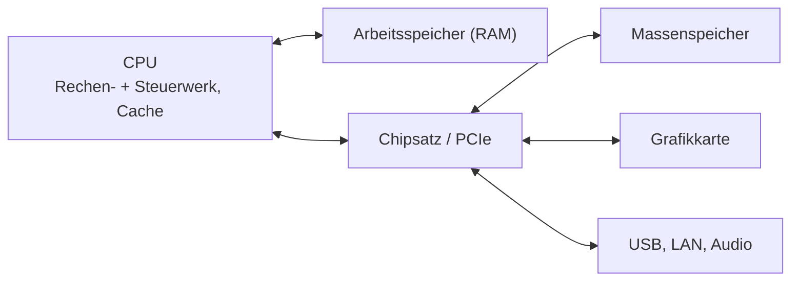

# H1 · PC-Komponenten und Arbeitsplatzgeräte

> [!abstract] Überblick
> **Bereich:** [[Übersicht Hardware]]
> **Dauer:** ca. 2 h · **Prüfungsrelevanz:** ★★★ – „Welche Komponente für welchen Arbeitsplatz?“ ist ein AP1-Dauerbrenner
> **Voraussetzungen:** keine · **Danach:** [[H2 Massenspeicher und Schnittstellen]]
> **Berufsschule:** GiD LF2 LS2.3 (Plakate zu CPU, Mainboard, Grafikkarte, Festplatte), LS2.1 (Modellvergleich)

## Lernziele
- [ ] Ich kann Aufgabe und Kenngrößen von CPU, RAM, Mainboard, Grafikkarte und Netzteil erklären.
- [ ] Ich kann aus einem Datenblatt die für einen Arbeitsplatz relevanten Werte herauslesen.
- [ ] Ich kann Monitore nach Auflösung, Pixeldichte, Panel und Ergonomie bewerten.
- [ ] Ich kann Geräteklassen (Desktop, Notebook, Thin Client, Mini-PC, Einplatinencomputer) passend zum Einsatz auswählen.
- [ ] Ich kann eine Hardwareempfehlung nach dem Muster Anforderung → Komponente → Begründung formulieren.

## Worum geht es?
Drei neue Arbeitsplätze: eine Buchhalterin (Office, ERP im Browser), ein CAD-Konstrukteur und eine Entwicklerin mit mehreren virtuellen Maschinen. Ein „Standard-PC für alle“ wäre für die Buchhalterin zu teuer und für den Konstrukteur zu schwach. Die Prüfung will sehen, dass du **Anforderungen in Komponenten übersetzt** und das begründest.

---

## 1. Das Zusammenspiel (Von-Neumann-Prinzip)
Ein Computer besteht aus **Rechenwerk** und **Steuerwerk** (zusammen die CPU), **Speicher** (Programme und Daten gemeinsam), **Ein-/Ausgabe** und einem **Bussystem**, das alles verbindet. Programme und Daten liegen im gleichen Arbeitsspeicher und werden nacheinander verarbeitet.



## 2. Prozessor (CPU)

| Kenngröße | Bedeutung | Worauf achten? |
|---|---|---|
| **Kerne / Threads** | Anzahl paralleler Rechenwerke; SMT/Hyper-Threading = 2 Threads pro Kern | viele Kerne für Virtualisierung, Rendering, Kompilieren |
| **Taktfrequenz (GHz)** | Arbeitsgeschwindigkeit pro Kern (Basis- und Boost-Takt) | hoher Takt für Einzelthread-Anwendungen (manche CAD-Programme, Spiele) |
| **Cache (L1/L2/L3)** | sehr schneller Zwischenspeicher auf dem Chip | größer = weniger Wartezeit auf den RAM |
| **TDP (W)** | typische Wärmeabgabe | Kühlung, Stromverbrauch, Lautstärke |
| **Sockel** | mechanischer/elektrischer Anschluss | muss zum Mainboard passen |
| **integrierte Grafik (iGPU)** | Grafik im Prozessor | reicht für Office und Video, spart Strom und Kosten |
| **Architektur** | x86-64 (Intel, AMD) oder ARM (Apple, Raspberry Pi, viele Notebooks) | Software muss für die Architektur verfügbar sein |

> [!tip] Merke
> „Mehr GHz“ allein sagt wenig. Eine neue CPU mit weniger Takt kann schneller sein als eine alte mit mehr Takt (mehr Befehle pro Takt, **IPC**). Vergleiche über **Benchmarks** oder die Generation.

## 3. Arbeitsspeicher (RAM)
- **flüchtig** – Inhalt geht ohne Strom verloren
- speichert laufende Programme und Daten; zu wenig RAM → das System lagert auf den Massenspeicher aus (**Auslagerungsdatei**) → sehr langsam
- **Typen:** DDR4, **DDR5** – nicht kompatibel (andere Kerbe, anderer Sockel am Board)
- **Bauformen:** DIMM (Desktop), **SO-DIMM** (Notebook), oft auch fest verlötet (Ultrabooks – nicht aufrüstbar!)
- **Dual Channel:** zwei gleiche Module in den richtigen Slots → doppelte Bandbreite
- **ECC-RAM:** erkennt und korrigiert Bitfehler → Server, Workstations
- **Richtwerte:** Office 16 GB, Entwicklung/Bildbearbeitung 32 GB, VMs/CAD 32–64 GB

<!-- erg:SRAM und DRAM -->
### SRAM und DRAM
| | **SRAM** (statisch) | **DRAM** (dynamisch) |
|---|---|---|
| Speicherzelle | Flipflop aus mehreren Transistoren | Kondensator + Transistor |
| Auffrischen (Refresh) | nicht nötig | ständig nötig, sonst verlieren die Kondensatoren die Ladung |
| Tempo / Preis / Dichte | sehr schnell, teuer, wenig Kapazität | langsamer, günstig, hohe Kapazität |
| Einsatz | **Cache** der CPU | **Arbeitsspeicher** (DDR4, DDR5) |

Beide sind **flüchtig**. Nicht flüchtig sind z. B. Flash-Speicher (SSD, UEFI-Chip) und ROM.

## 4. Mainboard
Die Hauptplatine verbindet alles.
- **Sockel** und **Chipsatz** (bestimmt Anzahl PCIe-Lanes, USB-Ports, Übertaktung)
- RAM-Slots (Anzahl, Typ, max. Kapazität), **PCIe-Slots** (x16 für Grafik), **M.2-Slots** (NVMe/SATA), SATA-Anschlüsse
- Onboard: LAN (1/2,5/10 Gbit/s), WLAN/Bluetooth, Audio, USB, Grafikausgänge für die iGPU
- **Formfaktor:** ATX (groß, viele Slots) · Micro-ATX · Mini-ITX (kompakt)
- **UEFI** (Nachfolger des BIOS): grafische Oberfläche, **GPT**-Laufwerke > 2 TiB, **Secure Boot**; **TPM 2.0** (Sicherheitschip für BitLocker, Windows 11 Pflicht)

<!-- abb:mainboard -->
![[mainboard.svg]]
*Abb.: Mainboard schematisch mit den wichtigsten Steckplätzen*

<!-- erg:Bootvorgang -->
### Der Bootvorgang
1. **Einschalten** – das Netzteil meldet stabile Spannungen („Power Good“).
2. **POST** (Power-On Self-Test): Die Firmware prüft CPU, RAM, Grafik und wichtige Komponenten. Fehler werden als **Pieptöne**, LED- oder Displaycodes gemeldet (z. B. kein RAM erkannt).
3. **UEFI/BIOS** initialisiert die Hardware und sucht nach der **Bootreihenfolge** ein startfähiges Laufwerk.
4. **Bootloader** wird geladen – bei UEFI von der **EFI-Systempartition** (GPT); **Secure Boot** prüft dabei die Signatur.
5. Der **Betriebssystemkern** startet, lädt Treiber und Dienste, danach folgt die **Anmeldung**.

Bleibt ein PC nach dem Einschalten schwarz und piept, liegt der Fehler **vor** dem Betriebssystem – typisch sind RAM, Grafikkarte oder Stromversorgung.

## 5. Grafikkarte (GPU)
- **integriert (iGPU):** Office, Web, Video, mehrere Monitore – ausreichend für die meisten Büroarbeitsplätze
- **dediziert:** eigener Grafikspeicher (**VRAM**), eigene Stromversorgung – für **CAD**, Videoschnitt, 3D, **KI/Machine Learning**, Spiele
- Profikarten (z. B. für CAD) haben zertifizierte Treiber für bestimmte Programme
- auf **Monitoranschlüsse** (DisplayPort, HDMI) und Anzahl unterstützter Monitore achten

## 6. Netzteil
- Leistung mit Reserve (nicht „so knapp wie möglich“ – Wirkungsgrad ist bei ca. 50 % Last am besten)
- **Wirkungsgrad η = P_ab / P_zu**; **80 PLUS**-Zertifikate: Bronze < Silver < Gold < Platinum < Titanium
- Beispiel: PC braucht 300 W, Netzteil η = 0,9 → aus der Steckdose 300 / 0,9 = **333 W**, **33 W** werden zu Wärme
- ausführlich: [[H5 Elektrotechnik, USV und Energie]]

## 7. Monitor
| Kenngröße | Bedeutung |
|---|---|
| **Diagonale** | in Zoll (1" = 2,54 cm) |
| **Auflösung** | Full HD 1920×1080 · WQHD 2560×1440 · 4K UHD 3840×2160 · UWQHD 3440×1440 (21:9) |
| **Pixeldichte** | ppi = √(Breite² + Höhe²) / Diagonale – höher = schärfer |
| **Panel** | **IPS**: farbtreu, blickwinkelstabil (Büro, Grafik) · **VA**: hoher Kontrast · **TN**: schnell, schlechte Blickwinkel · **OLED**: perfektes Schwarz, teurer |
| **Bildwiederholrate** | 60 Hz Büro, 120–240 Hz Gaming |
| **Farbraum** | sRGB, Adobe RGB, DCI-P3 – wichtig für Grafik/Foto |
| **Ergonomie** | höhenverstellbar, neig- und drehbar, **entspiegelt**, flimmerfrei, VESA-Halterung |
| **Anschlüsse** | DisplayPort, HDMI, **USB-C mit Power Delivery** (ein Kabel zum Notebook) |

> [!example] Pixeldichte durchgerechnet
> 27", 2560 × 1440: √(2560² + 1440²) = √8 627 200 ≈ 2 937,2 Pixel Diagonale → 2 937,2 / 27 ≈ **108,8 ppi**
> 24", 1920 × 1080: √4 852 800 ≈ 2 202,9 → / 24 ≈ **91,8 ppi**

## 8. Geräteklassen
| Gerät | Stärken | Schwächen | Einsatz |
|---|---|---|---|
| **Desktop-PC** | leistungsstark, aufrüstbar, günstig pro Leistung | nicht mobil | feste Arbeitsplätze, CAD |
| **Notebook** | mobil, mit Dockingstation vollwertiger Arbeitsplatz | teurer, schlechter aufrüstbar, Diebstahlrisiko | Außendienst, Homeoffice, Desk-Sharing |
| **Mini-PC** | klein, sparsam, leise | begrenzte Erweiterbarkeit | Büro, Empfang, Digital Signage |
| **All-in-One** | aufgeräumt, wenig Kabel | schwer reparierbar, Monitor und PC fallen zusammen aus | Empfang, Showroom |
| **Thin Client** | sehr sparsam, zentral verwaltet, sicher (keine lokalen Daten) | braucht Server/VDI und Netzwerk | Call-Center, Schulungsräume, Terminalserver |
| **Workstation** | ECC-RAM, Profi-GPU, zertifiziert | teuer | CAD, Simulation |
| **Einplatinencomputer** (z. B. Raspberry Pi) | sehr günstig, sparsam, GPIO für Sensoren/Aktoren | wenig Leistung, ARM | IoT, Steuerung, Lernen, Messstationen |

**Dockingstation:** Ein Kabel (USB-C/Thunderbolt) verbindet das Notebook mit Monitoren, LAN, Tastatur, Maus und Strom → ideal für wechselnde Arbeitsplätze.

## 9. Peripherie
Tastatur, Maus (ergonomisch, kabellos), Headset (Videokonferenz, Großraumbüro), Webcam, Scanner, Drucker (Laser für viel Text, Tinte für Farbe/Foto; **Multifunktionsgerät** mit Scan/Kopie/Fax; Netzwerkdrucker mit Zugangskontrolle per PIN/Karte → „Follow-me-Printing“ schützt vertrauliche Ausdrucke).

---

## 10. So begründest du eine Auswahl
**Anforderung → Komponente → Begründung** (am Szenario!):

> [!example] Musterformulierungen
> - „Da Frau Keller **mehrere VMs parallel** betreibt, empfehle ich **32 GB RAM**, weil jede VM ihren Arbeitsspeicher exklusiv reserviert und sonst ausgelagert würde.“
> - „Für den **CAD-Arbeitsplatz** ist eine **dedizierte Grafikkarte mit zertifizierten Treibern** nötig, weil 3D-Modelle in Echtzeit gedreht und gerendert werden.“
> - „Für die **Buchhaltung** genügt eine **CPU mit integrierter Grafik**, weil nur Office und Browser genutzt werden – das spart Anschaffungs- und Stromkosten.“

---

> [!warning] Typische Fehler in Prüfungen
> - Nur Komponenten aufzählen, ohne Bezug zur Anforderung.
> - DDR4- und DDR5-Module als austauschbar ansehen.
> - Für Büroarbeitsplätze automatisch eine dedizierte Grafikkarte empfehlen.
> - Pixeldichte mit Breite statt mit der **Diagonale in Pixeln** berechnen.
> - Beim Notebook übersehen, dass RAM oft verlötet ist – dann muss die Ausstattung beim Kauf passen.

## Verwandte Themen
- [[H2 Massenspeicher und Schnittstellen]] – Speicher und Anschlüsse der Komponenten
- [[P5 Arbeitsplatz, Ergonomie und Umwelt]] – Monitor und Ergonomie
- [[W2 Nutzwertanalyse und Entscheidungen]] – Auswahl per Nutzwertanalyse begründen

## Zusammenfassung
- CPU: Kerne für Parallelität, Takt/IPC für Einzelaufgaben, TDP für Kühlung/Strom.
- RAM flüchtig, ==🔴DDR4 ≠ DDR5==, Dual Channel, ECC für Server; Richtwerte ==🔵16/32/64 GB==.
- Mainboard: Sockel, Chipsatz, Slots, Formfaktor, UEFI, TPM.
- iGPU fürs Büro, dedizierte GPU für CAD/Video/KI.
- Monitor: Auflösung, ==🟢ppi = Diagonale in Pixeln / Zoll==, IPS fürs Büro, ergonomisch verstellbar.
- Geräteklasse passend zum Einsatz; Begründungen immer am Szenario.

## Direkt üben
```dataviewjs
await dv.view("AP1/99 System/views/trainer", { typen: ["ppi"] })
```

## Selbstcheck
```dataviewjs
await dv.view("AP1/99 System/views/quiz", { modul: "H1" })
```

**Weitere Aufgaben:** [[Aufgaben Hardware#H1 PC-Komponenten und Arbeitsplatzgeräte]] · **Karteikarten:** [[Karten Hardware]]

## Einschätzung
```dataviewjs
await dv.view("AP1/99 System/views/selbstcheck")
```

---
← [[N7 Internet und Webanwendungen]] · Weiter: [[H2 Massenspeicher und Schnittstellen]] →
