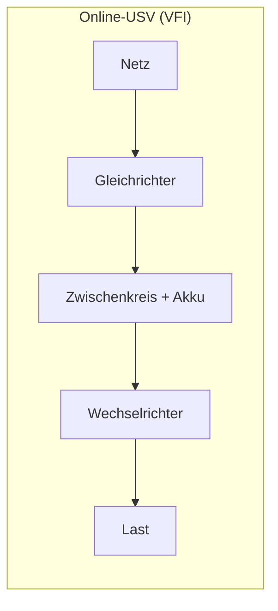

# H5 · Elektrotechnik, USV und Energie

> [!abstract] Überblick
> **Bereich:** [[Übersicht Hardware]]
> **Dauer:** ca. 2 h · **Prüfungsrelevanz:** ★★★ – USV-Dimensionierung und Stromkosten sind beliebte Rechenaufgaben
> **Voraussetzungen:** Dreisatz, Prozentrechnung
> **Berufsschule:** Evp-CPS LF3 (USV-Bauarten, Akku-Überbrückungszeit) · GiD LF2 LS2.3 (Grundbegriffe, Netzteiloptimierung)

## Lernziele
- [ ] Ich kann Spannung, Strom, Widerstand, Leistung und Arbeit mit Einheiten und Formeln anwenden.
- [ ] Ich kann Wirkungsgrad und Verlustleistung eines Netzteils berechnen.
- [ ] Ich kann Schein- und Wirkleistung unterscheiden (VA vs. W, cos φ).
- [ ] Ich kann USV-Bauarten (VFD, VI, VFI) vergleichen, eine USV dimensionieren und die Überbrückungszeit berechnen.
- [ ] Ich kann Energiekosten und Einsparungen berechnen und Green-IT-Maßnahmen nennen.

## Worum geht es?
Ein kurzer Stromausfall – und die Datenbank auf dem Server ist beschädigt, weil er hart abgeschaltet wurde. Eine **USV** hätte das verhindert. Aber welche? Und wie groß? Außerdem will die Geschäftsführung wissen, was die 40 Arbeitsplätze pro Jahr an Strom kosten und ob sich neue, sparsamere Geräte lohnen.

---

## 1. Elektrotechnische Grundgrößen

| Größe | Zeichen | Einheit | Bedeutung |
|---|---|---|---|
| Spannung | U | Volt (V) | „Druck“, der Ladungen antreibt (Steckdose 230 V) |
| Stromstärke | I | Ampere (A) | Menge der fließenden Ladung pro Zeit |
| Widerstand | R | Ohm (Ω) | hemmt den Stromfluss |
| Leistung | P | Watt (W) | Energie pro Zeit |
| Arbeit/Energie | W | Wattstunde (Wh), kWh; 1 Ws = 1 J | über die Zeit umgesetzte Leistung |
| Ladung (Akku) | Q | Amperestunde (Ah) | Akkukapazität |

**Formeln:**
- Ohmsches Gesetz: **U = R · I**
- Leistung: **P = U · I** (auch P = I² · R = U² / R)
- Arbeit: **W = P · t** (= U · I · t)
- Akku-Energie: **W = Q · U** (Ah × V = Wh)

> [!tip] Das „URI“-Dreieck
> U oben, R und I unten: Verdeckt man die gesuchte Größe, steht die Rechnung da (U = R·I, I = U/R, R = U/I). Dasselbe für **P = U · I**.

> [!example] Beispiele
> - Ein Monitor nimmt an 230 V 0,15 A auf → P = 230 × 0,15 = **34,5 W**
> - Ein Server mit 690 W an 230 V → I = 690 / 230 = **3 A**
> - Derselbe Server an einem 24-V-Akku → I = 690 / 24 = **28,75 A** (dicke Kabel nötig!)

## 2. Wirkungsgrad

**η = P_ab / P_zu** (Nutzleistung / aufgenommene Leistung), immer < 1 bzw. < 100 %. Die Differenz ist **Verlustleistung** (Wärme).

> [!example] Netzteil
> Ein PC braucht 240 W. Netzteil A hat η = 82 %, Netzteil B (80 PLUS Gold) η = 92 %.
> - A: P_zu = 240 / 0,82 = **292,7 W**, Verlust 52,7 W
> - B: P_zu = 240 / 0,92 = **260,9 W**, Verlust 20,9 W
> - Ersparnis 31,8 W. Bei 2 000 h/Jahr: 31,8 × 2 000 / 1 000 = 63,6 kWh × 0,32 €/kWh = **20,35 €/Jahr** pro PC

## 3. Schein- und Wirkleistung
Bei Geräten mit Netzteilen (Kondensatoren, Spulen) sind Strom und Spannung nicht ganz „im Takt“. Deshalb gibt es:
- **Wirkleistung P** in **Watt (W)** – wird tatsächlich umgesetzt
- **Scheinleistung S** in **Voltampere (VA)** – muss die Leitung/USV bereitstellen
- **Leistungsfaktor cos φ** (0 … 1): **P = S · cos φ** → **S = P / cos φ**

USV-Datenblätter nennen **beide** Werte, z. B. „1 500 VA / 1 350 W“. Die Last darf **keinen** der beiden Grenzwerte überschreiten.

---

<!-- abb:leistungsdreieck -->
![[leistungsdreieck.svg]]
*Abb.: Leistungsdreieck: Schein-, Wirk- und Blindleistung*

## 4. USV – Unterbrechungsfreie Stromversorgung

### Wozu?
- Stromausfall überbrücken, bis ein Notstrom-Aggregat läuft oder die Systeme **sauber herunterfahren** (Datenverlust, beschädigte Dateisysteme/Datenbanken vermeiden)
- Schutz vor **Netzstörungen**: Spannungseinbrüche und -spitzen, Über-/Unterspannung, Frequenzschwankungen, Oberschwingungen

### Bauarten (IEC 62040-3)
| Klasse | Name | Funktionsweise | Umschaltzeit | Schutz | Einsatz |
|---|---|---|---|---|---|
| **VFD** (Voltage and Frequency Dependent) | **Offline / Standby** | Last hängt direkt am Netz; bei Ausfall wird auf Batterie/Wechselrichter umgeschaltet | ca. 2–10 ms | nur Ausfall, wenig gegen Störungen | Einzel-PC, günstig |
| **VI** (Voltage Independent) | **Line-Interactive** | wie VFD, zusätzlich Spannungsregelung (Transformator) | ca. 2–4 ms | Ausfall + Über-/Unterspannung | kleine Server, Netzwerktechnik |
| **VFI** (Voltage and Frequency Independent) | **Online / Doppelwandler** | Netzstrom wird **dauerhaft** gleichgerichtet (lädt Akku) und wieder zu sauberem Wechselstrom gewandelt | **0 ms** | alle Netzstörungen | Server, Rechenzentrum, Medizintechnik |



Nachteil Online-USV: teurer, geringerer Wirkungsgrad (ständige Wandlung → Wärme), lauter.

### Dimensionierung
1. **Wirkleistung** aller angeschlossenen Geräte addieren (Datenblatt, Maximalwerte!)
2. **Reserve** aufschlagen (meist 20–25 %, auch für Wachstum und Akkualterung)
3. **Scheinleistung** berechnen: S = P / cos φ
4. Modell wählen, das **VA und W** abdeckt; **Überbrückungszeit** laut Herstellertabelle bei dieser Last prüfen

> [!example] Beispiel durchgerechnet
> Server 450 W, Switch 60 W, Router 30 W, NAS 80 W = **620 W**; Reserve 25 %; cos φ = 0,9
> - 620 × 1,25 = **775 W**
> - S = 775 / 0,9 = **861,1 VA**
> - Modelle: 750 VA/675 W ✗ · 1 000 VA/900 W ✓ → **1 000 VA / 900 W**

### Überbrückungszeit aus Akkudaten
**t = (Q · U · η) / P**
Q = Akkukapazität (Ah), U = Akkuspannung (V), η = Wirkungsgrad des Wechselrichters, P = Last (W).

> [!example] Beispiel
> Akku 9 Ah, 24 V, η = 0,85, Last 300 W:
> t = 9 × 24 × 0,85 / 300 = 183,6 Wh / 300 W = 0,612 h = **36,7 min**
> Akkustrom: I = P_Last / (U · η) = 300 / (24 · 0,85) ≈ **14,71 A**. Dabei werden konstante Akkuspannung und konstanter Wirkungsgrad angenommen.
> Merke: Bei doppelter Last halbiert sich die Zeit – in der Realität sogar etwas mehr, weil Akkus bei hohem Strom weniger Kapazität liefern.

### Betrieb
- **Shutdown-Software/Netzwerkkarte** der USV: meldet per USB oder Netzwerk (SNMP) den Stromausfall → Server fahren automatisch geordnet herunter
- Akkus altern (typisch 3–5 Jahre) → regelmäßige Selbsttests, Tauschintervall
- Nicht jeden Verbraucher an die USV: Laserdrucker (hohe Einschaltströme) gehören nicht an eine kleine USV

---

## 5. Energiekosten

**Energie (kWh) = Leistung (W) × Zeit (h) / 1 000** · **Kosten = kWh × Preis (€/kWh)**

Vorgehen: Betriebsstunden pro Jahr bestimmen → pro Betriebszustand (Betrieb, Leerlauf, Standby) rechnen → × Anzahl Geräte → × Preis.

> [!example] Arbeitsplätze
> 40 PCs à 65 W und 40 Monitore à 22 W, 8 h an 220 Tagen; Standby 1,5 W (PC) + 0,3 W (Monitor) in der restlichen Zeit; 0,32 €/kWh.
> - Betrieb: (65 + 22) × 40 × 1 760 h / 1 000 = **6 124,8 kWh**
> - Standby: (1,5 + 0,3) × 40 × (8 760 − 1 760) / 1 000 = **504 kWh**
> - Summe 6 628,8 kWh × 0,32 € = **2 121,22 €/Jahr**

> [!example] Server 24/7
> 180 W × 8 760 h = 1 576,8 kWh × 0,30 € = **473,04 €/Jahr** – plus Kühlung (Faustregel: Klimatisierung kann noch einmal 30–100 % obendrauf bringen; Kennzahl **PUE**).

### Green IT – Energie sparen
- effiziente Geräte (EU-Energielabel, 80-PLUS-Netzteile), Energie-Management (Standby, Ruhezustand, Wake-on-LAN)
- **Virtualisierung/Serverkonsolidierung** statt vieler schwach ausgelasteter Server
- Thin Clients, Mini-PCs, Notebooks statt großer Desktops im Büro
- abschaltbare Steckdosenleisten, zeitgesteuerte Abschaltung von Druckern/Displays
- Serverraum: Kalt-/Warmgang, höhere Zieltemperatur, freie Kühlung
- lange Nutzungsdauer und fachgerechte Entsorgung/Recycling ([[P5 Arbeitsplatz, Ergonomie und Umwelt]])

---

> [!warning] Typische Fehler in Prüfungen
> - W und VA gleichsetzen bzw. nur eine der beiden USV-Grenzen prüfen.
> - Wirkungsgrad falsch herum: P_zu = P_ab / η (nicht × η).
> - Bei kWh das „/ 1 000“ vergessen.
> - Standby-Zeiten vergessen oder mit 24 h statt Reststunden rechnen.
> - Offline-USV für einen Server empfehlen, der Netzstörungen nicht verträgt.

## Verwandte Themen
- [[H4 Server und Netzwerkspeicher]] – Server absichern
- [[P5 Arbeitsplatz, Ergonomie und Umwelt]] – Green IT
- [[W3 Investition und Finanzierung]] – Amortisation sparsamer Geräte

## Zusammenfassung
- ==🟢U = R·I · P = U·I · W = P·t== · Akku W = Q·U.
- η = P_ab / P_zu; Verlust = P_zu − P_ab.
- ==🟢P = S · cos φ==; ==🔴USV muss VA und W erfüllen==.
- USV-Klassen: VFD (offline) < VI (line-interactive) < VFI (online, 0 ms).
- Dimensionierung: Summe W + Reserve → / cos φ → Modell; t = Q·U·η / P.
- Energiekosten = W × h / 1000 × €/kWh; Green IT: Effizienz, Konsolidierung, Abschalten.

## Direkt üben
```dataviewjs
await dv.view("AP1/99 System/views/trainer", { typen: ["strom", "usv-dimension", "usv-akku"] })
```

## Selbstcheck
```dataviewjs
await dv.view("AP1/99 System/views/quiz", { modul: "H5" })
```

**Weitere Aufgaben:** [[Aufgaben Hardware#H5 Elektrotechnik, USV und Energie]] · **Karteikarten:** [[Karten Hardware]]

## Einschätzung
```dataviewjs
await dv.view("AP1/99 System/views/selbstcheck")
```

---
← [[H4 Server und Netzwerkspeicher]] · Weiter: [[H6 Drucker, Peripherie und Mobilgeräte]] →
