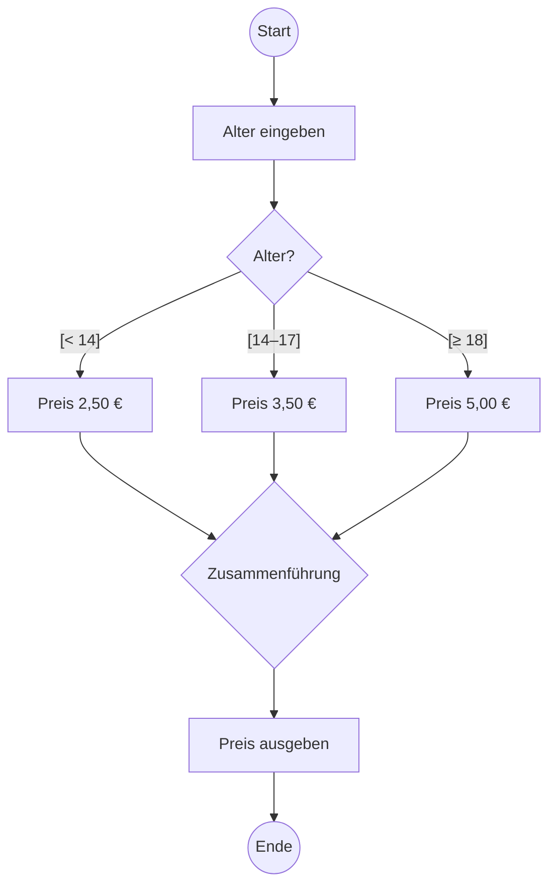

# S3 · Algorithmen, Darstellung und Testen

> [!abstract] Überblick
> **Bereich:** [[Übersicht Software]]
> **Dauer:** ca. 2,5 h · **Prüfungsrelevanz:** ★★★ – UML-Aktivitätsdiagramm, Schreibtischtest, Pseudocode und Testfälle
> **Voraussetzungen:** [[S2 Programmierung – Grundlagen]]
> **Berufsschule:** SuD LF5 LS5.2–5.4 (Testfallkatalog, UML-Aktivitätsdiagramm, pytest)

## Lernziele
- [ ] Ich kann UML-Aktivitätsdiagramme lesen und ergänzen.
- [ ] Ich kann einen Schreibtischtest (Trace-Tabelle) durchführen.
- [ ] Ich kann Standardalgorithmen (lineare/binäre Suche, Bubble Sort, Tausch) erklären und anwenden.
- [ ] Ich kann Syntax-, Laufzeit- und Logikfehler unterscheiden und typische Fehler in Pseudocode finden.
- [ ] Ich kann Testfälle mit Äquivalenzklassen und Grenzwerten entwerfen und Teststufen einordnen.

## Worum geht es?
Ein Algorithmus ist eine **eindeutige, endliche Folge von Schritten**, die ein Problem löst. Bevor programmiert wird, plant man ihn grafisch – und nachdem programmiert wurde, beweist man mit Tests, dass er stimmt. Genau diese beiden Seiten prüft die AP1: Darstellung lesen/ergänzen und Fehler finden.

---

## 1. Darstellungsformen

> [!note] Prüfungskatalog ab 2025
> **Struktogramm und Programmablaufplan (PAP)** sind aus dem Prüfungskatalog gestrichen. Algorithmen werden als **UML-Aktivitätsdiagramm** oder **Pseudocode** dargestellt; Geschäftsprozesse zusätzlich mit **BPMN** ([[S8 UML und Softwareentwurf]]). [[Prüfung AP1]]

### UML-Aktivitätsdiagramm
Standard für Abläufe in der Softwareentwicklung: **Startknoten** (gefüllter Kreis), **Aktionen** (abgerundete Rechtecke), **Entscheidung/Zusammenführung** (Raute, Bedingungen in [eckigen Klammern] an den Kanten), **Gabelung/Vereinigung** (Balken, für parallele Abläufe), **Endknoten** (Kreis mit Punkt).



---

## 2. Schreibtischtest (Trace-Tabelle)
Man führt den Algorithmus **von Hand** aus: eine Spalte je Variable (plus Bedingung/Ausgabe), eine Zeile je Schritt oder Schleifendurchlauf.

> [!example] Beispiel
> ```text
> werte ← [4, −2, 7, 0, 5]
> summe ← 0
> anzahl ← 0
> FÜR i ← 0 BIS 4
>     WENN werte[i] > 0 DANN
>         summe ← summe + werte[i]
>         anzahl ← anzahl + 1
>     ENDE WENN
> ENDE FÜR
> ausgabe(summe / anzahl)
> ```
> | i | werte[i] | > 0? | summe | anzahl |
> |---|---|---|---|---|
> | – | – | – | 0 | 0 |
> | 0 | 4 | ja | 4 | 1 |
> | 1 | −2 | nein | 4 | 1 |
> | 2 | 7 | ja | 11 | 2 |
> | 3 | 0 | nein | 11 | 2 |
> | 4 | 5 | ja | 16 | 3 |
> Ausgabe: 16 / 3 = **5,33** (Durchschnitt der positiven Werte). Risiko: Enthält die Liste keinen positiven Wert → Division durch 0!

---

## 3. Standardalgorithmen

### Zwei Werte tauschen
Nicht `a ← b; b ← a` (dann haben beide den Wert von b)! Richtig mit Hilfsvariable: `tmp ← a; a ← b; b ← tmp`.

### Lineare Suche
Jedes Element nacheinander prüfen; im schlimmsten Fall **n** Vergleiche. Funktioniert auch bei unsortierten Daten.
```text
FUNKTION suche(liste, ziel) : Ganzzahl
    FÜR i ← 0 BIS länge(liste) − 1
        WENN liste[i] = ziel DANN
            RÜCKGABE i
        ENDE WENN
    ENDE FÜR
    RÜCKGABE −1          // nicht gefunden
ENDE FUNKTION
```

### Binäre Suche
Nur für **sortierte** Daten: mittleres Element prüfen, dann in der passenden Hälfte weitersuchen. Höchstens ca. **log₂(n)** Schritte – bei 1 000 000 Elementen ~20 statt bis zu 1 000 000 Vergleiche.

### Bubble Sort
Benachbarte Elemente vergleichen und tauschen, wenn sie in falscher Reihenfolge sind. Nach jedem Durchlauf steht das größte der verbleibenden Elemente am Ende.
```text
FÜR i ← 0 BIS n − 2
    FÜR j ← 0 BIS n − 2 − i
        WENN a[j] > a[j + 1] DANN
            tmp ← a[j]
            a[j] ← a[j + 1]
            a[j + 1] ← tmp
        ENDE WENN
    ENDE FÜR
ENDE FÜR
```
Aufwand ca. **n²** Vergleiche – einfach, aber langsam für große Datenmengen (schneller: Quicksort, Mergesort mit ca. n · log n).

> [!example] Ein Durchlauf Bubble Sort auf [5, 1, 4, 2]
> 5>1 tauschen → [1, 5, 4, 2] · 5>4 tauschen → [1, 4, 5, 2] · 5>2 tauschen → [1, 4, 2, **5**]

---

## 4. Fehlerarten und Debugging
| Fehlerart | Merkmal | Beispiel |
|---|---|---|
| **Syntaxfehler** | Programm lässt sich nicht übersetzen/starten | fehlender Doppelpunkt, Tippfehler im Schlüsselwort |
| **Laufzeitfehler** | Absturz während der Ausführung (Exception) | Division durch 0, Index außerhalb der Liste, Datei fehlt |
| **Logikfehler** | läuft, liefert aber **falsche Ergebnisse** – am schwersten zu finden | `<` statt `≤`, falsche Initialisierung, Off-by-one |

**Debugging:** Haltepunkte (Breakpoints) setzen, Schritt für Schritt ausführen, Variablenwerte beobachten – im Prinzip ein automatischer Schreibtischtest.

### Typische Fehler in Pseudocode-Aufgaben
- Variable nicht initialisiert · Schleifengrenze falsch (Off-by-one) · Endlosschleife · Division durch 0 · falscher Vergleichsoperator an der Grenze · Zuweisung statt Vergleich · Rückgabe an der falschen Stelle (innerhalb statt nach der Schleife)

---

## 5. Testen

### Testfälle entwerfen
Ein **Testfall** besteht aus **Eingabe**, **erwartetem Ergebnis (Soll)**, tatsächlichem Ergebnis (Ist) und Bewertung. In der Berufsschule als **Testfallkatalog** (Tabelle).

**Äquivalenzklassen:** Eingaben, die das Programm gleich behandeln sollte, bilden eine Klasse – ein Vertreter pro Klasse genügt.
**Grenzwertanalyse:** Fehler passieren an den Grenzen → **genau auf** der Grenze und **direkt daneben** testen.

> [!example] Testfälle für den Eintrittspreis (unter 14: 2,50 € · 14–17: 3,50 € · ab 18: 5,00 €)
> | Nr. | Eingabe | Klasse | Soll |
> |---|---|---|---|
> | 1 | 8 | Kind | 2,50 € |
> | 2 | **13** | Grenze Kind | 2,50 € |
> | 3 | **14** | Grenze Jugend | 3,50 € |
> | 4 | **17** | Grenze Jugend | 3,50 € |
> | 5 | **18** | Grenze Erwachsen | 5,00 € |
> | 6 | −3 | ungültig | Fehlermeldung |
> | 7 | „abc“ | ungültig (kein Zahlwert) | Fehlermeldung |

- **Positivtest** (gültige Eingaben, „Happy Path“) vs. **Negativtest** (ungültige Eingaben, Randfälle/Edge Cases)
- **Black-Box-Test:** nur Ein-/Ausgabe laut Spezifikation, Code unbekannt · **White-Box-Test:** anhand des Codes, jeden Zweig/Pfad abdecken

### Teststufen und Testpyramide

<!-- abb:testpyramide -->
![[testpyramide.svg]]
*Abb.: Teststufen als Testpyramide*

| Stufe | prüft | Wer/wie |
|---|---|---|
| **Unit-/Modultest** | einzelne Funktionen | Entwickler, automatisiert (pytest) – **viele**, schnell, billig |
| **Integrationstest** | Zusammenspiel von Modulen/Schnittstellen | |
| **Systemtest** | Gesamtsystem gegen Anforderungen (Pflichtenheft) | Testteam |
| **Abnahmetest** | Erfüllung des Auftrags aus Kundensicht (Lastenheft) | Kunde → **Abnahmeprotokoll** |

**Regressionstest:** Nach jeder Änderung alte Tests erneut ausführen, damit nichts Funktionierendes kaputtgeht. Automatisierte Unit-Tests machen **Refactoring** (Umbau ohne Verhaltensänderung) sicher.

pytest-Ergebnisse: **PASSED** (bestanden) · **FAILED** (Soll ≠ Ist) · **ERROR** (Testcode wirft eine Exception).

<!-- erg:Lasttest -->
### Weitere Testarten und das Testprotokoll
- **Lasttest:** Verhalten unter der **erwarteten** Last (z. B. 200 gleichzeitige Nutzer) – Antwortzeiten, Stabilität.
- **Stresstest:** Belastung **über** die Grenze hinaus – wann und wie fällt das System aus, erholt es sich wieder?
- **Abnahmetest:** Der Auftraggeber prüft gegen die Anforderungen und bestätigt die Abnahme ([[P1 Projektmanagement und Vorgehensmodelle]]).

**Testprotokoll** – je Testfall: Testfall-Nr. · Ziel/Anforderung · Voraussetzungen · Eingaben/Testschritte · **erwartetes Ergebnis** · **tatsächliches Ergebnis** · Status (bestanden/nicht bestanden) · Datum und Tester · ggf. Fehlernummer. So sind Tests **nachvollziehbar und wiederholbar** (Regressionstest).

---

> [!warning] Typische Fehler in Prüfungen
> - Kanten nach einer Entscheidung im Aktivitätsdiagramm ohne [Bedingung] beschriften.
> - Beim Schreibtischtest Zwischenschritte auslassen – dann sieht man den Fehler nicht.
> - Testfälle nur mit „normalen“ Werten – Grenzwerte fehlen.
> - Binäre Suche auf unsortierte Daten anwenden.

### Insertion Sort und Selection Sort
- **Selection Sort:** In jedem Durchlauf wird das **kleinste Element des unsortierten Teils** gesucht und an dessen Anfang getauscht. `[5, 1, 4, 2]` → `[1, 5, 4, 2]` → `[1, 2, 4, 5]`.
- **Insertion Sort:** Jedes Element wird **an der passenden Stelle in den bereits sortierten Teil eingefügt** (wie Spielkarten auf der Hand). `[4, 3, 1, 2]` → `[3, 4, 1, 2]` → `[1, 3, 4, 2]` → `[1, 2, 3, 4]`.
- Beide (wie Bubble Sort) haben zwei verschachtelte Schleifen und die Laufzeit **O(n²)**; sie sind für kleine Listen einfach und gut nachvollziehbar.

## Verwandte Themen
- [[S2 Programmierung – Grundlagen]] – die Sprachelemente
- [[S8 UML und Softwareentwurf]] – UML-Aktivitätsdiagramm
- [[P1 Projektmanagement und Vorgehensmodelle]] – Tests im V-Modell und die Abnahme

## Zusammenfassung
- UML-Aktivitätsdiagramm: Start-/Endknoten, Aktionen, Rauten mit [Bedingungen], Balken für Parallelität.
- Schreibtischtest: Spalte je Variable, Zeile je Durchlauf.
- Tausch mit Hilfsvariable; lineare Suche n, binäre Suche log₂ n (nur sortiert); Bubble Sort n².
- Syntax- / Laufzeit- / Logikfehler.
- Testfälle mit Äquivalenzklassen und Grenzwerten; Unit → Integration → System → Abnahme; Regressionstests.

## Direkt üben
```dataviewjs
await dv.view("AP1/99 System/views/trainer", { typen: ["trace"] })
```

## Selbstcheck
```dataviewjs
await dv.view("AP1/99 System/views/quiz", { modul: "S3" })
```

**Weitere Aufgaben:** [[Aufgaben Software#S3 Algorithmen, Darstellung und Testen]] · **Karteikarten:** [[Karten Software]]

## Einschätzung
```dataviewjs
await dv.view("AP1/99 System/views/selbstcheck")
```

---
← [[S2 Programmierung – Grundlagen]] · Weiter: [[S4 Betriebssysteme, Dateisysteme und Rechte]] →
