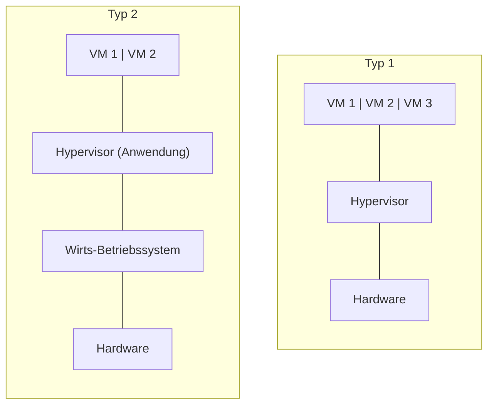

# S5 · Virtualisierung und Cloud

> [!abstract] Überblick
> **Bereich:** [[Übersicht Software]]
> **Dauer:** ca. 90 min · **Prüfungsrelevanz:** ★★★ – Hypervisor-Typen, IaaS/PaaS/SaaS und Cloud-Vor-/Nachteile werden regelmäßig gefragt
> **Voraussetzungen:** [[S4 Betriebssysteme, Dateisysteme und Rechte]], [[H4 Server und Netzwerkspeicher]]

## Lernziele
- [ ] Ich kann Virtualisierung erklären und Typ-1- und Typ-2-Hypervisoren unterscheiden.
- [ ] Ich kann Vor- und Nachteile der Servervirtualisierung begründen.
- [ ] Ich kann VMs und Container vergleichen.
- [ ] Ich kann Desktopvirtualisierung (VDI, Terminalserver) einordnen.
- [ ] Ich kann Cloud-Service- und -Bereitstellungsmodelle unterscheiden und eine Cloudlösung unter Datenschutzaspekten bewerten.

## Worum geht es?
Im Serverraum stehen sechs alte Server, jeder zu 10 % ausgelastet, jeder mit eigener USV-Last, eigenen Wartungsverträgen und eigener Hardware, die bald ausfällt. Mit Virtualisierung laufen alle sechs als virtuelle Maschinen auf zwei modernen Hosts. Und das Mailsystem? Vielleicht gar nicht mehr im eigenen Haus, sondern aus der Cloud.

---

## 1. Virtualisierung
**Virtualisierung** trennt Software von der physischen Hardware. Ein **Hypervisor** (Virtual Machine Monitor) teilt CPU, RAM, Speicher und Netzwerk eines **Hosts** auf mehrere **virtuelle Maschinen (VMs, Gäste)** auf. Jede VM hat ein eigenes Betriebssystem und „glaubt“, eigene Hardware zu besitzen.

| | **Typ 1 – Bare Metal** | **Typ 2 – Hosted** |
|---|---|---|
| läuft auf | **direkt auf der Hardware** | auf einem **Wirtsbetriebssystem** (Windows, macOS, Linux) |
| Beispiele | VMware ESXi, Microsoft Hyper-V (Server), Proxmox VE (KVM), Xen | Oracle VirtualBox, VMware Workstation, Parallels |
| Leistung | hoch, wenig Overhead | geringer (Umweg über das Host-OS) |
| Einsatz | **Server, Rechenzentrum** | **Test, Entwicklung, Schulung** am Arbeitsplatz |



Voraussetzung: CPU mit **Virtualisierungserweiterung** (Intel VT-x, AMD-V), im UEFI aktiviert.

### Vorteile der Servervirtualisierung
- **Konsolidierung:** bessere Auslastung, weniger physische Server → weniger **Strom, Kühlung, Platz, Hardwarekosten**
- **Flexibilität:** neue Server in Minuten aus **Vorlagen (Templates)** bereitstellen
- **Snapshots:** Zustand vor einem Update sichern und bei Problemen zurückspringen
- **Hochverfügbarkeit:** im **Cluster** mit gemeinsamem Speicher startet eine VM bei Hostausfall automatisch auf einem anderen Host neu; **Live-Migration** (VM im laufenden Betrieb verschieben) für Wartung ohne Ausfall
- **Hardwareunabhängigkeit:** VM läuft auf neuer Hardware ohne Neuinstallation
- **Testumgebungen** und Isolation von Diensten

### Nachteile/Risiken
- **Single Point of Failure:** fällt ein Host ohne Cluster aus, fallen **alle** VMs darauf aus
- **Ressourcenkonkurrenz** (VMs bremsen sich gegenseitig, Überbuchung)
- Lizenzkosten (Hypervisor, Windows-Server-Lizenzen nach Kernen), Know-how nötig
- hohe Anforderungen an Host-Hardware (RAM!), Speicher und Backup

> [!danger] Snapshot ≠ Backup
> Ein Snapshot liegt auf **demselben Speicher** wie die VM und hängt von ihr ab. Viele alte Snapshots verlangsamen die VM. Für Datensicherung: echte Backups der VMs auf ein anderes System ([[I3 Datensicherung]]).

## 2. Container
**Container** (z. B. Docker, Podman) virtualisieren nicht die Hardware, sondern isolieren **Anwendungen** auf Betriebssystemebene. Alle Container teilen sich den **Kernel** des Hosts.

| | **VM** | **Container** |
|---|---|---|
| enthält | komplettes Betriebssystem | nur Anwendung + Bibliotheken |
| Größe/Start | GB, Minuten | MB, Sekunden |
| Isolation | stark (eigener Kernel) | schwächer (gemeinsamer Kernel) |
| Einsatz | unterschiedliche Betriebssysteme, klassische Server | Microservices, Webanwendungen, DevOps |

## 3. Desktopvirtualisierung
| Konzept | Funktion |
|---|---|
| **Terminalserver** (Remote Desktop Services) | viele Nutzer arbeiten gleichzeitig auf **einem** Server-Betriebssystem |
| **VDI** (Virtual Desktop Infrastructure) | jeder Nutzer hat eine **eigene Desktop-VM** im Rechenzentrum |
| **Desktop as a Service** | VDI aus der Cloud (z. B. Windows 365, Azure Virtual Desktop) |

Zugriff per **Thin Client**, Notebook oder Browser. Vorteile: zentrale Verwaltung, Daten verlassen das Rechenzentrum nicht, ortsunabhängig. Nachteile: abhängig von Netzwerk und Server, bei Grafiklast teuer.

---

## 4. Cloud Computing
**Cloud Computing** = IT-Ressourcen (Rechenleistung, Speicher, Software) werden **über ein Netz** bereitgestellt, **bedarfsgerecht** und **nutzungsabhängig** abgerechnet (Self-Service, schnell skalierbar, „Pay per Use“).

### Servicemodelle

<!-- abb:cloud-modelle -->
![[cloud-modelle.svg]]
*Abb.: Wer verwaltet was? On-Premises, IaaS, PaaS und SaaS*

| Modell | Anbieter verwaltet | Kunde verwaltet | Beispiele |
|---|---|---|---|
| **IaaS** – Infrastructure as a Service | Rechenzentrum, Hardware, Netzwerk, Virtualisierung | **Betriebssystem**, Middleware, Anwendungen, Daten | virtuelle Server, Speicher |
| **PaaS** – Platform as a Service | + Betriebssystem, Laufzeitumgebung, Datenbank | **Anwendung**, Daten | App-Hosting, Datenbank als Dienst |
| **SaaS** – Software as a Service | alles | nur **Nutzung**, Einstellungen, Daten | Webmail, Office 365, CRM, Online-Buchhaltung |

> [!tip] Merkhilfe „Pizza as a Service“
> **On-Premises** = selbst backen · **IaaS** = Küche mieten, selbst backen · **PaaS** = Pizza liefern lassen, Tisch selbst decken · **SaaS** = ins Restaurant gehen

**Shared Responsibility:** Auch in der Cloud bleibt der Kunde für seine **Daten, Benutzerkonten und Zugriffsrechte** verantwortlich (z. B. MFA aktivieren, Backup der SaaS-Daten).

<!-- erg:FaaS -->
**FaaS** (Function as a Service, „Serverless“): Der Kunde lädt nur einzelne **Funktionen** hoch, die bei einem Ereignis (z. B. Datei-Upload, Web-Anfrage) ausgeführt werden. Server sieht er nicht; abgerechnet wird **pro Ausführung**. Geeignet für kleine, ereignisgesteuerte Aufgaben.

### Bereitstellungsmodelle
| Modell | Beschreibung |
|---|---|
| **Public Cloud** | Infrastruktur eines Anbieters, von vielen Kunden geteilt (mandantenfähig); günstig, stark skalierbar |
| **Private Cloud** | nur für eine Organisation, im eigenen RZ oder beim Dienstleister; mehr Kontrolle, teurer |
| **Hybrid Cloud** | Kombination (z. B. sensible Daten on-premises, Webshop in der Public Cloud) |
| **Community Cloud** | mehrere Organisationen mit gleichen Anforderungen (z. B. Behörden, Kliniken) |
| Multi-Cloud | Dienste mehrerer Anbieter parallel |

### Vor- und Nachteile
| Vorteile | Nachteile / Risiken |
|---|---|
| keine hohe Anfangsinvestition (**Betriebskosten statt Investition**, OPEX statt CAPEX) | laufende Kosten, auf Dauer ggf. teurer |
| **Skalierbarkeit** – schnell mehr/weniger Leistung | **Abhängigkeit** von Internetverbindung und Anbieter (**Vendor Lock-in**) |
| Wartung, Updates, Hardware übernimmt der Anbieter | weniger Kontrolle über Daten und Systeme |
| hohe Verfügbarkeit und Georedundanz laut **SLA** | **Datenschutz**: Serverstandort, Zugriff durch Drittstaaten |
| ortsunabhängiger Zugriff, gut für Homeoffice | Kosten schwer planbar bei nutzungsabhängiger Abrechnung |

### Cloud unter Datenschutzgesichtspunkten auswählen
- **Serverstandort** in der EU/Deutschland bevorzugen
- **Auftragsverarbeitungsvertrag (AVV)** nach Art. 28 DSGVO ([[I2 Datenschutz]])
- Bei Anbietern aus Drittstaaten (z. B. USA): Rechtsgrundlage für die Übermittlung prüfen (EU-US Data Privacy Framework, Standardvertragsklauseln)
- **Verschlüsselung** bei Übertragung und Speicherung, möglichst mit eigenem Schlüssel
- **Zertifizierungen:** ISO/IEC 27001, **BSI C5**
- **SLA** prüfen: Verfügbarkeit, Support, Reaktionszeiten
- **Exit-Strategie:** Daten in einem gängigen Format zurückbekommen

---

> [!warning] Typische Fehler in Prüfungen
> - VirtualBox als Typ-1-Hypervisor einordnen.
> - IaaS/PaaS/SaaS am Beispiel verwechseln (Webmail = SaaS; virtueller Server = IaaS).
> - Cloud als „automatisch DSGVO-konform“ bewerten.
> - Snapshots als Backup-Strategie nennen.

## Verwandte Themen
- [[H4 Server und Netzwerkspeicher]] – Serverhardware für Hosts
- [[I2 Datenschutz]] – Cloud und Auftragsverarbeitung
- [[W3 Investition und Finanzierung]] – Kaufen oder mieten

## Zusammenfassung
- ==🟡Hypervisor Typ 1 (bare metal, Server) vs. Typ 2 (hosted, Test)==.
- Virtualisierung: Konsolidierung, Snapshots, Templates, HA/Live-Migration – aber SPOF ohne Cluster; ==🔴Snapshot ≠ Backup==.
- ==🟢Container teilen den Kernel==, sind leicht und schnell.
- Terminalserver (ein OS, viele Nutzer) vs. VDI (eigene VM je Nutzer).
- IaaS / PaaS / SaaS; Public / Private / Hybrid / Community.
- Cloud-Auswahl: Standort, AVV, Verschlüsselung, Zertifikate, SLA, Exit-Strategie.

## Selbstcheck
```dataviewjs
await dv.view("AP1/99 System/views/quiz", { modul: "S5" })
```

**Weitere Aufgaben:** [[Aufgaben Software#S5 Virtualisierung und Cloud]] · **Karteikarten:** [[Karten Software]]

## Einschätzung
```dataviewjs
await dv.view("AP1/99 System/views/selbstcheck")
```

---
← [[S4 Betriebssysteme, Dateisysteme und Rechte]] · Weiter: [[S6 Software beschaffen und lizenzieren]] →
