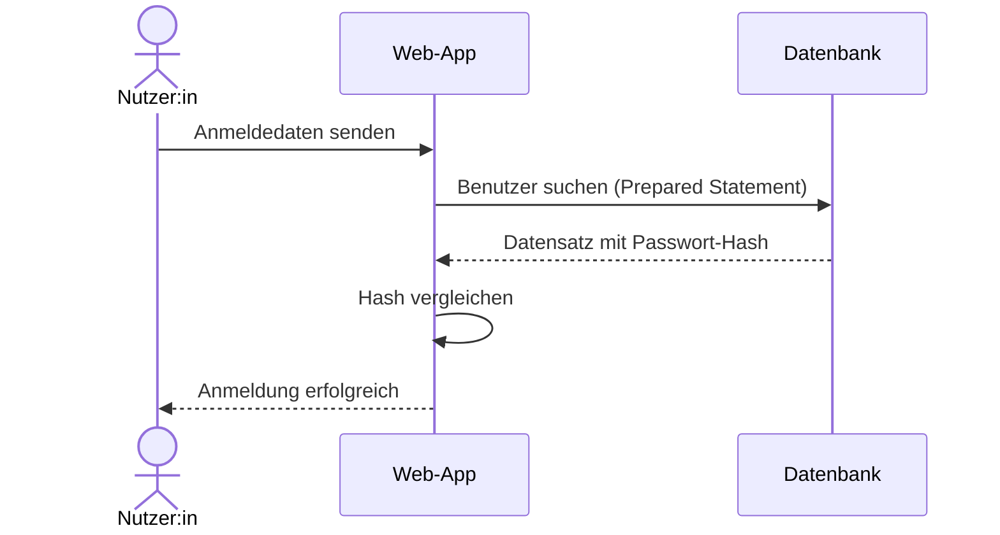
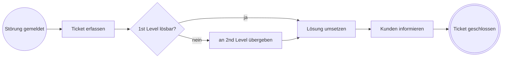

# S8 · UML und Softwareentwurf

> [!abstract] Überblick
> **Bereich:** [[Übersicht Software]]
> **Dauer:** ca. 90 min · **Prüfungsrelevanz:** ★★☆ – Anwendungsfall- und Aktivitätsdiagramme lesen und ergänzen, Klassendiagramm deuten, Werkzeuge der Softwareentwicklung zuordnen
> **Voraussetzungen:** [[S2 Programmierung – Grundlagen]], [[S3 Algorithmen, Darstellung und Testen]]
> **Berufsschule:** Lernfeld 5 – Modellierung und Programmierung

## Lernziele
- [ ] Ich kann ein Anwendungsfalldiagramm lesen und ergänzen – inklusive «include», «extend» und Generalisierung.
- [ ] Ich kann ein Aktivitätsdiagramm mit Entscheidungen, Parallelität und Swimlanes erstellen.
- [ ] Ich kann ein Klassendiagramm lesen: Attribute, Methoden, Sichtbarkeiten, Multiplizitäten, Vererbung, Aggregation und Komposition.
- [ ] Ich kann Compiler, Interpreter, Linker, IDE, Bibliothek und API unterscheiden.
- [ ] Ich kann Kriterien für die Wahl einer Programmiersprache und für eine gute Bildschirmmaske nennen.

## Worum geht es?
Bevor eine Software gebaut wird, müssen Auftraggeber und Entwickler dasselbe Bild vor Augen haben. Die **UML** (Unified Modeling Language) ist die gemeinsame Zeichensprache dafür: Wer darf was tun? In welcher Reihenfolge laufen die Schritte ab? Welche Daten und Funktionen gibt es? In der AP1 musst du solche Diagramme vor allem **lesen**, **ergänzen** und **Fehler finden**.

---

## 1. UML im Überblick
UML ist genormt (ISO/IEC 19505) und kennt **Strukturdiagramme** (was gibt es?) und **Verhaltensdiagramme** (was passiert?).

| Diagramm | Art | Zeigt | Frage |
|---|---|---|---|
| **Anwendungsfalldiagramm** (Use Case) | Verhalten | Akteure und die Funktionen, die sie nutzen | **Wer** darf **was**? |
| **Aktivitätsdiagramm** | Verhalten | Ablauf mit Entscheidungen und Parallelität | **Wie** läuft es ab? |
| **Sequenzdiagramm** | Verhalten | Nachrichten zwischen Beteiligten in zeitlicher Folge | **Wer** schickt **wann** was an wen? |
| **Klassendiagramm** | Struktur | Klassen mit Attributen, Methoden und Beziehungen | **Welche** Daten und Funktionen gibt es? |

## 2. Anwendungsfalldiagramm (Use-Case-Diagramm)
<!-- abb:uml-anwendungsfall -->
![[uml-anwendungsfall.svg]]
*Abb.: Anwendungsfalldiagramm eines Ticketsystems*

| Element | Darstellung | Bedeutung |
|---|---|---|
| **Akteur** | Strichmännchen **außerhalb** des Systems | Rolle (Person oder anderes System), die das System nutzt – eine Rolle, keine konkrete Person |
| **Anwendungsfall** | **Ellipse** innerhalb der Systemgrenze | eine Funktion mit Nutzen für den Akteur |
| **Systemgrenze** | Rechteck mit Systemnamen | was gehört zum System? |
| **Assoziation** | einfache **Linie** ohne Pfeil | Akteur nutzt den Anwendungsfall |
| **«include»** | gestrichelter Pfeil **vom Basisfall zum eingebundenen Fall** | wird **immer** mit ausgeführt (z. B. „Störung melden“ schließt „Anmelden“ ein) |
| **«extend»** | gestrichelter Pfeil **vom erweiternden Fall zum Basisfall** | wird nur **unter einer Bedingung/optional** ausgeführt (z. B. „Anhang hochladen“) |
| **Generalisierung** | durchgezogene Linie mit **hohlem Dreieck** zum allgemeineren Element | „ist ein“: Azubi erbt alle Anwendungsfälle von Mitarbeiter |

> [!tip] Anwendungsfälle richtig benennen
> **Objekt + Verb im Infinitiv** aus Sicht des Akteurs: „Störung melden“, „Rechnung erstellen“, „Gerät ausleihen“.
> Nicht: „Datenbank speichern“ (Technik), „Rechnung“ (nur Substantiv), „Button klicken“ (Bedienschritt). Das Use-Case-Diagramm zeigt **keine Reihenfolge** und **keine Technik**.

## 3. Aktivitätsdiagramm
Zeigt einen **Ablauf** mit Verzweigungen, Parallelität und Zuständigkeiten (Swimlanes).

<!-- abb:uml-aktivitaet -->
![[uml-aktivitaet.svg]]
*Abb.: Aktivitätsdiagramm mit Swimlanes, Entscheidung und Parallelisierung*

| Element | Darstellung |
|---|---|
| **Startknoten** | ausgefüllter Kreis ● |
| **Endknoten** | Kreis mit Punkt ◉ – **mehrere** Endknoten sind erlaubt (z. B. „Absage“ und „erfolgreich“) |
| **Aktion** | Rechteck mit **abgerundeten** Ecken, Beschriftung mit Verb („Rechnung erstellen“) |
| **Entscheidung** | **Raute**, die Bedingungen stehen in **eckigen Klammern an den ausgehenden Kanten**: [lieferbar] / [nicht lieferbar] |
| **Zusammenführung** | Raute, in die mehrere Pfade münden |
| **Gabelung (Fork)** | dicker **Balken**, danach laufen Aktionen **parallel** |
| **Vereinigung (Join)** | dicker Balken, der wartet, bis **alle** parallelen Pfade fertig sind |
| **Swimlanes** (Aktivitätsbereiche) | Spalten, die zeigen, **wer** eine Aktion ausführt – Pflicht, sobald mehrere Beteiligte vorkommen |

> [!tip] Raute oder Balken?
> **Raute = entweder – oder** (genau ein Weg wird genommen). **Balken = sowohl – als auch** (alle Wege laufen gleichzeitig). „Die Ware wird verpackt, **während** die Rechnung erstellt wird“ → Balken.

**Bedingungen** an einer Raute müssen **vollständig und überschneidungsfrei** sein. Falsch: [alter < 18] und [alter > 18] – was ist mit genau 18? Richtig: [alter < 18] und [alter ≥ 18].

**Schleife:** Aktion → Raute mit [weitere Positionen] zurück vor die Aktion und [keine weiteren] weiter zum nächsten Schritt.

## 4. Sequenzdiagramm
Beteiligte stehen oben nebeneinander, darunter verläuft ihre **Lebenslinie** (gestrichelt) nach unten = Zeit. Nachrichten sind waagerechte Pfeile (durchgezogen = Aufruf, gestrichelt = Antwort).


*Abb.: Sequenzdiagramm einer Anmeldung – dieselbe Darstellung nutzt der Vault bei TCP, DHCP und DNS*

<!-- erg:Katalog Vererbung -->
> [!note] Prüfungskatalog ab 2025
> Im AP1-Katalog ab 2025 ist **Vererbung als Programmierkonzept** gestrichen; **Klassen, Objekte, Attribute, Methoden, Sichtbarkeiten** und das **Lesen von Klassendiagrammen** mit ihren Beziehungen bleiben Prüfungsstoff. Das Vererbungssymbol solltest du im Diagramm deshalb erkennen – Vererbung programmieren musst du in der AP1 nicht.

## 5. Klassendiagramm
<!-- abb:uml-klassendiagramm -->
![[uml-klassendiagramm.svg]]
*Abb.: Klassendiagramm mit Vererbung, Komposition, Aggregation und Multiplizitäten*

**Aufbau einer Klasse** – drei Fächer: **Name** · **Attribute** · **Methoden**.
Schreibweise: `- inventarNr : String` (Sichtbarkeit Name : Typ) und `+ getAlter() : int` (Sichtbarkeit Name(Parameter) : Rückgabetyp).

| Sichtbarkeit | Symbol | Zugriff |
|---|---|---|
| public | **+** | von überall |
| private | **−** | nur innerhalb der Klasse |
| protected | **#** | Klasse und Unterklassen |
| package | **~** | innerhalb des Pakets |

**Warum sind Attribute meist privat?** **Kapselung:** Andere Klassen ändern Daten nur über Methoden (z. B. `setPreis()`), die Eingaben prüfen können – ein negativer Preis wird abgelehnt, statt unbemerkt gespeichert zu werden.

| Beziehung | Symbol | Bedeutung | Beispiel |
|---|---|---|---|
| **Assoziation** | Linie | kennt/nutzt | Mitarbeiter – Gerät |
| **Aggregation** | Linie mit **hohler Raute** am Ganzen | „hat“, Teil kann **allein existieren** | Abteilung ◇— Gerät |
| **Komposition** | Linie mit **gefüllter Raute** am Ganzen | „besteht aus“, Teil **stirbt mit dem Ganzen** | Notebook ◆— Akku |
| **Vererbung** | Linie mit **hohlem Dreieck** zur Oberklasse | „ist ein“, Unterklasse erbt Attribute und Methoden | Notebook ▷ Gerät |

**Multiplizitäten** stehen an den Linienenden und werden von der **gegenüberliegenden** Klasse aus gelesen: „Eine Abteilung hat **0..\*** Geräte“, „Ein Gerät gehört zu genau **1** Abteilung“.

| Angabe | Bedeutung |
|---|---|
| `1` | genau eins |
| `0..1` | keins oder eins |
| `*` bzw. `0..*` | beliebig viele (auch keins) |
| `1..*` | mindestens eins |
| `2..5` | zwei bis fünf |

**Objektorientierung kurz:** **Klasse** = Bauplan · **Objekt** = konkrete Instanz („Notebook mit Inventarnummer 4711“) · **Attribut** = Eigenschaft · **Methode** = Fähigkeit/Funktion. Vorteile gegenüber rein prozeduraler Programmierung: Wiederverwendbarkeit, Kapselung (weniger Fehler), bessere Wartbarkeit und näher an der realen Welt.

## 6. Vom Quelltext zum Programm – Werkzeuge
| Begriff | Erklärung |
|---|---|
| **Compiler** | übersetzt den **gesamten** Quelltext **vor** der Ausführung in Maschinencode (bzw. Bytecode). Fehler werden vorher gemeldet, das Programm läuft schnell. Beispiele: C, C++, Go, Rust; Java/C# kompilieren in Bytecode für eine virtuelle Maschine |
| **Interpreter** | führt ein Programm zur Laufzeit aus. Implementierungen können zuvor Bytecode erzeugen oder JIT-Kompilierung nutzen. Syntaxfehler können deshalb bereits vor der Ausführung erkannt werden. Beispiele: CPython und PowerShell; JavaScript-Engines kombinieren häufig Interpretation und JIT |
| **Linker** | verbindet die kompilierten Teile (Objektdateien) und **Bibliotheken** zu einem ausführbaren Programm |
| **IDE** | integrierte Entwicklungsumgebung: Editor mit Syntaxhervorhebung und Autovervollständigung, Compiler/Interpreter, **Debugger**, Versionsverwaltung – z. B. Visual Studio, IntelliJ, VS Code |
| **Bibliothek** (Library) | fertiger, wiederverwendbarer Code, den man ins eigene Programm einbindet (z. B. für Datumsrechnung, PDF-Erzeugung) |
| **Framework** | Grundgerüst, das den Aufbau vorgibt; das eigene Programm füllt die Lücken („Don’t call us, we call you“) |
| **API** | Programmierschnittstelle: festgelegte Funktionen, über die Programme miteinander kommunizieren – z. B. eine Web-API, die Wetterdaten als JSON liefert |
| **Debugger** | Programm schrittweise ausführen, **Haltepunkte** setzen, Variablenwerte beobachten |
| **Versionsverwaltung** | Änderungen nachvollziehen, zurückrollen und im Team zusammenführen – z. B. Git |

**Formaler und inhaltlicher Fehler:** Ein **formaler (Syntax-)Fehler** verstößt gegen die Regeln der Sprache und wird vom Compiler/Interpreter gemeldet. Ein **inhaltlicher (logischer) Fehler** läuft fehlerfrei, liefert aber ein falsches Ergebnis – nur durch Tests zu finden ([[S3 Algorithmen, Darstellung und Testen]]).

**Kriterien für die Wahl einer Programmiersprache:** Einsatzzweck (Web, Desktop, Skript, Embedded) · vorhandenes Know-how im Team · Plattform/Betriebssystem · verfügbare Bibliotheken und Frameworks · Performance · Lizenzkosten und Langzeitunterstützung · Integration in bestehende Systeme.

## 7. Bildschirmmasken entwerfen
| Entwurfsstufe | Inhalt |
|---|---|
| **Skizze / Wireframe** | grobes Layout aus Kästen und Platzhaltern: **wo** steht **was**? Ohne Farben und Design, schnell änderbar |
| **Mockup** | realistische, **statische** Gestaltung mit Farben, Schriften, Icons – so soll es aussehen |
| **Prototyp** | **klickbar**, zeigt Abläufe; eignet sich für Tests mit echten Nutzern |

**Kriterien für eine gute Maske** (vgl. Software-Ergonomie in [[P5 Arbeitsplatz, Ergonomie und Umwelt]]):
- logische Reihenfolge der Felder (wie auf dem Papierformular), Tab-Reihenfolge stimmt
- Pflichtfelder gekennzeichnet, verständliche **Beschriftungen** direkt am Feld
- Eingaben werden geprüft, **Fehlermeldungen** sagen, was zu tun ist
- ausreichender **Kontrast**, skalierbare Schrift, Bedienung per **Tastatur**, nicht nur Farbe als Signal (**Barrierefreiheit**)
- einheitliche Gestaltung, sinnvolle Vorbelegungen, Auswahllisten statt Freitext, wo möglich

<!-- erg:BPMN -->
## 8. Geschäftsprozesse mit BPMN
**BPMN** (Business Process Model and Notation) modelliert **Geschäftsprozesse** – auch über Abteilungs- und Unternehmensgrenzen hinweg. Sie ähnelt dem Aktivitätsdiagramm, ist aber auf Abläufe im Betrieb ausgerichtet.

| Element | Symbol | Bedeutung |
|---|---|---|
| **Pool** | großes Rechteck | ein Beteiligter/Organisation (z. B. Kunde, Systemhaus) |
| **Lane** (Bahn) | Streifen im Pool | Rolle/Abteilung innerhalb der Organisation |
| **Startereignis** | Kreis mit **dünnem** Rand | Auslöser des Prozesses („Störung gemeldet“) |
| **Zwischenereignis** | Kreis mit **doppeltem** Rand | etwas passiert währenddessen (Nachricht, Timer „3 Tage warten“) |
| **Endereignis** | Kreis mit **dickem** Rand | Prozessende |
| **Aufgabe** (Task) | Rechteck mit **abgerundeten** Ecken | Tätigkeit („Ticket erfassen“) |
| **exklusives Gateway (XOR)** | Raute mit **X** (oder leer) | **genau ein** Weg wird genommen |
| **paralleles Gateway (AND)** | Raute mit **+** | **alle** Wege laufen parallel bzw. warten aufeinander |
| **inklusives Gateway (OR)** | Raute mit **Kreis** | ein oder mehrere Wege |
| **Sequenzfluss** | durchgezogener Pfeil | Reihenfolge **innerhalb** eines Pools |
| **Nachrichtenfluss** | **gestrichelter** Pfeil | Kommunikation **zwischen** Pools |
| **Datenobjekt** | Blatt mit Eselsohr | benötigtes/erzeugtes Dokument |


*Abb.: vereinfachter Serviceprozess – in BPMN: Start- und Endereignis, Aufgaben, exklusives Gateway (hier mit Mermaid angenähert)*

Ältere Alternative: die **EPK** (ereignisgesteuerte Prozesskette) mit abwechselnd Ereignissen und Funktionen.

---

> [!warning] Typische Fehler in Prüfungen
> - Im Use-Case-Diagramm eine Reihenfolge darstellen oder Anwendungsfälle wie Bedienschritte benennen.
> - «include» und «extend» vertauschen – bei «extend» zeigt der Pfeil **zum Basisfall**.
> - Parallelität mit einer Raute zeichnen (richtig: Balken) oder den Join-Balken vergessen.
> - Bedingungen an der Raute, die nicht alle Fälle abdecken oder sich überschneiden.
> - Aggregation und Komposition verwechseln – Kriterium: Kann das Teil ohne das Ganze existieren?
> - Multiplizität an das falsche Linienende schreiben.
> - Compiler und Interpreter nur als „schnell/langsam“ unterscheiden, ohne den Zeitpunkt der Übersetzung zu nennen.

### Ergänzung: Entwurfsrichtung und UML-Sichten
- **Top-down:** Die Gesamtaufgabe wird schrittweise in Teilaufgaben und Module zerlegt. **Bottom-up:** Aus vorhandenen Bausteinen (Bibliotheken, Klassen) entsteht das Gesamtsystem. Häufig werden beide kombiniert.
- **Statische Sicht** (Struktur): Klassen- und Objektdiagramm. **Dynamische Sicht** (Verhalten): Aktivitäts-, Sequenz- und Zustandsdiagramm.

## Verwandte Themen
- [[S7 Datenbanken]] – Datenmodell der Anwendung
- [[S3 Algorithmen, Darstellung und Testen]] – Pseudocode, Schreibtischtest und Testen
- [[P1 Projektmanagement und Vorgehensmodelle]] – Anforderungen aus dem Lastenheft

## Zusammenfassung
- Use Case: wer darf was – Akteure außen, Ellipsen innen, ==🟢«include» immer, «extend» optional==.
- Aktivitätsdiagramm: Start ●, Ende ◉, Aktion, Raute mit [Bedingungen], Balken für Parallelität, Swimlanes für Zuständigkeiten.
- Klassendiagramm: Name/Attribute/Methoden, + − # ~, Multiplizitäten, ==🔴◇ Aggregation, ◆ Komposition, ▷ Vererbung==.
- Compiler übersetzt Code in eine andere Darstellung (z. B. Maschinen- oder Bytecode), Interpreter führt Programme aus; Mischformen und JIT sind möglich; Linker bindet zusammen; IDE, Bibliothek, Framework, API.
- Wireframe → Mockup → Prototyp; Masken logisch, geprüft, barrierefrei.

## Selbstcheck
```dataviewjs
await dv.view("AP1/99 System/views/quiz", { modul: "S8" })
```

**Weitere Aufgaben:** [[Aufgaben Software#S8 UML und Softwareentwurf]] · **Karteikarten:** [[Karten Software]]

## Einschätzung
```dataviewjs
await dv.view("AP1/99 System/views/selbstcheck")
```

---
← [[S7 Datenbanken]] · Weiter: [[S9 KI und Unternehmenssoftware]] →
