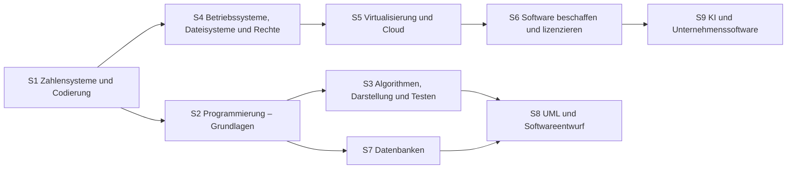

# Übersicht Software

Zahlensysteme, Programmlogik und Modellierung, Betriebssysteme, Virtualisierung und Lizenzen.

## Lernpfad

*Pfeile: empfohlene Reihenfolge – was links steht, hilft beim Verständnis rechts.*

## Module
|                                                     | Modul                                    | Inhalt                                                       |
| --------------------------------------------------- | ---------------------------------------- | ------------------------------------------------------------ |
| [[S1 Zahlensysteme und Codierung\|S1]]              | Zahlensysteme und Codierung              | Binär, Hex, Zweierkomplement, Codierung                      |
| [[S2 Programmierung – Grundlagen\|S2]]              | Programmierung – Grundlagen              | Datentypen, Verzweigung, Schleifen, Funktionen               |
| [[S3 Algorithmen, Darstellung und Testen\|S3]]      | Algorithmen, Darstellung und Testen      | UML-Aktivitätsdiagramm, Pseudocode, Schreibtischtest, Testen |
| [[S4 Betriebssysteme, Dateisysteme und Rechte\|S4]] | Betriebssysteme, Dateisysteme und Rechte | Boot, Dateisysteme, Rechte, Rollout                          |
| [[S5 Virtualisierung und Cloud\|S5]]                | Virtualisierung und Cloud                | Hypervisor, Container, Cloud-Modelle                         |
| [[S6 Software beschaffen und lizenzieren\|S6]]      | Software beschaffen und lizenzieren      | Standard vs. Individual, Lizenzmodelle, Open Source          |
| [[S7 Datenbanken\|S7]]                              | Datenbanken                              | ER-Modell, Schlüssel, Anomalien, Normalisierung              |
| [[S8 UML und Softwareentwurf\|S8]]                  | UML und Softwareentwurf                  | Use Case, Aktivität, Klassen, BPMN, Werkzeuge                |
| [[S9 KI und Unternehmenssoftware\|S9]]              | KI und Unternehmenssoftware              | KI-Einsatz, Chatbots, Risiken, ERP/CRM/DMS                   |

## Üben
- **Aufgaben im IHK-Stil:** [[Aufgaben Software]]
- **Karteikarten:** [[Karten Software]]
- **Rechentrainer und Quiz:** [[Trainer]] · [[Quiz]]

← [[Start]]
