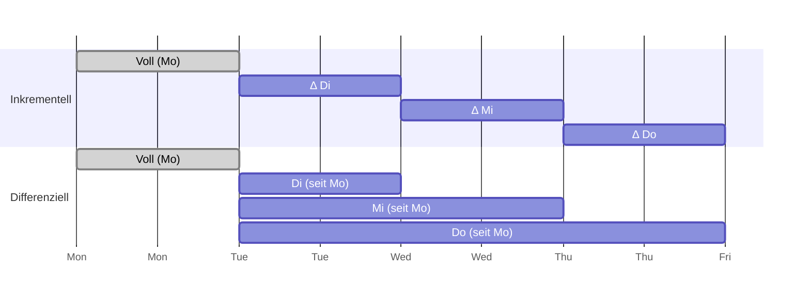

# I3 · Datensicherung

> [!abstract] Überblick
> **Bereich:** [[Übersicht IT-Sicherheit]]
> **Dauer:** ca. 90 min · **Prüfungsrelevanz:** ★★★ – Sicherungsarten, Speicherbedarf und Wiederherstellung sind klassische Rechen- und Erklärungsaufgaben
> **Voraussetzungen:** [[H4 Server und Netzwerkspeicher]]
> **Berufsschule:** Evp-CPS LF3 LS3.5 (Backupstrategien)

## Lernziele
- [ ] Ich kann Voll-, differenzielle und inkrementelle Sicherung erklären und vergleichen.
- [ ] Ich kann Speicherbedarf und benötigte Sicherungen für eine Wiederherstellung berechnen.
- [ ] Ich kann die 3-2-1-Regel und das Generationenprinzip anwenden.
- [ ] Ich kann Backupmedien auswählen und ein Backupkonzept (inkl. RPO/RTO, Restore-Tests) entwerfen.
- [ ] Ich kann Backup von Archivierung, Spiegelung, Snapshot und RAID abgrenzen.

## Worum geht es?
„Wir haben doch ein Backup!“ – bis sich herausstellt, dass die Sicherung seit drei Monaten fehlschlägt, auf demselben NAS liegt, das die Ransomware gerade verschlüsselt hat, oder niemand weiß, wie man sie zurückspielt. Ein gutes Backupkonzept beantwortet: **Was** wird **wie oft**, **womit**, **wohin** gesichert, **wie lange** aufbewahrt – und **wie** und **wie schnell** wiederhergestellt?

---

## 1. Sicherungsarten

| Art | sichert | Dauer/Speicher | Wiederherstellung benötigt | Archivbit |
|---|---|---|---|---|
| **Vollsicherung** | **alle** ausgewählten Daten | langsam, viel Platz | **nur die letzte Vollsicherung** | wird zurückgesetzt |
| **Differenzielle Sicherung** | alle Änderungen **seit der letzten Vollsicherung** | wächst von Tag zu Tag | **Voll + letzte differenzielle** | bleibt gesetzt |
| **Inkrementelle Sicherung** | alle Änderungen **seit der letzten Sicherung (egal welcher Art)** | schnell, wenig Platz | **Voll + alle inkrementellen** seitdem, in richtiger Reihenfolge | wird zurückgesetzt |

**Archivbit:** Dateiattribut, das beim Ändern einer Datei gesetzt wird. Voll- und inkrementelle Sicherung setzen es zurück, die differenzielle nicht – deshalb „sieht“ die differenzielle Sicherung alle Änderungen seit der letzten Vollsicherung. (Moderne Backupsoftware nutzt stattdessen Zeitstempel, Änderungsjournale oder Blockvergleiche – das Prinzip ist dasselbe.)



> [!example] Beispiel durchgerechnet
> Montag Vollsicherung **800 GB**, Dienstag bis Freitag täglich eine Teilsicherung, jeden Tag ändern sich **40 GB** (immer andere Daten). Freitagabend nach der Sicherung fällt der Server aus.
>
> | | inkrementell | differenziell |
> |---|---|---|
> | Di | 40 GB | 40 GB |
> | Mi | 40 GB | 80 GB |
> | Do | 40 GB | 120 GB |
> | Fr | 40 GB | 160 GB |
> | **Speicher gesamt** | 800 + 160 = **960 GB** | 800 + 400 = **1 200 GB** |
> | **Restore** | Mo + Di + Mi + Do + Fr = **5 Sicherungen** | Mo + Fr = **2 Sicherungen** |
>
> Merke: **Inkrementell spart Speicher und Sicherungszeit, differenziell spart Wiederherstellungszeit** und ist robuster (fällt ein Inkrement aus, sind alle folgenden wertlos).

<!-- abb:backup-arten -->
![[backup-arten.svg]]
*Abb.: Voll-, differenzielle und inkrementelle Sicherung im Wochenverlauf*

<!-- erg:Hot und Cold Backup -->
### Hot und Cold Backup
- **Cold Backup (Offline):** Dienst bzw. Datenbank wird **angehalten**, dann gesichert – die Daten sind garantiert **konsistent**, dafür gibt es eine **Ausfallzeit**.
- **Hot Backup (Online):** Sicherung im **laufenden Betrieb** – keine Ausfallzeit, aber die Software muss Konsistenz sicherstellen (z. B. Datenbank-Backupfunktion, Snapshots, Volumeschattenkopie unter Windows).

### Weitere Verfahren
| Verfahren | Beschreibung | Einordnung |
|---|---|---|
| **Image-Sicherung** | ganzes Laufwerk inkl. Betriebssystem als Abbild | schnelle Komplettwiederherstellung (**Bare-Metal-Restore**) |
| **Spiegelung/Replikation** | Daten werden (nahezu) in Echtzeit auf ein zweites System kopiert | hohe Verfügbarkeit – **aber** Löschungen und Verschlüsselung werden mitkopiert → **kein** Backup-Ersatz |
| **Snapshot** | Momentaufnahme auf demselben Speicher | schnelles Zurückrollen, **kein** Backup-Ersatz (gleicher Datenträger) |
| **Versionierung** | mehrere Stände einer Datei behalten | Schutz vor versehentlichem Überschreiben |
| **Archivierung** | Daten werden **langfristig und unveränderbar** aufbewahrt und oft vom Produktivsystem entfernt | Zweck: rechtliche Aufbewahrung (z. B. Buchungsbelege 8 Jahre, Bücher und Jahresabschlüsse 10 Jahre, Geschäftsbriefe und geschäftliche E-Mails 6 Jahre) – nicht Wiederherstellung |
| **Deduplizierung** | identische Blöcke werden nur einmal gespeichert | spart Backupspeicher |

---

## 2. Strategien

### 3-2-1-Regel

<!-- abb:regel-3-2-1 -->
![[regel-3-2-1.svg]]
*Abb.: Die 3-2-1-Regel*

- **3** Kopien der Daten (Original + 2 Sicherungen)
- auf **2** unterschiedlichen Medientypen/Systemen
- **1** Kopie **außer Haus** (offsite: anderer Standort, Bankschließfach, Cloud)
Erweiterung **3-2-1-1-0:** zusätzlich **1** Kopie **offline oder unveränderbar (immutable)** gegen Ransomware, **0** Fehler bei der Überprüfung (Restore-Tests).

### Generationenprinzip (Großvater – Vater – Sohn)
| Generation | Rhythmus | Aufbewahrung (Beispiel) |
|---|---|---|
| **Sohn** | täglich (Mo–Do) | 1 Woche, Medien werden überschrieben |
| **Vater** | wöchentlich (Fr) | 4 Wochen |
| **Großvater** | monatlich | 12 Monate |
Vorteil: Man kann auf viele verschiedene Stände zurückgreifen (z. B. einen Fehler, der erst nach drei Wochen auffällt) bei überschaubarer Anzahl Medien.

### Kennzahlen
- **RPO** (Recovery Point Objective): maximal tolerierbarer **Datenverlust** als Zeitraum → bestimmt die **Sicherungshäufigkeit** (RPO 1 h → mindestens stündlich sichern)
- **RTO** (Recovery Time Objective): maximal tolerierbare **Ausfallzeit** bis zur Wiederherstellung → bestimmt **Verfahren und Medien** (Image, schnelle Platten, Ersatzhardware)

### Backupkonzept – Inhalte
Was wird gesichert (Datenbanken, Fileserver, VMs, Postfächer, Konfigurationen)? · Wie oft und wann (Backupfenster)? · Sicherungsart · Medien und Speicherort · Aufbewahrungsfristen und Generationen · **Verschlüsselung** (Datenschutz!) · Verantwortliche und Vertretung · **Überwachung** (Protokolle, Fehlermeldungen) · **Regelmäßige Restore-Tests** · Dokumentation/Notfallhandbuch.

> [!danger] Ein ungetestetes Backup ist kein Backup
> Sicherungen können unbemerkt fehlschlagen, unvollständig oder beschädigt sein. Nur ein **regelmäßiger Test der Wiederherstellung** beweist, dass man im Ernstfall die Daten zurückbekommt – und wie lange das dauert (RTO!).

---

## 3. Backupmedien

| Medium | Vorteile | Nachteile | Einsatz |
|---|---|---|---|
| **externe HDD/SSD** | günstig, einfach, schnell | leicht zu verlieren/beschädigen, bei Dauerverbindung ransomware-gefährdet | kleine Betriebe, rotierende Offline-Kopien |
| **NAS** | zentral, automatisierbar, RAID, Snapshots | im Netzwerk erreichbar → angreifbar, gleicher Standort | tägliches Backup-Ziel |
| **Bandlaufwerk (LTO)** | sehr günstig pro TB, lange haltbar (30 Jahre), **offline** (Air Gap), WORM-Medien | Anschaffung Laufwerk teuer, sequenzieller Zugriff, langsamer Restore einzelner Dateien | große Datenmengen, Archiv, Offsite |
| **Cloud-Backup** | automatisch offsite, skalierbar | abhängig von Internetbandbreite (Restore großer Mengen dauert!), Datenschutz/AVV, laufende Kosten | Offsite-Kopie, kleine Firmen |
| **optische Medien** | unveränderbar | kleine Kapazität | kaum noch |

**Schutz vor Ransomware:** Backups **offline** oder **unveränderbar** (Immutable Storage, WORM), getrennte Zugangsdaten für das Backupsystem (nicht in der Domäne), MFA, Backup-Server nicht aus dem normalen Netz erreichbar.

---

> [!warning] Typische Fehler in Prüfungen
> - Inkrementell und differenziell vertauschen (**inkrementell = seit letzter Sicherung**, **differenziell = seit letzter Vollsicherung**).
> - Beim Restore inkrementeller Sicherungen nur die letzte nennen.
> - Speicherbedarf der differenziellen Sicherung linear statt aufsummiert rechnen.
> - RAID, Spiegelung oder Snapshots als Backup bezeichnen.
> - Backup auf dem **gleichen** System/Standort speichern und das als ausreichend bewerten.

### Ergänzung: LTFS
**LTFS** (Linear Tape File System) macht den Inhalt eines LTO-Bandes wie ein Laufwerk mit Ordnern und Dateien nutzbar (Inhaltsverzeichnis auf dem Band). Der Zugriff bleibt **sequenziell**: Einzelne Dateien dauern wegen des Spulens länger als von der Festplatte.

## Verwandte Themen
- [[H4 Server und Netzwerkspeicher]] – RAID ist kein Backup
- [[I5 Bedrohungen und Schutzmaßnahmen]] – Schutz vor Ransomware
- [[P3 IT-Service, Support und Qualität]] – RTO und RPO im Service

## Zusammenfassung
- Voll: alles · Differenziell: seit letzter Voll (==🟢Restore: Voll + letzte Diff==) · Inkrementell: seit letzter Sicherung (Restore: Voll + alle Inkremente).
- Speicher: inkrementell = Voll + n × Δ; differenziell = Voll + Δ + 2Δ + … + nΔ.
- 3-2-1(-1-0), Generationenprinzip Großvater–Vater–Sohn.
- ==🟡RPO = max. Datenverlust (Häufigkeit), RTO = max. Ausfallzeit (Verfahren)==.
- Medien: HDD/NAS/Band/Cloud; Offline/Immutable gegen Ransomware; Restore testen.
- RAID, Spiegelung, ==🔴Snapshot ≠ Backup; Archivierung ≠ Backup==.

## Direkt üben
```dataviewjs
await dv.view("AP1/99 System/views/trainer", { typen: ["backup"] })
```

## Selbstcheck
```dataviewjs
await dv.view("AP1/99 System/views/quiz", { modul: "I3" })
```

**Weitere Aufgaben:** [[Aufgaben IT-Sicherheit#I3 Datensicherung]] · **Karteikarten:** [[Karten IT-Sicherheit]]

## Einschätzung
```dataviewjs
await dv.view("AP1/99 System/views/selbstcheck")
```

---
← [[I2 Datenschutz]] · Weiter: [[I4 Kryptografie]] →
