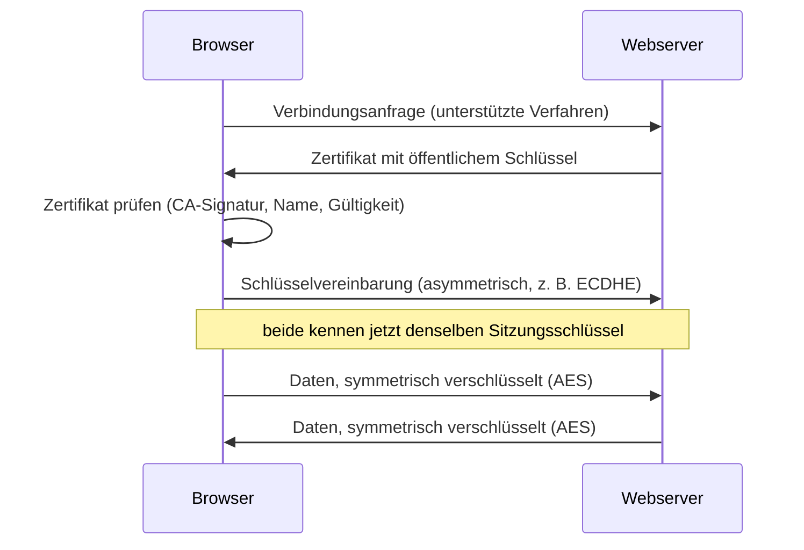

# I4 · Kryptografie

> [!abstract] Überblick
> **Bereich:** [[Übersicht IT-Sicherheit]]
> **Dauer:** ca. 2 h · **Prüfungsrelevanz:** ★★★ – symmetrisch/asymmetrisch/hybrid, Signatur und Hash werden sehr häufig gefragt
> **Voraussetzungen:** [[I1 Informationssicherheit und IT-Grundschutz]]
> **Berufsschule:** ITG LF4 (Verschlüsselungsverfahren, TLS) · SuD LF5 LS5.4 (Passwort-Hashing mit hashlib)

## Lernziele
- [ ] Ich kann symmetrische und asymmetrische Verschlüsselung erklären, vergleichen und die Schlüsselanzahl berechnen.
- [ ] Ich kann das hybride Verfahren (z. B. TLS) begründen.
- [ ] Ich kann Hashfunktionen und ihre Einsatzzwecke (Integrität, Passwortspeicherung) erklären.
- [ ] Ich kann den Ablauf einer digitalen Signatur beschreiben und die richtigen Schlüssel zuordnen.
- [ ] Ich kann Zertifikate, CA und PKI erklären und typische Anwendungen (BitLocker, VPN, S/MIME, HTTPS) zuordnen.

## Worum geht es?
Angebote an Kunden per Mail, Zugriff aus dem Homeoffice, das Notebook im Zug, der Webshop mit Kundendaten: Überall müssen Daten **vertraulich**, **unverändert** und **echt** bleiben. Kryptografie liefert die Werkzeuge. In der Prüfung wird selten gerechnet, aber sehr oft **erklärt und zugeordnet**: Welcher Schlüssel wofür?

---

## 1. Grundbegriffe
- **Klartext** → *Verschlüsselung* mit **Schlüssel** → **Geheimtext (Chiffrat)** → *Entschlüsselung* → Klartext
- **Kerckhoffs-Prinzip:** Die Sicherheit darf nur vom **Schlüssel** abhängen, nicht von der Geheimhaltung des Verfahrens. Gute Verfahren (AES, RSA) sind öffentlich und geprüft.
- **Schlüssellänge:** Jedes zusätzliche Bit verdoppelt die Anzahl möglicher Schlüssel (Brute Force).

## 2. Symmetrische Verschlüsselung
**Ein gemeinsamer, geheimer Schlüssel** zum Ver- und Entschlüsseln.

| Vorteile | Nachteile |
|---|---|
| **sehr schnell**, auch für große Datenmengen | **Schlüsselaustausch**: Wie kommt der Schlüssel sicher zum Partner? |
| wenig Rechenaufwand | **viele Schlüssel** nötig: für n Personen **n · (n − 1) / 2** |
| | keine Authentizität (jeder mit dem Schlüssel könnte die Nachricht erstellt haben) |

Verfahren: **AES** (128/192/256 Bit, Standard), ChaCha20; veraltet/unsicher: DES, 3DES, RC4.
Einsatz: Festplattenverschlüsselung (BitLocker, VeraCrypt), verschlüsselte Backups/Archive, WLAN (WPA2/3 mit AES), die eigentliche Datenübertragung bei TLS/VPN.

> [!example] Schlüsselanzahl
> 10 Personen, jede soll mit jeder vertraulich kommunizieren: 10 · 9 / 2 = **45** symmetrische Schlüssel. Bei 100 Personen schon 4 950.

## 3. Asymmetrische Verschlüsselung (Public-Key-Verfahren)
Jede Person hat ein **Schlüsselpaar**:
- **öffentlicher Schlüssel (Public Key):** darf jeder kennen, wird verteilt
- **privater Schlüssel (Private Key):** bleibt **geheim** beim Besitzer

Was mit dem einen Schlüssel verschlüsselt wird, lässt sich nur mit dem **anderen** des Paares entschlüsseln.

| Ziel | womit? | Wer kann es rückgängig machen/prüfen? |
|---|---|---|
| **Vertraulichkeit** – Nachricht an Bob verschlüsseln | mit **Bobs öffentlichem** Schlüssel | nur Bob mit **seinem privaten** Schlüssel |
| **Signatur** – beweisen, dass Alice es war | mit **Alices privatem** Schlüssel | jeder mit **Alices öffentlichem** Schlüssel |

| Vorteile | Nachteile |
|---|---|
| kein geheimer Schlüsselaustausch nötig | **langsam** (ca. 100–1 000× langsamer) → ungeeignet für große Daten |
| nur **2 · n** Schlüssel (n Schlüsselpaare) | Echtheit des öffentlichen Schlüssels muss sichergestellt werden (→ Zertifikate) |
| ermöglicht Signaturen (Authentizität, Nichtabstreitbarkeit) | |

Verfahren: **RSA** (heute ≥ 3 072 Bit empfohlen), **ECC** (elliptische Kurven, kürzere Schlüssel bei gleicher Sicherheit), **Diffie-Hellman** (Schlüsselvereinbarung).

<!-- abb:verschluesselung -->
![[verschluesselung.svg]]
*Abb.: Symmetrische und asymmetrische Verschlüsselung im Vergleich*

## 4. Hybride Verschlüsselung
Kombiniert die Stärken beider Verfahren:
1. Ein zufälliger **Sitzungsschlüssel** (symmetrisch) wird erzeugt.
2. Dieser wird **asymmetrisch** ausgetauscht bzw. vereinbart (mit dem Public Key des Partners oder per Diffie-Hellman).
3. Die eigentlichen Daten werden **symmetrisch** (AES) verschlüsselt – schnell.

Einsatz: **TLS/HTTPS**, **VPN** (IPsec, WireGuard, OpenVPN), **S/MIME** und **PGP** bei E-Mails, SSH.



> [!tip] Faustregel
> - Eigene Daten ohne Austausch mit anderen (Festplatte, Backup) → **symmetrisch** (AES)
> - Kommunikation mit Partnern → **hybrid** (TLS, S/MIME, VPN)

---

## 5. Hashfunktionen
Eine **Hashfunktion** berechnet aus beliebig großen Daten einen **Hashwert fester Länge** („digitaler Fingerabdruck“).

Eigenschaften: **Einwegfunktion** (nicht umkehrbar) · gleiche Eingabe → gleicher Hash · **kleinste Änderung → völlig anderer Hash** (Lawineneffekt) · **kollisionsresistent** (praktisch keine zwei Eingaben mit gleichem Hash).

| sicher | unsicher (nicht mehr verwenden) |
|---|---|
| **SHA-256**, SHA-512, SHA-3 | MD5, SHA-1 |

**Einsatz:**
- **Integritätsprüfung:** Prüfsumme einer heruntergeladenen Datei vergleichen; Manipulation erkennen
- **Passwortspeicherung:** Datenbanken speichern **nie das Passwort**, sondern einen Hash. Beim Login wird die Eingabe gehasht und verglichen. Zusätzlich **Salt** (Zufallswert je Benutzer, verhindert Rainbow-Tables und gleiche Hashes bei gleichen Passwörtern) und **langsame** Verfahren (**bcrypt, scrypt, Argon2, PBKDF2**) gegen Brute Force
- Grundlage der **digitalen Signatur**
- Deduplizierung, Blockchain

> [!info] Hash ≠ Verschlüsselung
> Verschlüsselung ist umkehrbar (mit Schlüssel), ein Hash nicht. „Passwörter werden verschlüsselt gespeichert“ ist streng genommen falsch – sie werden **gehasht**.

## 6. Digitale Signatur
**Ablauf beim Signieren (Alice):**
1. Hashwert des Dokuments berechnen
2. Aus Hash und **Alices privatem Schlüssel** berechnet das Signaturverfahren die **Signatur**. (Prüfungs-Merksatz: mit eigenem privaten Schlüssel signieren.)
3. Dokument + Signatur versenden

**Prüfen (Bob):**
1. Signatur mit **Alices öffentlichem Schlüssel** kryptografisch prüfen
2. selbst den Hash des empfangenen Dokuments berechnen → Hash B
3. Ist die Prüfung erfolgreich und stimmt der Dokument-Hash, sind **Integrität** und die Zuordnung zum passenden privaten Schlüssel (**Authentizität**) nachgewiesen. Eine Signatur ist keine Verschlüsselung; moderne Verfahren wie ECDSA/RSA-PSS „verschlüsseln“ den Hash nicht. Nichtabstreitbarkeit hängt außerdem von Schlüsselkontrolle, Identitätsprüfung und rechtlichem Kontext ab.

Eine Signatur sorgt **nicht** für Vertraulichkeit – das Dokument ist lesbar, solange es nicht zusätzlich verschlüsselt wird.

## 7. Zertifikate und PKI
Problem: Woher weiß Bob, dass der öffentliche Schlüssel wirklich Alice gehört (und nicht einem Angreifer)?
- Ein **digitales Zertifikat** (Standard **X.509**) bestätigt die Zuordnung **öffentlicher Schlüssel ↔ Identität** (Person, Firma, Domain) und enthält Aussteller, Gültigkeitszeitraum, Verwendungszweck.
- Ausgestellt und **signiert** von einer **Zertifizierungsstelle (CA, Certificate Authority)**.
- **Vertrauenskette:** Root-CA → Zwischen-CA → Endzertifikat. Die Zertifikate der Root-CAs sind im Betriebssystem/Browser vorinstalliert.
- **PKI** (Public Key Infrastructure): Gesamtsystem aus CA, Registrierungsstelle, Verzeichnisdienst und **Sperrlisten** (CRL/OCSP für kompromittierte Zertifikate).
- Beispiele: **Let's Encrypt** (kostenlose TLS-Zertifikate), firmeninterne CA für WLAN (802.1X/EAP-TLS) und S/MIME.

---

## 8. Anwendungen im Überblick
| Bereich | Lösung | Verfahren |
|---|---|---|
| Festplatte/Notebook | **BitLocker** (mit TPM), FileVault, LUKS | symmetrisch (AES) |
| Web | **HTTPS** (TLS 1.2/1.3) | hybrid |
| Fernzugriff, Standortkopplung | **VPN** (IPsec, WireGuard, OpenVPN), **SSH** | hybrid |
| E-Mail Inhalt | **S/MIME** (Zertifikate, CA), **PGP** (Web of Trust) | hybrid + Signatur |
| E-Mail Transport | STARTTLS, SMTPS | TLS – nur Transport, nicht Ende-zu-Ende |
| WLAN | **WPA3**/WPA2 | AES |
| Messenger | Signal-Protokoll | Ende-zu-Ende, hybrid |

**Transport- vs. Ende-zu-Ende-Verschlüsselung:** Bei Transportverschlüsselung ist die Verbindung zwischen zwei Stationen gesichert, der Server kann die Daten aber lesen. Bei **Ende-zu-Ende** können nur Absender und Empfänger lesen.

---

> [!warning] Typische Fehler in Prüfungen
> - Beim Verschlüsseln an Bob den **eigenen** statt Bobs öffentlichen Schlüssel nennen.
> - Beim Signieren den öffentlichen statt des **privaten** Schlüssels nennen.
> - Hash als umkehrbare Verschlüsselung beschreiben.
> - Behaupten, asymmetrische Verfahren seien „besser“ – sie sind langsamer; deshalb hybrid.
> - Formel für Schlüsselanzahl verwechseln: symmetrisch n(n−1)/2, asymmetrisch 2n.

## Verwandte Themen
- [[N4 Netzwerkdienste und Protokolle]] – HTTPS und sichere Mailprotokolle
- [[I2 Datenschutz]] – Verschlüsselung als TOM
- [[N6 WLAN]] – WLAN-Verschlüsselung

## Zusammenfassung
- Symmetrisch (AES): ein Schlüssel, schnell, Problem Schlüsselaustausch, ==🔵n(n−1)/2 Schlüssel==.
- Asymmetrisch (RSA, ECC): Schlüsselpaar, langsam, 2n Schlüssel; ==🟢verschlüsseln mit Public Key des Empfängers, signieren mit eigenem Private Key==.
- Hybrid (TLS, VPN, S/MIME): asymmetrischer Schlüsselaustausch + symmetrische Daten.
- Hash (SHA-256): Einweg, Integrität, Passwörter mit Salt + bcrypt/Argon2; ==🔴MD5/SHA-1 unsicher==.
- Signatur: Signaturverfahren + Hash + privater Schlüssel; Prüfung mit öffentlichem Schlüssel → Integrität und Authentizität (keine Vertraulichkeit). Keine pauschale rechtliche Nichtabstreitbarkeit.
- Zertifikat (X.509) bestätigt Public Key ↔ Identität, signiert von einer CA; PKI mit Sperrlisten.

## Direkt üben
```dataviewjs
await dv.view("AP1/99 System/views/trainer", { typen: ["schluessel"] })
```

## Selbstcheck
```dataviewjs
await dv.view("AP1/99 System/views/quiz", { modul: "I4" })
```

**Weitere Aufgaben:** [[Aufgaben IT-Sicherheit#I4 Kryptografie]] · **Karteikarten:** [[Karten IT-Sicherheit]]

## Einschätzung
```dataviewjs
await dv.view("AP1/99 System/views/selbstcheck")
```

---
← [[I3 Datensicherung]] · Weiter: [[I5 Bedrohungen und Schutzmaßnahmen]] →
