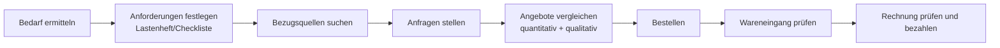

# W1 · Beschaffung und Kalkulation

> [!abstract] Überblick
> **Bereich:** [[Übersicht Wirtschaft]]
> **Dauer:** ca. 2,5 h · **Prüfungsrelevanz:** ★★★ – Bezugskalkulation und Angebotsvergleich sind feste Bestandteile der AP1
> **Voraussetzungen:** Prozentrechnung · **Danach:** [[W2 Nutzwertanalyse und Entscheidungen]]
> **Berufsschule:** GiD LF2 LS2.1 (Raspberry-Pi-Beschaffung), LS2.4 (Kalkulation für einen Kunden-PC)

## Lernziele
- [ ] Ich kann den Beschaffungsprozess von der Bedarfsermittlung bis zur Rechnungsprüfung beschreiben.
- [ ] Ich kann Anfrage, Angebot und Anpreisung rechtlich unterscheiden und die Bestandteile eines Angebots nennen.
- [ ] Ich kann eine Bezugskalkulation (Listenpreis → Bezugspreis) rechnen und Angebote quantitativ vergleichen.
- [ ] Ich kann mit Umsatzsteuer rechnen (netto ↔ brutto).
- [ ] Ich kann eine Verkaufspreiskalkulation vorwärts und rückwärts durchführen.

## Worum geht es?
Für den Schulungsraum werden 15 Notebooks gebraucht. Drei Händler schicken Angebote mit unterschiedlichen Preisen, Rabatten, Skonti und Lieferkosten. Welches ist wirklich das günstigste? Und umgekehrt: Wenn dein Ausbildungsbetrieb einem Kunden einen PC zusammenstellt – welchen Preis muss er verlangen, damit Kosten gedeckt sind und Gewinn bleibt?

---

## 1. Der Beschaffungsprozess


**Bezugsquellen:** Stammlieferanten, Onlinehändler/Marktplätze, Distributoren, Hersteller, Messen, Ausschreibungsportale.
**Bedarf:** Welche Menge? Welche Qualität/Anforderungen? Bis wann? Welches Budget?

## 2. Anfrage, Angebot, Bestellung
| Begriff | rechtliche Bedeutung |
|---|---|
| **Anfrage** | Bitte um ein Angebot – **unverbindlich** |
| **Anpreisung** (Werbung, Katalog, Webshop-Artikel, Schaufenster) | an die Allgemeinheit gerichtet → **unverbindlich**, nur Aufforderung, selbst ein Angebot abzugeben |
| **Angebot** | an eine **bestimmte Person** gerichtete Willenserklärung → **verbindlich** (Antrag), außer mit **Freizeichnungsklausel** („freibleibend“, „solange Vorrat reicht“, „unverbindlich“) |
| **Bestellung** | Annahme eines Angebots → **Kaufvertrag** entsteht; Bestellung ohne vorheriges Angebot = Antrag, Vertrag erst mit Annahme (Auftragsbestätigung/Lieferung) |

**Bindungsfrist:** mündlich/telefonisch nur „sofort“, schriftlich so lange, wie unter normalen Umständen mit einer Antwort zu rechnen ist (Brief ca. eine Woche) – oder die im Angebot genannte Frist.

**Inhalt eines Angebots:** Art, Güte, Menge der Ware · Preis und Preisnachlässe (Rabatt, Skonto, Bonus) · Lieferbedingungen (Lieferzeit, Kosten: „ab Werk“ vs. „frei Haus“) · Zahlungsbedingungen (Zahlungsziel, Skontofrist) · Erfüllungsort und Gerichtsstand · ggf. Eigentumsvorbehalt, Garantie.

---

## 3. Bezugskalkulation (Angebotsvergleich, quantitativ)

```text
  Listeneinkaufspreis (LEP)     = Menge × Listenpreis
− Liefererrabatt                (in % vom LEP)
= Zieleinkaufspreis (ZEP)
− Liefererskonto                (in % vom ZEP)
= Bareinkaufspreis (BEP)
+ Bezugskosten                  (Fracht, Verpackung, Versicherung, Zoll)
= Bezugspreis / Einstandspreis
```

- **Rabatt:** Preisnachlass, z. B. Mengen-, Treue-, Wiederverkäufer-, Sonderrabatt → wird **zuerst** abgezogen
- **Skonto:** Nachlass für **Zahlung innerhalb einer kurzen Frist** („2 % Skonto bei Zahlung innerhalb von 10 Tagen, 30 Tage netto“) → vom **Zieleinkaufspreis**; gilt nur, wenn fristgerecht gezahlt wird!
- **Bezugskosten** zum Schluss addieren
- Unternehmen vergleichen **netto** (die gezahlte Umsatzsteuer bekommen sie als Vorsteuer vom Finanzamt zurück)

> [!example] Beispiel durchgerechnet – 15 Notebooks
> | | Händler A | Händler B | Händler C |
> |---|---|---|---|
> | Listenpreis/Stück | 780,00 € | 745,00 € | 810,00 € |
> | Rabatt | 5 % | – | 10 % ab 10 Stück |
> | Skonto | 2 % | 3 % | – |
> | Versand | 39,00 € | 59,00 € | frei Haus |
> | **LEP** (× 15) | 11 700,00 € | 11 175,00 € | 12 150,00 € |
> | − Rabatt | 585,00 € | 0,00 € | 1 215,00 € |
> | **ZEP** | 11 115,00 € | 11 175,00 € | 10 935,00 € |
> | − Skonto | 222,30 € | 335,25 € | 0,00 € |
> | **BEP** | 10 892,70 € | 10 839,75 € | 10 935,00 € |
> | + Bezugskosten | 39,00 € | 59,00 € | 0,00 € |
> | **Bezugspreis** | **10 931,70 €** | **10 898,75 €** | **10 935,00 €** |
>
> **B** ist am günstigsten – aber nur bei Zahlung innerhalb der Skontofrist. Ohne Skonto: B = 11 234,00 €, A = 11 154,00 €, C = 10 935,00 € → dann gewinnt **C**. Die Unterschiede sind klein → **qualitative Kriterien** (Lieferzeit, Service, Garantie) entscheiden mit: [[W2 Nutzwertanalyse und Entscheidungen]].

> [!question]- Kurz nachgedacht: Lohnt es sich, für Skonto einen Kredit aufzunehmen?
> Meist ja. 2 % Skonto für 20 Tage frühere Zahlung (10 statt 30 Tage) entsprechen einem Jahreszins von ca. 2 % × 360/20 = **36 %**. Ein Kontokorrentkredit kostet deutlich weniger.

### Weitere Kostenbegriffe
- **Mindermengenzuschlag**, **Verpackungskosten**, **Transportversicherung**
- **Lieferbedingungen:** „ab Werk“ = Käufer trägt alle Transportkosten · „frei Haus“ = Verkäufer trägt alle Transportkosten
- **TCO** (Total Cost of Ownership): nicht nur Kaufpreis, sondern auch Energie, Wartung, Support, Schulung, Entsorgung über die Nutzungsdauer

---

## 4. Umsatzsteuer
- Regelsatz **19 %**, ermäßigt **7 %** (z. B. Lebensmittel, Bücher)
- **Netto → Brutto:** × 1,19 · **Brutto → Netto:** ÷ 1,19 · **USt aus Brutto:** Brutto × 19/119
- Das Unternehmen zahlt beim Einkauf **Vorsteuer** und nimmt beim Verkauf **Umsatzsteuer** ein; an das Finanzamt geht die **Zahllast** = USt − Vorsteuer

> [!warning] Klassischer Fehler
> Brutto 1 190 € → Netto ist 1 190 / 1,19 = **1 000 €** – nicht 1 190 × 0,81 = 963,90 €! Die 19 % beziehen sich auf den **Nettobetrag**.

## 5. Rechnung und Warenannahme
**Pflichtangaben einer Rechnung** (§ 14 UStG, Auswahl): vollständiger Name und Anschrift von Lieferer und Kunde · Steuernummer oder USt-IdNr. · Ausstellungsdatum · fortlaufende **Rechnungsnummer** · Menge und Art der Leistung · Liefer-/Leistungszeitpunkt · Nettobetrag, Steuersatz, Steuerbetrag · ggf. Hinweis auf Preisnachlässe. Seit 2025 müssen Unternehmen **E-Rechnungen** empfangen können (strukturiertes Format wie XRechnung/ZUGFeRD).

**Warenannahme:** Lieferung sofort prüfen: Anzahl der Packstücke, äußere Beschädigungen (in Anwesenheit des Fahrers, auf dem Lieferschein vermerken), dann Inhalt: Art, Menge, Qualität mit Bestellung und Lieferschein vergleichen. Beim **Handelskauf** müssen offene Mängel **unverzüglich** gerügt werden → [[W4 Verträge und Kaufvertragsstörungen]].

---

## 6. Verkaufspreiskalkulation
Wer selbst verkauft (z. B. einen konfigurierten PC an einen Kunden), muss alle Kosten decken und Gewinn erzielen.

### Vorwärtskalkulation (vom Bezugspreis zum Verkaufspreis)
```text
  Bezugspreis
+ Handlungskostenzuschlag (HKZ, % vom Bezugspreis)   → Gemeinkosten: Miete, Löhne, Verwaltung, Strom …
= Selbstkostenpreis
+ Gewinnzuschlag (% von den Selbstkosten)
= Barverkaufspreis
+ Kundenskonto (im Hundert)
= Zielverkaufspreis
+ Kundenrabatt (im Hundert)
= Listenverkaufspreis (netto)
+ Umsatzsteuer 19 %
= Listenverkaufspreis (brutto)
```

**„Im Hundert“:** Kundenskonto und -rabatt werden vom Kunden später vom **höheren** Preis abgezogen. Deshalb bildet der Barverkaufspreis nicht 100 %, sondern z. B. 98 % (bei 2 % Skonto): **Zielverkaufspreis = Barverkaufspreis / (1 − Skontosatz)**.

> [!example] Beispiel
> Bezugspreis eines Gaming-PCs 1 200 €, HKZ 25 %, Gewinn 10 %, Kundenskonto 2 %, Kundenrabatt 5 %:
> - Selbstkosten: 1 200 + 300 = **1 500,00 €**
> - Barverkaufspreis: 1 500 + 150 = **1 650,00 €**
> - Zielverkaufspreis: 1 650 / 0,98 = **1 683,67 €**
> - Listenverkaufspreis netto: 1 683,67 / 0,95 = **1 772,28 €**
> - brutto: × 1,19 = **2 109,01 €**
> Probe: 1 772,28 − 5 % = 1 683,67 − 2 % = 1 650,00 ✓

**Handlungskostenzuschlagssatz** = Handlungskosten (Gemeinkosten) / Wareneinsatz × 100.
Beispiel: 180 000 € Handlungskosten bei 600 000 € Wareneinsatz → **30 %**.

### Rückwärtskalkulation
Vom **Marktpreis** (was der Kunde zu zahlen bereit ist bzw. die Konkurrenz verlangt) zurück zum **höchstens zulässigen Bezugspreis** (Preisobergrenze im Einkauf): alle Schritte umgekehrt – im Hundert wird zu **vom Hundert** und umgekehrt.

> [!example] Beispiel
> Ein Monitor soll netto höchstens 299 € kosten (kein Kundenrabatt/-skonto). HKZ 20 %, Gewinn 15 %.
> Selbstkosten = 299 / 1,15 = 260,00 € · Bezugspreis = 260 / 1,20 = **216,67 €** → teurer darf der Einkauf nicht sein.

**Differenzkalkulation:** Bezugspreis und Verkaufspreis sind vorgegeben → Wie hoch ist der Gewinn? (Barverkaufspreis − Selbstkosten)

### Dienstleistungen kalkulieren
Für Montage, Installation oder Support: **Stundenverrechnungssatz** = (Lohnkosten + Lohnnebenkosten + Gemeinkostenanteil + Gewinn) je produktiver Stunde. Beispiel-Personalkosten: Bruttolohn + Arbeitgeberanteile zur Sozialversicherung (ca. 20 %) + ggf. Urlaubsgeld, Weiterbildung.

---

> [!warning] Typische Fehler in Prüfungen
> - Skonto vom Listenpreis statt vom **Zieleinkaufspreis** berechnen.
> - Bezugskosten vor dem Skonto addieren.
> - Skonto im Vergleich nutzen, ohne darauf hinzuweisen, dass die Frist eingehalten werden muss.
> - Kundenskonto/-rabatt „vom Hundert“ statt „im Hundert“ aufschlagen.
> - Brutto × 0,81 statt ÷ 1,19.

## Verwandte Themen
- [[W2 Nutzwertanalyse und Entscheidungen]] – qualitativ vergleichen
- [[W3 Investition und Finanzierung]] – finanzieren
- [[H6 Drucker, Peripherie und Mobilgeräte]] – TCO bei Druckern

## Zusammenfassung
- Beschaffung: Bedarf → Anfrage → Angebote vergleichen → Bestellung → Wareneingang → Rechnung.
- ==🔴Anfrage und Anpreisung unverbindlich, Angebot an bestimmte Person verbindlich== (außer Freizeichnung).
- ==🟢LEP − Rabatt = ZEP − Skonto = BEP + Bezugskosten = Bezugspreis==.
- ==🔵USt 19 %: netto × 1,19, brutto ÷ 1,19==.
- Vorwärts: Bezugspreis + HKZ = Selbstkosten + Gewinn = BVP + Skonto (i. H.) = ZVP + Rabatt (i. H.) = LVP netto + USt.
- Rückwärts: vom Marktpreis zur Preisobergrenze im Einkauf.

## Direkt üben
```dataviewjs
await dv.view("AP1/99 System/views/trainer", { typen: ["bezugskalkulation", "angebotsvergleich", "umsatzsteuer", "verkaufskalkulation"] })
```

## Selbstcheck
```dataviewjs
await dv.view("AP1/99 System/views/quiz", { modul: "W1" })
```

**Weitere Aufgaben:** [[Aufgaben Wirtschaft#W1 Beschaffung und Kalkulation]] · **Karteikarten:** [[Karten Wirtschaft]]

## Einschätzung
```dataviewjs
await dv.view("AP1/99 System/views/selbstcheck")
```

---
← [[I5 Bedrohungen und Schutzmaßnahmen]] · Weiter: [[W2 Nutzwertanalyse und Entscheidungen]] →
