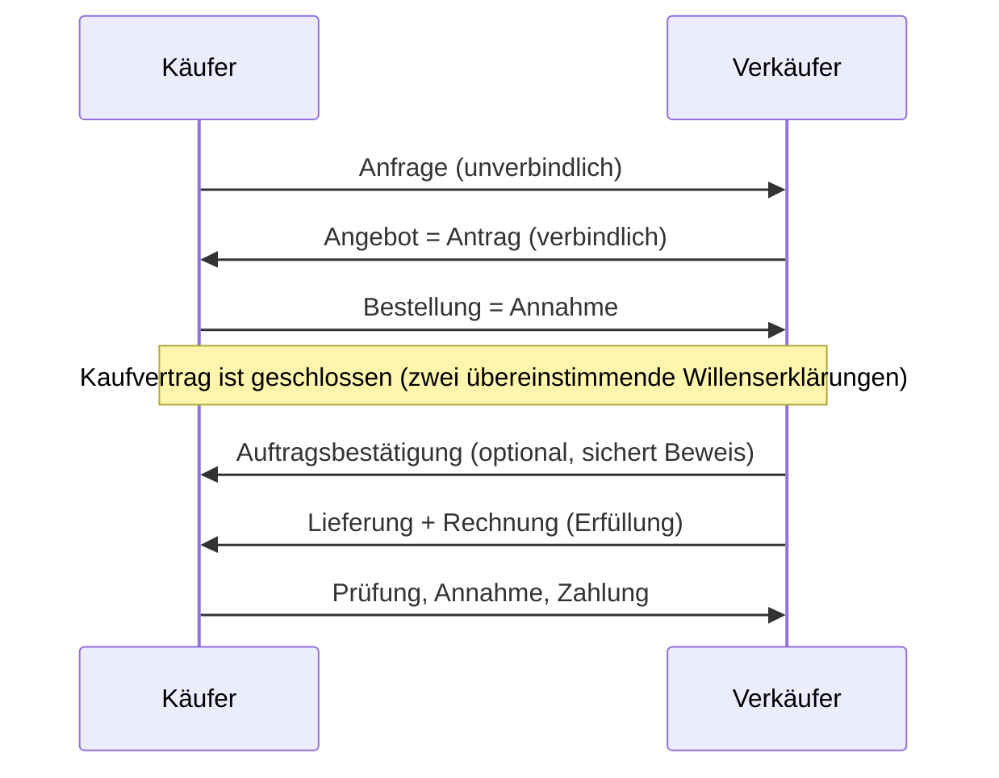
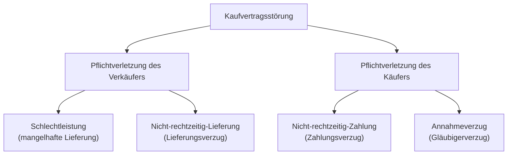

# W4 · Verträge und Kaufvertragsstörungen

> [!abstract] Überblick
> **Bereich:** [[Übersicht Wirtschaft]]
> **Dauer:** ca. 2,5 h · **Prüfungsrelevanz:** ★★★ – Mängelrechte, Gewährleistung vs. Garantie, Vertragsarten sind Standardfragen
> **Voraussetzungen:** [[W1 Beschaffung und Kalkulation]]
> **Berufsschule:** GiD LF2 LS2.1 (Rechtsgeschäfte), LS2.4 (Kaufvertragsstörungen), LF6 (SLA als Dienstvertrag)

## Lernziele
- [ ] Ich kann Rechtsfähigkeit, Geschäftsfähigkeit und Rechtsgeschäfte einordnen.
- [ ] Ich kann das Zustandekommen und die Pflichten aus einem Kaufvertrag erklären und Kaufarten unterscheiden.
- [ ] Ich kann Kauf-, Werk-, Dienst-, Miet- und Leasingverträge für IT-Leistungen zuordnen.
- [ ] Ich kann die vier Kaufvertragsstörungen erkennen und die Rechte der Beteiligten in der richtigen Reihenfolge nennen.
- [ ] Ich kann Gewährleistung, Garantie, Kulanz, Widerrufsrecht und Umtausch abgrenzen.

## Worum geht es?
Die neuen Dockingstationen für die Vertriebsabteilung kommen zwei Wochen zu spät, eines der Notebooks hat nur halb so viel Arbeitsspeicher wie bestellt, und ein Monitor zeigt nach drei Monaten Streifen. Gleichzeitig hat ein eigener Kunde die Rechnung für eine Netzwerkinstallation seit sechs Wochen nicht bezahlt. Wer darf was verlangen – und in welcher Reihenfolge? Das regelt das BGB (bzw. zwischen Kaufleuten ergänzend das HGB).

---

## 1. Rechtliche Grundlagen
| Begriff | Bedeutung |
|---|---|
| **Rechtsfähigkeit** | Träger von Rechten und Pflichten sein – natürliche Personen ab Geburt, juristische Personen (GmbH, AG, Verein) ab Eintragung |
| **Geschäftsfähigkeit** | Rechtsgeschäfte wirksam abschließen können |

| Alter | Geschäftsfähigkeit | Folge |
|---|---|---|
| unter 7 | **geschäftsunfähig** | Willenserklärungen nichtig |
| 7 bis 17 | **beschränkt geschäftsfähig** | Verträge **schwebend unwirksam** bis zur Zustimmung der Eltern; Ausnahmen: nur rechtliche Vorteile (Geschenk), **Taschengeldparagraf** (mit eigenen Mitteln bezahlt), Geschäfte im Rahmen eines genehmigten Arbeits-/Ausbildungsverhältnisses |
| ab 18 | **voll geschäftsfähig** | |

**Rechtsgeschäfte** entstehen durch **Willenserklärungen**:
- **einseitig** (eine Willenserklärung): empfangsbedürftig (Kündigung, Anfechtung) oder nicht empfangsbedürftig (Testament)
- **zwei- bzw. mehrseitig** = **Verträge** (übereinstimmende Willenserklärungen): einseitig verpflichtend (Schenkung, Bürgschaft) oder **zwei-/mehrseitig verpflichtend** (**Kaufvertrag**, Miet-, Werk-, Dienstvertrag)

**Form:** grundsätzlich **formfrei** (mündlich, schriftlich, elektronisch, durch schlüssiges Handeln). Gesetzliche Formvorschriften z. B. Schriftform (Kündigung eines Arbeitsvertrags), notarielle Beurkundung (Grundstückskauf).
**Nichtig** sind z. B. Geschäfte von Geschäftsunfähigen, Scheingeschäfte, sittenwidrige oder gesetzwidrige Geschäfte, Formverstöße. **Anfechtbar** bei Irrtum, arglistiger Täuschung oder Drohung.

## 2. Der Kaufvertrag
**Zustandekommen:** **Antrag + Annahme** (zwei übereinstimmende Willenserklärungen). Beispiel: Angebot des Händlers (Antrag) → Bestellung (Annahme). Oder: Bestellung ohne Angebot (Antrag) → Auftragsbestätigung/Lieferung (Annahme).

**Pflichten:**

| Verkäufer | Käufer |
|---|---|
| Ware **mangelfrei** übergeben | Kaufpreis **zahlen** |
| **Eigentum** verschaffen | Ware **annehmen** |

**Besitz vs. Eigentum:** Besitz = tatsächliche Herrschaft („in der Hand haben“), Eigentum = rechtliche Herrschaft („gehören“). Beim **Eigentumsvorbehalt** bleibt der Verkäufer Eigentümer, bis vollständig bezahlt ist.

**Kaufarten nach Beteiligten:**

| Art | Beteiligte | Besonderheit |
|---|---|---|
| **bürgerlicher Kauf** | zwei Privatpersonen (oder zwei Kaufleute, bei denen es kein Handelsgeschäft ist) | nur BGB |
| **Verbrauchsgüterkauf** (einseitiger Handelskauf) | Unternehmer verkauft an **Verbraucher** | besonderer Verbraucherschutz (§§ 474 ff. BGB) |
| **zweiseitiger Handelskauf** | **Kaufmann ↔ Kaufmann** | zusätzlich HGB, u. a. **unverzügliche Rügepflicht** (§ 377 HGB) |

**Erfüllungsort:** Ort, an dem die Leistung zu erbringen ist; gesetzlich der **Sitz des Schuldners** (Warenschulden beim Verkäufer, Geldschulden beim Käufer), vertraglich abweichend möglich. Wichtig für Gefahrübergang und Gerichtsstand.

<!-- abb:kaufvertrag -->

*Abb.: Zustandekommen und Erfüllung eines Kaufvertrags*

## 3. Vertragsarten für IT-Leistungen
| Vertrag | geschuldet wird | IT-Beispiel |
|---|---|---|
| **Kaufvertrag** | Übereignung einer Sache/Standardsoftware gegen Geld | Notebooks, Lizenz für Standardsoftware |
| **Werkvertrag** | ein **Erfolg** (Werk) | Netzwerk einrichten, Individualsoftware entwickeln, Webshop programmieren → Abnahme durch den Kunden |
| **Dienstvertrag** | eine **Tätigkeit**, kein Erfolg | Support-Stunden, Beratung, Schulung, Hotline, **SLA** (Leistung nach Vereinbarung ohne Erfolgsgarantie) |
| **Werklieferungsvertrag** | Herstellung und Lieferung einer beweglichen Sache | individuell zusammengebauter PC (Kaufrecht anwendbar) |
| **Mietvertrag** | Gebrauchsüberlassung auf Zeit gegen Entgelt | Server mieten, SaaS (oft Mietrecht) |
| **Leasingvertrag** | Gebrauchsüberlassung mit Finanzierungsfunktion | geleaste Notebooks → [[W3 Investition und Finanzierung]] |
| **Arbeitsvertrag** | Dienstvertrag in abhängiger Beschäftigung | Ausbildung/Anstellung |

---

## 4. Kaufvertragsstörungen (Leistungsstörungen)



### 4.1 Schlechtleistung (mangelhafte Lieferung)
**Sachmangel (§ 434 BGB)** – die Ware entspricht nicht den subjektiven Anforderungen (vereinbarte Beschaffenheit), den objektiven Anforderungen (übliche Beschaffenheit, Werbeaussagen) oder den Montageanforderungen:

| Mangelart | Beispiel |
|---|---|
| Mangel in der **Beschaffenheit/Qualität** | Monitor mit Streifen oder Pixelfehlern, Gehäuse verbeult, Gerät defekt |
| **fehlende vereinbarte Eigenschaft** | Notebook mit 8 statt bestellter 16 GB RAM |
| **Falschlieferung** (Artmangel) | Maus statt Tastatur geliefert |
| **Zuweniglieferung** (Mengenmangel) | 3 statt 5 bestellte Headsets |
| **Werbeaussage** nicht erfüllt | Akku hält nicht die beworbene Laufzeit |
| **Montagemangel** / mangelhafte Montageanleitung | fehlerhafte Installation durch den Verkäufer, unverständliche Anleitung („IKEA-Klausel“) |
| **fehlende Aktualisierungen** bei digitalen Produkten | keine Sicherheitsupdates für Software/Smart-Geräte (Verbrauchsgüterkauf) |

**Rechtsmangel (§ 435 BGB):** Dritte haben Rechte an der Ware (z. B. gestohlenes Gerät, Software ohne gültige Lizenz, Pfandrecht).

**Nach Erkennbarkeit:** **offener** Mangel (sofort erkennbar) · **versteckter** Mangel (erst später erkennbar) · **arglistig verschwiegener** Mangel (Verkäufer kennt ihn und verschweigt ihn → Verjährung erst nach 3 Jahren ab Kenntnis).

**Rechte des Käufers – Reihenfolge beachten!**
1. **Vorrangig: Nacherfüllung** (§ 439 BGB) – der **Käufer wählt**: **Nachbesserung** (Reparatur) **oder Ersatzlieferung** (neue, mangelfreie Ware). Der Verkäufer trägt die Kosten (Transport, Arbeit, Material). Er darf die gewählte Art nur bei unverhältnismäßigen Kosten verweigern.
2. **Nachrangig** – wenn die Nacherfüllung fehlgeschlagen ist (i. d. R. nach dem **zweiten erfolglosen Versuch**), verweigert wird, unzumutbar ist oder eine angemessene Frist erfolglos abgelaufen ist:
   - **Rücktritt** vom Vertrag (nicht bei unerheblichem Mangel)
   - **Minderung** des Kaufpreises
   - **Schadensersatz** statt der Leistung bzw. **Ersatz vergeblicher Aufwendungen** – nur bei **Verschulden** des Verkäufers, zusätzlich zu Rücktritt/Minderung möglich

**Fristen:**
- **Gewährleistungsfrist** (Verjährung der Mängelansprüche): **2 Jahre** ab Übergabe bei neuen Sachen; bei gebrauchten Sachen im B2C-Geschäft vertraglich auf **1 Jahr** verkürzbar
- **Beweislastumkehr** beim Verbrauchsgüterkauf: Zeigt sich ein Mangel innerhalb von **12 Monaten** nach Übergabe, wird vermutet, dass er schon bei Übergabe bestand – der **Verkäufer** muss das Gegenteil beweisen (seit 2022; vorher 6 Monate)
- **Zweiseitiger Handelskauf (§ 377 HGB):** Ware **unverzüglich** prüfen, offene Mängel **unverzüglich rügen**, versteckte unverzüglich nach Entdeckung – sonst gilt die Ware als genehmigt, alle Rechte sind verloren!

> [!example] Beispiel
> Eine GmbH bestellt 10 Monitore. Beim Auspacken hat einer einen gesprungenen Rahmen.
> → Sachmangel, **offener** Mangel · beidseitiger Handelskauf → **sofort schriftlich rügen** (mit Fotos, Lieferschein) · Recht: zuerst **Nacherfüllung**, die GmbH wählt z. B. **Ersatzlieferung** · scheitert sie zweimal → Rücktritt (für diesen Monitor) oder Minderung; Schadensersatz nur bei Verschulden.

### 4.2 Nicht-rechtzeitig-Lieferung (Lieferungsverzug)
**Voraussetzungen:** Lieferung **fällig**, **Mahnung** (entbehrlich bei **kalendermäßig bestimmtem Termin** – „Lieferung am 15.03.“ –, bei Leistungsverweigerung oder besonderen Gründen) und **Verschulden** des Verkäufers (für Schadensersatz).
**Rechte des Käufers:**
- ohne Nachfrist: auf **Lieferung bestehen** und ggf. **Verzögerungsschaden** verlangen (bei Verschulden)
- nach Ablauf einer **angemessenen Nachfrist**: **Rücktritt** und/oder **Schadensersatz statt der Leistung** (bei Verschulden) bzw. Ersatz vergeblicher Aufwendungen
- **Fixkauf** (Termin ist wesentlich, z. B. „fix“, Messe-Hardware): Rücktritt ohne Nachfrist möglich

### 4.3 Nicht-rechtzeitig-Zahlung (Zahlungsverzug)
Der Käufer gerät in Verzug durch **Mahnung** nach Fälligkeit, bei **kalendermäßig bestimmtem Zahlungstermin** automatisch, spätestens **30 Tage** nach Fälligkeit und Zugang der Rechnung (bei Verbrauchern nur, wenn in der Rechnung darauf hingewiesen wurde).
**Rechte des Verkäufers:** Zahlung und **Verzugszinsen** verlangen (Basiszinssatz + **5** Prozentpunkte bei Verbrauchern, + **9** Prozentpunkte zwischen Unternehmen; zwischen Unternehmen zusätzlich 40 € Pauschale), nach Nachfrist Rücktritt/Schadensersatz. **Mahnverfahren:** kaufmännische Mahnung → gerichtliches Mahnverfahren (Mahnbescheid, Vollstreckungsbescheid) → Zwangsvollstreckung. **Verjährung** von Zahlungsansprüchen: regelmäßig **3 Jahre** ab Ende des Jahres der Entstehung.

### 4.4 Annahmeverzug (Gläubigerverzug)
Der Käufer nimmt die **ordnungsgemäß angebotene** Ware nicht an – **Verschulden ist nicht nötig**. Folgen: Haftung des Verkäufers nur noch für Vorsatz und grobe Fahrlässigkeit; Gefahr geht auf den Käufer über. **Rechte des Verkäufers:** Ware **hinterlegen** und auf Abnahme klagen, **Selbsthilfeverkauf** (öffentliche Versteigerung nach Androhung; Mindererlös trägt der Käufer), Ersatz der Mehrkosten, ggf. Rücktritt.

---

## 5. Gewährleistung, Garantie, Kulanz, Widerruf, Umtausch
| | Rechtsgrundlage | Inhalt |
|---|---|---|
| **Gewährleistung** (Mängelhaftung) | **gesetzlich** (BGB), gegenüber dem **Verkäufer** | Rechte bei Mängeln, die bei Übergabe vorhanden waren; 2 Jahre |
| **Garantie** | **freiwillig**, vertraglich, meist vom **Hersteller** | zusätzliche Zusage (z. B. 3 Jahre Funktionsgarantie), Bedingungen legt der Garantiegeber fest; schränkt gesetzliche Rechte nicht ein |
| **Kulanz** | freiwillig, **kein Rechtsanspruch** | Entgegenkommen, z. B. Reparatur nach Ablauf der Gewährleistung |
| **Widerrufsrecht** | gesetzlich, nur bei **Fernabsatzverträgen** (online, Telefon) und Verträgen außerhalb von Geschäftsräumen, nur für **Verbraucher** | **14 Tage** ohne Angabe von Gründen; ausgeschlossen z. B. bei entsiegelter Software/Datenträgern, individuell angefertigter Ware |
| **Umtausch** | **kein** gesetzlicher Anspruch bei mangelfreier Ware im Laden | reine Kulanz des Händlers |

> [!question]- Kurz nachgedacht: Ein Kunde kauft im Laden ein funktionierendes Headset, gefällt ihm nicht – darf er es zurückgeben?
> Nein, kein gesetzlicher Anspruch: Die Ware ist mangelfrei (keine Gewährleistung), und im Ladengeschäft gibt es **kein Widerrufsrecht**. Eine Rückgabe ist nur aus **Kulanz** möglich. Hätte er online bestellt, könnte er innerhalb von 14 Tagen widerrufen.

---

> [!warning] Typische Fehler in Prüfungen
> - Direkt Rücktritt oder Minderung nennen, ohne den **Vorrang der Nacherfüllung**.
> - Behaupten, der **Verkäufer** wähle zwischen Reparatur und Ersatz – es wählt der **Käufer**.
> - Garantie und Gewährleistung gleichsetzen.
> - Beim Handelskauf die **unverzügliche Rügepflicht** vergessen.
> - Werk- und Dienstvertrag verwechseln (Erfolg vs. Tätigkeit).
> - Widerrufsrecht auch für Ladenkäufe oder zwischen Unternehmen annehmen.

### Ergänzung: Gesetz gegen den unlauteren Wettbewerb (UWG)
Das **UWG** schützt vor irreführender oder aggressiver Werbung und anderen unlauteren Handlungen (z. B. Werbeanrufe ohne Einwilligung). **Preisabsprachen** zwischen Unternehmen verbietet dagegen das Kartellrecht (**GWB**).

### Ergänzung: Kosten im Soll-Ist-Vergleich
Die **Nachkalkulation** vergleicht kalkulierte Kosten (Soll) mit tatsächlichen Kosten (Ist): Soll 2 400 €, Ist 2 760 € → Abweichung **360 € (15 %)**. Sie liefert Erkenntnisse für künftige Angebote und ist Teil der Auftragsbewertung.

## Verwandte Themen
- [[W1 Beschaffung und Kalkulation]] – Anfrage, Angebot, Bestellung
- [[S6 Software beschaffen und lizenzieren]] – Lizenz- und Softwareverträge
- [[P1 Projektmanagement und Vorgehensmodelle]] – Abnahme beim Werkvertrag

## Zusammenfassung
- Geschäftsfähigkeit: < 7 unfähig, 7–17 beschränkt (Taschengeldparagraf), ab 18 voll.
- Kaufvertrag = Antrag + Annahme; Verkäufer: mangelfrei übergeben + Eigentum verschaffen; Käufer: zahlen + annehmen.
- Werkvertrag = Erfolg, Dienstvertrag = Tätigkeit (SLA), Kaufvertrag = Übereignung.
- Vier Störungen: Schlechtleistung, Lieferungsverzug, Zahlungsverzug, Annahmeverzug.
- Mängelrechte: erst Nacherfüllung (Käufer wählt), dann Rücktritt/Minderung, Schadensersatz nur bei Verschulden.
- 2 Jahre Gewährleistung, 12 Monate Beweislastumkehr (B2C), § 377 HGB Rügepflicht (B2B).
- Garantie freiwillig, Kulanz ohne Anspruch, Widerruf 14 Tage nur Fernabsatz/B2C.

## Selbstcheck
```dataviewjs
await dv.view("AP1/99 System/views/quiz", { modul: "W4" })
```

**Weitere Aufgaben:** [[Aufgaben Wirtschaft#W4 Verträge und Kaufvertragsstörungen]] · **Karteikarten:** [[Karten Wirtschaft]]

## Einschätzung
```dataviewjs
await dv.view("AP1/99 System/views/selbstcheck")
```

---
← [[W3 Investition und Finanzierung]] · Weiter: [[W5 Unternehmen und Ausbildung]] →
