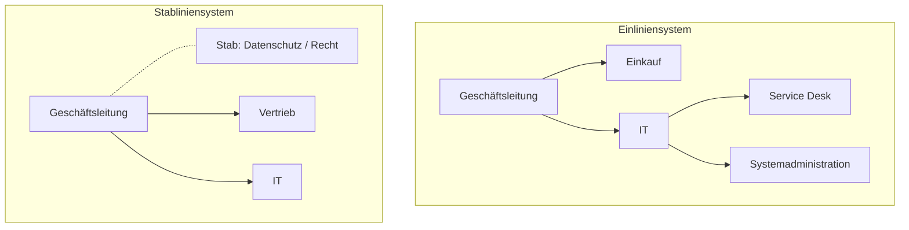

# W5 · Unternehmen und Ausbildung

> [!abstract] Überblick
> **Bereich:** [[Übersicht Wirtschaft]]
> **Dauer:** ca. 90 min · **Prüfungsrelevanz:** ★☆☆ für die AP1 (Randthema) – wichtig für Berufsschul-Klausuren und später für WiSo in der AP2
> **Voraussetzungen:** keine
> **Berufsschule:** GiD LF1 LS1.1–LS1.3

## Lernziele
- [ ] Ich kann Unternehmensziele und ein Leitbild erklären sowie Zielkonflikte erkennen.
- [ ] Ich kann die wichtigsten Rechtsformen nach Haftung, Kapital und Geschäftsführung vergleichen.
- [ ] Ich kann Aufgaben des Handelsregisters (HRA/HRB) und die Begriffe Unternehmen, Betrieb, Firma unterscheiden.
- [ ] Ich kann Leitungssysteme (Einlinien, Mehrlinien, Stablinien, Matrix, Sparten) mit Vor- und Nachteilen beschreiben.
- [ ] Ich kenne Rechte und Pflichten aus dem Ausbildungsvertrag nach BBiG.

## Worum geht es?
In der AP1 bildet ein Unternehmen immer den **Rahmen** der Aufgaben: „Die XY GmbH …“. Wer weiß, was eine GmbH ausmacht, wie Entscheidungswege in einer Firma laufen und welche Ziele sie verfolgt, kann Szenarien besser einordnen und Antworten passender begründen.

---

## 1. Unternehmen, Betrieb, Firma
| Begriff | Bedeutung |
|---|---|
| **Unternehmen** | rechtlich und wirtschaftlich selbstständige Einheit mit eigenem Kapital, kann mehrere Betriebe haben |
| **Betrieb** | örtliche, technisch-organisatorische Einheit (Werk, Filiale, Standort), rechtlich unselbstständig |
| **Firma** | der **Name**, unter dem ein Kaufmann seine Geschäfte betreibt und unterschreibt (§ 17 HGB), mit Rechtsformzusatz |

### Unternehmensziele und Leitbild
- **ökonomische** Ziele: Gewinn, Umsatz, Marktanteil, Liquidität, Kostensenkung
- **ökologische** Ziele: Ressourcen schonen, Energie sparen, Emissionen senken (Green IT)
- **soziale** Ziele: sichere Arbeitsplätze, gute Arbeitsbedingungen, Weiterbildung
- **Zielharmonie** (ein Ziel fördert das andere: energieeffiziente Server senken Kosten **und** Emissionen) · **Zielkonflikt** (höhere Löhne vs. Gewinn) · **Zielneutralität**
- **Leitbild:** schriftliches Selbstverständnis (Mission, Werte, Vision) – Orientierung nach innen, Image nach außen
- Ziele operationalisieren: **SMART** (spezifisch, messbar, attraktiv, realistisch, terminiert) → [[P1 Projektmanagement und Vorgehensmodelle]]

## 2. Rechtsformen
| Rechtsform | Gründer | Mindestkapital | Haftung | Geschäftsführung | Register |
|---|---|---|---|---|---|
| **Einzelunternehmen** | 1 Person | keins | **unbeschränkt** mit Privatvermögen | Inhaber | HRA (als Kaufmann) |
| **GbR** | ≥ 2 | keins | unbeschränkt, gesamtschuldnerisch | gemeinsam | (Gesellschaftsregister möglich) |
| **OHG** | ≥ 2 | keins | alle Gesellschafter **unbeschränkt, unmittelbar, solidarisch** | jeder Gesellschafter | HRA |
| **KG** | ≥ 2 | keins | **Komplementär** unbeschränkt, **Kommanditist** nur mit Einlage | Komplementär | HRA |
| **GmbH** | ≥ 1 | **25 000 €** Stammkapital | nur **Gesellschaftsvermögen** (Gesellschafter nicht privat) | Geschäftsführer | **HRB** |
| **UG (haftungsbeschränkt)** | ≥ 1 | ab 1 € (Rücklagenpflicht) | Gesellschaftsvermögen | Geschäftsführer | HRB |
| **AG** | ≥ 1 | **50 000 €** Grundkapital | Gesellschaftsvermögen | Vorstand (Aufsichtsrat kontrolliert, Hauptversammlung) | HRB |
| **GmbH & Co. KG** | – | – | Komplementär ist eine GmbH → Haftung faktisch beschränkt | GmbH | HRA |

> [!tip] Merke
> **Personengesellschaften** (OHG, KG): Gesellschafter haften persönlich, meist Arbeit + Kapital. **Kapitalgesellschaften** (GmbH, AG): juristische Person, Haftung auf das Gesellschaftsvermögen beschränkt.

## 3. Kaufmann und Handelsregister
- **Istkaufmann** (§ 1 HGB): betreibt ein Handelsgewerbe, das einen kaufmännisch eingerichteten Geschäftsbetrieb erfordert → Eintragung Pflicht (**deklaratorisch** = bestätigend)
- **Kannkaufmann:** Kleingewerbe, freiwillige Eintragung (**konstitutiv** = rechtsbegründend)
- **Formkaufmann:** GmbH, AG – Kaufmann kraft Rechtsform
- Kaufleute unterliegen dem **HGB** (z. B. Rügepflicht § 377, Buchführungspflicht)

**Handelsregister:** öffentliches Verzeichnis beim **Amtsgericht**, online einsehbar. **Abteilung A (HRA):** Einzelkaufleute, OHG, KG · **Abteilung B (HRB):** GmbH, UG, AG. Inhalte: Firma, Sitz, Gegenstand, Inhaber/Geschäftsführer, Prokura, Kapital. **Öffentlicher Glaube:** Man darf auf eingetragene Tatsachen vertrauen.

## 4. Aufbau- und Ablauforganisation
- **Aufbauorganisation:** Gliederung in **Stellen** (kleinste Einheit, Aufgabenbereich einer Person) und **Abteilungen**, Über- und Unterordnung → dargestellt im **Organigramm**
- **Ablauforganisation:** zeitliche und logische Reihenfolge von Arbeitsschritten (Prozesse) → z. B. BPMN, Flussdiagramm, EPK
- **Instanz:** Stelle mit **Leitungs- und Weisungsbefugnis** · **Ausführungsstelle:** ohne Weisungsbefugnis · **Stabsstelle:** berät, ohne Weisungsbefugnis

### Leitungssysteme
| System | Prinzip | Vorteile | Nachteile |
|---|---|---|---|
| **Einliniensystem** | jede Stelle hat **genau einen** Vorgesetzten | klare Zuständigkeiten, eindeutige Weisungen | lange Dienstwege, Überlastung der Leitung |
| **Mehrliniensystem** | Stellen erhalten Weisungen von **mehreren Fachvorgesetzten** | Spezialisierung, kurze Wege | Kompetenzkonflikte, widersprüchliche Weisungen |
| **Stabliniensystem** | Einlinie + **Stabsstellen** (z. B. Datenschutz, Recht, IT-Sicherheit) beraten die Leitung | Entlastung durch Experten, klare Weisungswege | Stäbe ohne Entscheidungsbefugnis, Konflikte Stab–Linie |
| **Matrixorganisation** | zwei Dimensionen, z. B. **Funktion × Projekt/Produkt** – zwei Vorgesetzte | Flexibilität, Kommunikation, gut für Projekte | Konflikte zwischen den Leitungen, hoher Abstimmungsaufwand |
| **Spartenorganisation** | Gliederung nach Produkten/Regionen/Kundengruppen, jede Sparte teils eigenständig | marktnah, klare Verantwortung | Doppelarbeit in den Sparten |

**Vollmachten:** **Prokura** (fast alle Geschäfte, Eintragung ins Handelsregister, Zusatz „ppa.“) · **Handlungsvollmacht** (gewöhnliche Geschäfte, „i. V.“ bzw. „i. A.“).

<!-- abb:organigramm -->

*Abb.: Einlinien- und Stabliniensystem (gestrichelt: Stab ohne Weisungsbefugnis)*

## 5. Ausbildung (BBiG)
**Duales System:** Ausbildung im **Betrieb** (Praxis, Ausbildungsrahmenplan) und in der **Berufsschule** (Theorie, Lernfelder). Zuständige Stelle für IT-Berufe: **IHK** (Eintragung des Vertrags, Prüfungen, Überwachung).

**Ausbildungsvertrag** (Berufsbildungsgesetz): Die wesentlichen Inhalte werden unverzüglich nach Vertragsschluss, spätestens vor Beginn in **Textform** abgefasst (§ 11 BBiG; elektronisch speicher- und ausdruckbar, Empfangsnachweis erforderlich) – u. a. Art und Ziel der Ausbildung, **Beginn und Dauer**, Ausbildungsstätte, tägliche Arbeitszeit, **Probezeit (1–4 Monate)**, **Vergütung** (mind. Mindestausbildungsvergütung), **Urlaub**, Kündigungsvoraussetzungen.

| Pflichten der Auszubildenden | Pflichten des Ausbildenden |
|---|---|
| **Lernpflicht** – sich bemühen, die Fertigkeiten zu erwerben | **Ausbildungspflicht** – planmäßig und zielgerichtet ausbilden |
| Weisungen befolgen, Betriebsordnung einhalten | **Ausbildungsmittel kostenlos** bereitstellen |
| **Berufsschule** besuchen, **Ausbildungsnachweis** (Berichtsheft) führen | **Freistellung** für Berufsschule und Prüfungen |
| **Schweigepflicht** über Betriebsgeheimnisse | Vergütung zahlen, nur ausbildungsbezogene Tätigkeiten übertragen |
| Werkzeuge/Geräte pfleglich behandeln | **Zeugnis** am Ende ausstellen |

**Kündigung:** in der **Probezeit** jederzeit ohne Frist und ohne Grund · danach durch den Betrieb nur **fristlos aus wichtigem Grund** · durch Auszubildende mit **4 Wochen Frist**, wenn sie die Ausbildung aufgeben oder einen anderen Beruf erlernen wollen · immer **schriftlich** (nach der Probezeit mit Angabe der Gründe). **Ende:** mit Ablauf der Ausbildungszeit bzw. mit Bestehen der Abschlussprüfung. Für Minderjährige gilt zusätzlich das **Jugendarbeitsschutzgesetz**.

---

> [!warning] Typische Fehler
> - „Firma“ als Synonym für Unternehmen verwenden (rechtlich ist es der **Name**).
> - GmbH-Gesellschafter persönlich haften lassen.
> - HRA und HRB vertauschen.
> - Stabsstellen Weisungsbefugnis zuschreiben.

### Ergänzung: Unternehmensverbindungen, Wirtschaftsordnung, VL
- **Fusion:** Unternehmen verschmelzen. **Konzern:** rechtlich selbständige Unternehmen unter einheitlicher Leitung. **Kartell:** Absprache selbständiger Unternehmen, grundsätzlich verboten.
- **Soziale Marktwirtschaft:** Wettbewerb und Privateigentum, ergänzt durch sozialen Ausgleich und Wettbewerbsschutz.
- **Vermögenswirksame Leistungen (VL):** Geldbeträge, die für den Arbeitnehmer langfristig angelegt werden (z. B. Bausparen), oft tarifvertraglich geregelt.

## Verwandte Themen
- [[W4 Verträge und Kaufvertragsstörungen]] – Geschäftsfähigkeit und Verträge
- [[P1 Projektmanagement und Vorgehensmodelle]] – Projektorganisation
- [[P5 Arbeitsplatz, Ergonomie und Umwelt]] – Arbeitsschutz im Betrieb

## Zusammenfassung
- ==🟡Unternehmen (rechtlich selbstständig) – Betrieb (Standort) – Firma (Name)==.
- Ziele ökonomisch/ökologisch/sozial; Zielharmonie und -konflikt; Leitbild.
- Einzelunternehmen/OHG unbeschränkte Haftung · KG: Komplementär voll, Kommanditist Einlage · ==🔵GmbH 25 000 € · AG 50 000 €==.
- HRA Personen, HRB Kapitalgesellschaften; Istkaufmann deklaratorisch.
- Einlinien (klar, langsam), Mehrlinien (Spezialisten, Konflikte), Stablinien (Beratung), Matrix (zwei Dimensionen), Sparten.
- BBiG: ==🔵Probezeit 1–4 Monate==, Lernpflicht/Ausbildungspflicht, Kündigung nach Probezeit nur aus wichtigem Grund bzw. Azubi mit 4 Wochen.

## Selbstcheck
```dataviewjs
await dv.view("AP1/99 System/views/quiz", { modul: "W5" })
```

**Weitere Aufgaben:** [[Aufgaben Wirtschaft#W5 Unternehmen und Ausbildung]] · **Karteikarten:** [[Karten Wirtschaft]]

## Einschätzung
```dataviewjs
await dv.view("AP1/99 System/views/selbstcheck")
```

---
← [[W4 Verträge und Kaufvertragsstörungen]] · Weiter: [[W6 Markt, Marketing und Kostenrechnung]] →
