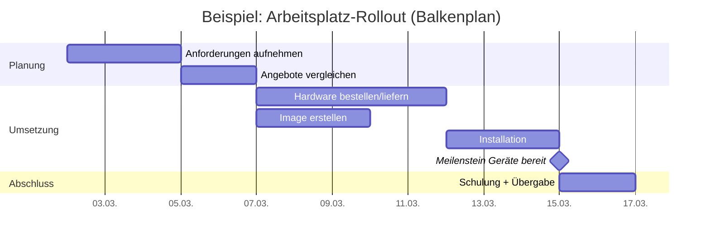
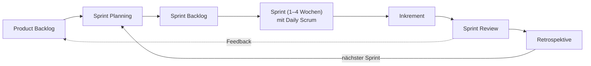

# P1 · Projektmanagement und Vorgehensmodelle

> [!abstract] Überblick
> **Bereich:** [[Übersicht Projekt und Service]]
> **Dauer:** ca. 2 h · **Prüfungsrelevanz:** ★★★ – das AP1-Szenario ist fast immer ein kleines IT-Projekt
> **Voraussetzungen:** keine · **Danach:** [[P2 Netzplan und Zeitplanung]]
> **Berufsschule:** SuD LF5 LS5.3 (Wasserfallmodell vs. Scrum, Lastenheft) · Evp-CPS LF7 (vollständige Handlung)

## Lernziele
- [ ] Ich kann Merkmale eines Projekts nennen und das magische Dreieck erklären.
- [ ] Ich kann Ziele SMART formulieren und Lastenheft und Pflichtenheft unterscheiden.
- [ ] Ich kann Projektphasen und Planungswerkzeuge (PSP, Gantt, Meilensteine) anwenden.
- [ ] Ich kann Stakeholder- und Risikoanalyse durchführen.
- [ ] Ich kann Wasserfall, V-Modell, Scrum und Kanban vergleichen und begründet auswählen.

## Worum geht es?
„Die Firma zieht um, 40 Arbeitsplätze müssen in drei Wochen im neuen Gebäude laufen.“ – „Die Buchhaltung bekommt eine neue Software.“ Solche Vorhaben sind **Projekte**. Ohne Planung laufen sie aus dem Ruder: zu spät, zu teuer, und am Ende fehlt die Hälfte. Projektmanagement liefert die Werkzeuge, und in der AP1 wirst du sie am Szenario anwenden.

---

## 1. Was ist ein Projekt
Ein Vorhaben mit den Merkmalen (DIN 69901):
- **Einmaligkeit** (kein Routinevorgang)
- **zeitliche Begrenzung** (Start und Ende)
- **klares Ziel**
- **begrenzte Ressourcen** (Budget, Personal, Material)
- **eigene Projektorganisation**, oft fachübergreifend
- **Komplexität und Risiko**

### Magisches Dreieck

<!-- abb:magisches-dreieck -->
![[magisches-dreieck.svg]]
*Abb.: Das magische Dreieck*

**Leistung/Qualität – Zeit – Kosten** hängen voneinander ab: Soll mehr Qualität in derselben Zeit geliefert werden, steigen die Kosten; wird das Budget gekürzt, leidet Zeit oder Umfang. Ein Projekt muss hier bewusst Prioritäten setzen.

### SMART-Ziele
| | Bedeutung | schlecht | gut |
|---|---|---|---|
| **S**pezifisch | konkret, eindeutig | „bessere IT“ | „alle 40 Arbeitsplätze der Verwaltung auf Windows 11 umstellen“ |
| **M**essbar | überprüfbar | „schneller“ | „Anmeldezeit unter 30 Sekunden“ |
| **A**ttraktiv/akzeptiert | von Beteiligten getragen | | mit der Abteilung abgestimmt |
| **R**ealistisch | erreichbar | „in 2 Tagen“ | „mit 2 Technikern in 3 Wochen“ |
| **T**erminiert | fester Termin | „bald“ | „bis 31.03.“ |

---

## 2. Lastenheft und Pflichtenheft
| | **Lastenheft** | **Pflichtenheft** |
|---|---|---|
| erstellt von | **Auftraggeber** (Kunde) | **Auftragnehmer** (Dienstleister) |
| beschreibt | **WAS** und **WOFÜR** – Anforderungen aus Kundensicht | **WIE** und **WOMIT** – konkrete Umsetzung |
| Inhalt | Ist-Zustand, Soll-Zustand, **Muss-/Soll-/Kann-Kriterien**, Rahmenbedingungen, Abnahmekriterien | Lösungskonzept, Technik, Zeitplan, Kosten, Tests, Abnahmeverfahren |
| Zeitpunkt | Grundlage für Anfrage/Ausschreibung | nach Auftragsvergabe, Grundlage für Umsetzung und **Abnahme** |

**Anforderungen erheben:** Interviews, Beobachtung, Thinking-Aloud (Nutzer denkt laut bei der Arbeit), Fragebögen, Dokumentenanalyse, Workshops. **Funktionale** Anforderungen (was das System tun soll) vs. **nicht-funktionale** (Leistung, Sicherheit, Bedienbarkeit, Datenschutz).

---

## 3. Phasen und Planung

### Klassische Projektphasen
1. **Initialisierung:** Idee, Auftrag, Ziele, Machbarkeit
2. **Definition:** Anforderungen (Lastenheft), Projektauftrag, Organisation
3. **Planung:** Aufgaben, Termine, Ressourcen, Kosten, Risiken
4. **Durchführung/Steuerung:** Umsetzung, **Soll-Ist-Vergleich**, Gegensteuern
5. **Abschluss:** **Abnahme** (Abnahmeprotokoll), Übergabe, Dokumentation, Lessons Learned

Die **vollständige Handlung** aus der Berufsschule passt dazu: **Informieren → Planen → Entscheiden → Ausführen → Kontrollieren → Bewerten**.

### Planungswerkzeuge
| Werkzeug | Zweck |
|---|---|
| **Projektstrukturplan (PSP)** | Zerlegung des Projekts in **Teilaufgaben** und **Arbeitspakete** (hierarchisch, als Baum) – vollständiger Überblick über alle Aufgaben |
| **Arbeitspaket** | kleinste Planungseinheit mit Verantwortlichem, Aufwand, Dauer, Ergebnis |
| **Gantt-Diagramm (Balkenplan)** | Vorgänge als Balken auf einer **Zeitachse**, Abhängigkeiten, Meilensteine – anschaulich für Termine und Fortschritt |
| **Netzplan** | Abhängigkeiten, frühest/spätest mögliche Termine, **Puffer**, **kritischer Pfad** → [[P2 Netzplan und Zeitplanung]] |
| **Meilenstein** | Ereignis **ohne Dauer**, markiert einen wichtigen Zwischenstand (z. B. „Hardware geliefert“) – Prüfpunkt |
| **Ressourcenplan** | wer arbeitet wann woran, Engpässe erkennen |
| **Kostenplan** | Budget je Arbeitspaket |



### Stakeholder und Risiken
**Stakeholder** = alle, die vom Projekt betroffen sind oder es beeinflussen (Geschäftsführung, Nutzer, Betriebsrat, Datenschutzbeauftragter, Lieferanten, Kunden). **Stakeholderanalyse:** Interesse und Einfluss bewerten → Einbindung/Kommunikation planen (z. B. Betriebsrat bei Überwachungsfunktionen einbinden).

**Risikoanalyse:** Risiken sammeln → **Eintrittswahrscheinlichkeit × Auswirkung** bewerten → Gegenmaßnahmen (vorbeugend und im Eintrittsfall), Verantwortliche festlegen.

| Risiko | W | A | Maßnahme |
|---|---|---|---|
| Lieferverzug der Hardware | mittel | hoch | frühzeitig bestellen, Zweitlieferant, Pufferzeit |
| Mitarbeiter krank | mittel | mittel | Vertretung, Dokumentation |
| Datenverlust bei Migration | gering | sehr hoch | Vollsicherung vorher, Test-Migration |

---

## 4. Vorgehensmodelle

### Wasserfallmodell
Phasen **nacheinander**, jede Phase wird abgeschlossen, bevor die nächste beginnt (Analyse → Spezifikation/Lastenheft → Entwurf → Realisierung und Test → Übergabe/Betrieb).
- **Vorteile:** klare Struktur, gut planbar, Meilensteine, gute Dokumentation
- **Nachteile:** unflexibel bei Änderungen, Fehler aus frühen Phasen fallen spät auf, Kunde sieht Ergebnis erst am Ende
- **passt, wenn:** Anforderungen klar und stabil sind (z. B. Netzwerkverkabelung, Hardware-Rollout)

### V-Modell
Erweiterung des Wasserfalls: Jeder Entwicklungsphase steht eine **Testphase** gegenüber (Anforderungen ↔ Abnahmetest, Systementwurf ↔ Systemtest, Komponentenentwurf ↔ Unit-Test). Betont Qualitätssicherung; im öffentlichen Bereich verbreitet (V-Modell XT).

### Agile Vorgehensweisen – Scrum
Iterativ und inkrementell: In kurzen Zyklen (**Sprints**, 1–4 Wochen) entsteht jeweils ein nutzbares Teilergebnis (**Inkrement**). Grundlage: **Agiles Manifest** (Individuen und Interaktionen, funktionierende Software, Zusammenarbeit mit dem Kunden, Reagieren auf Veränderung).

| Scrum | |
|---|---|
| **Rollen** | **Product Owner** (vertritt den Kunden, verwaltet und priorisiert das Product Backlog) · **Scrum Master** (sorgt für den Prozess, beseitigt Hindernisse, coacht) · **Developers** (selbstorganisiertes Team, setzt um) |
| **Events** | **Sprint** · **Sprint Planning** (Was schaffen wir im Sprint?) · **Daily Scrum** (täglich max. 15 min: Fortschritt, Hindernisse) · **Sprint Review** (Ergebnis dem Kunden zeigen, Feedback) · **Sprint Retrospektive** (Zusammenarbeit verbessern) |
| **Artefakte** | **Product Backlog** (priorisierte Anforderungen, oft als User Stories: „Als … möchte ich …, damit …“) · **Sprint Backlog** · **Inkrement** |

- **Vorteile:** flexibel bei sich ändernden Anforderungen, frühes Kundenfeedback, frühe nutzbare Ergebnisse, Transparenz
- **Nachteile:** Gesamtkosten und -termin schwerer planbar, hohe Beteiligung des Kunden nötig, Disziplin im Team erforderlich
- **passt, wenn:** Anforderungen unklar sind oder sich ändern (Softwareentwicklung, Apps)

<!-- abb:scrum -->

*Abb.: Der Scrum-Zyklus*

### Kanban
Visualisierung des Arbeitsflusses auf einem **Board** (Spalten z. B. *To Do – In Arbeit – Review – Fertig*), **WIP-Limits** (begrenzte Anzahl gleichzeitig laufender Aufgaben), kontinuierlicher Fluss statt Sprints. Gut für Support- und Wartungsteams.

> [!question]- Kurz nachgedacht: Wasserfall oder Scrum für die Einführung einer neuen Kunden-App, deren Funktionen die Marketingabteilung noch nicht genau kennt?
> **Scrum**: Die Anforderungen sind unklar und ändern sich. Nach jedem Sprint sieht das Marketing ein nutzbares Zwischenergebnis und kann nachsteuern. Für den Aufbau der Serverinfrastruktur mit festen Anforderungen wäre dagegen ein klassisches Vorgehen sinnvoll – Mischformen (hybrid) sind üblich.

---

## 5. Projektabschluss und Dokumentation
- **Abnahme** mit **Abnahmeprotokoll** (Prüfung gegen Pflichtenheft/Abnahmekriterien, festgestellte Mängel, Unterschriften) – rechtlich wichtig beim Werkvertrag (Gefahrübergang, Beginn der Gewährleistung)
- **Übergabe** an den Betrieb, **Einweisung/Schulung** der Nutzer
- **Dokumentation:** Technik (Netzplan, Konfigurationen, Passwörter sicher hinterlegt), Benutzeranleitung, Projektbericht
- **Lessons Learned:** Was lief gut, was schlecht? → Wissen für künftige Projekte
- Nachkalkulation: Soll-Ist-Vergleich von Kosten und Zeit

---

> [!warning] Typische Fehler in Prüfungen
> - Lastenheft und Pflichtenheft vertauschen (Lastenheft = Auftrag**geber**).
> - Ziele unkonkret formulieren („das Netzwerk verbessern“).
> - Meilensteinen eine Dauer geben.
> - Scrum-Rollen verwechseln: Der **Product Owner** priorisiert, der **Scrum Master** ist kein Projektleiter.
> - Agil als „ohne Planung“ darstellen.

### Ergänzung: Spiralmodell
Mehrere Umläufe mit **Zielfestlegung → Risikoanalyse → Entwicklung/Test → Planung des nächsten Umlaufs**. Besonders für große, riskante Projekte; im Gegensatz zum sequenziellen Wasserfallmodell wird das Risiko in jedem Umlauf neu bewertet.

### Ergänzung: Probleme analysieren und Lösungsalternativen bewerten
Vorgehen: **Problem beschreiben → Alternativen entwickeln → bewerten** (z. B. Nutzwertanalyse, Kosten, Termin, Risiko) **→ entscheiden → umsetzen und kontrollieren** (Soll-Ist-Vergleich). Ohne klar beschriebenes Problem sind Alternativen nicht vergleichbar.

## Verwandte Themen
- [[P2 Netzplan und Zeitplanung]] – Zeitplanung mit Netzplan
- [[W4 Verträge und Kaufvertragsstörungen]] – Werkvertrag und Abnahme
- [[S8 UML und Softwareentwurf]] – Anforderungen modellieren

## Zusammenfassung
- Projekt: einmalig, befristet, Ziel, begrenzte Ressourcen; magisches Dreieck Leistung–Zeit–Kosten.
- SMART-Ziele; Lastenheft (WAS, Auftraggeber) vs. Pflichtenheft (WIE, Auftragnehmer).
- Phasen: Initialisierung, Definition, Planung, Durchführung, Abschluss (Abnahmeprotokoll, Lessons Learned).
- Werkzeuge: PSP (Arbeitspakete), Gantt, Netzplan, Meilensteine, Stakeholder- und Risikoanalyse.
- Wasserfall/V-Modell: stabil, planbar · Scrum: iterativ, flexibel (PO, SM, Developers; Sprint, Daily, Review, Retro) · Kanban: Board, WIP-Limits.

## Selbstcheck
```dataviewjs
await dv.view("AP1/99 System/views/quiz", { modul: "P1" })
```

**Weitere Aufgaben:** [[Aufgaben Projekt und Service#P1 Projektmanagement und Vorgehensmodelle]] · **Karteikarten:** [[Karten Projekt und Service]]

## Einschätzung
```dataviewjs
await dv.view("AP1/99 System/views/selbstcheck")
```

---
← [[W6 Markt, Marketing und Kostenrechnung]] · Weiter: [[P2 Netzplan und Zeitplanung]] →
