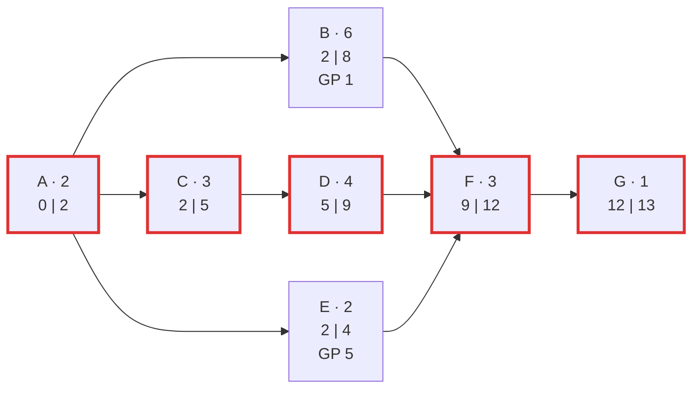

# P2 · Netzplan und Zeitplanung

> [!abstract] Überblick
> **Bereich:** [[Übersicht Projekt und Service]]
> **Dauer:** ca. 90 min (plus Training) · **Prüfungsrelevanz:** ★★★ – Netzplan vervollständigen, kritischen Pfad und Puffer bestimmen
> **Voraussetzungen:** [[P1 Projektmanagement und Vorgehensmodelle]]

## Lernziele
- [ ] Ich kann aus einer Vorgangsliste einen Vorgangsknoten-Netzplan erstellen.
- [ ] Ich kann Vorwärts- und Rückwärtsrechnung (FAZ, FEZ, SAZ, SEZ) durchführen.
- [ ] Ich kann Gesamtpuffer und freien Puffer berechnen und erklären.
- [ ] Ich kann den kritischen Pfad bestimmen und Konsequenzen von Verzögerungen beurteilen.

## Worum geht es?
Die Verkabelung kann erst beginnen, wenn die Planung steht, die Installation erst, wenn Kabel **und** Hardware da sind. Welche Aufgabe darf sich verspäten, ohne dass der Umzugstermin wackelt – und welche nicht? Genau das zeigt ein **Netzplan**.

---

## 1. Der Vorgangsknoten
Jeder Vorgang ist ein Kasten mit sieben Werten. Eine übliche Darstellung (die Prüfung gibt eine **Legende** vor – immer lesen!):

<!-- abb:vorgangsknoten -->
![[vorgangsknoten.svg]]
*Abb.: Vorgangsknoten mit Beispielwerten und den Rechenregeln*

| Abkürzung | Bedeutung |
|---|---|
| **D** | Dauer |
| **FAZ** | frühester Anfangszeitpunkt |
| **FEZ** | frühester Endzeitpunkt |
| **SAZ** | spätester Anfangszeitpunkt |
| **SEZ** | spätester Endzeitpunkt |
| **GP** | Gesamtpuffer |
| **FP** | freier Puffer (steht manchmal zusätzlich im Knoten) |

Die Pfeile zwischen den Knoten zeigen die **Abhängigkeiten** (Normalfolge: Nachfolger beginnt, wenn Vorgänger endet).

## 2. Rechenregeln
**Vorwärtsrechnung** (von links nach rechts, frühe Termine):
- Startvorgang: **FAZ = 0**
- **FEZ = FAZ + D**
- **FAZ** eines Vorgangs = **größter FEZ** aller direkten Vorgänger (er muss auf den langsamsten warten)
- **Projektdauer** = größter FEZ

**Rückwärtsrechnung** (von rechts nach links, späte Termine):
- letzter Vorgang: **SEZ = Projektdauer**
- **SAZ = SEZ − D**
- **SEZ** eines Vorgangs = **kleinster SAZ** aller direkten Nachfolger

**Puffer:**
- **Gesamtpuffer GP = SAZ − FAZ** (= SEZ − FEZ): So viel darf sich der Vorgang verschieben, **ohne das Projektende** zu gefährden
- **Freier Puffer FP = kleinster FAZ der Nachfolger − eigener FEZ**: So viel darf er sich verschieben, **ohne den frühesten Beginn eines Nachfolgers** zu verschieben
- **Kritischer Pfad:** Kette der Vorgänge mit **GP = 0** – jede Verzögerung dort verschiebt das Projektende

> [!tip] Merkhilfe
> **Vorwärts: MAXIMUM** der Vorgänger-FEZ · **Rückwärts: MINIMUM** der Nachfolger-SAZ.

---

## 3. Beispiel durchgerechnet
| Nr. | Vorgang | Dauer (Tage) | Vorgänger |
|---|---|---|---|
| A | Anforderungen aufnehmen | 2 | – |
| B | Hardware bestellen und liefern | 6 | A |
| C | Netzwerk planen | 3 | A |
| D | Verkabelung | 4 | C |
| E | Image vorbereiten | 2 | A |
| F | Installation | 3 | B, D, E |
| G | Test und Übergabe | 1 | F |

**Vorwärts:**
- A: FAZ 0, FEZ 2
- B: FAZ 2, FEZ 8 · C: FAZ 2, FEZ 5 · E: FAZ 2, FEZ 4
- D: FAZ 5, FEZ 9
- F: FAZ = max(8, 9, 4) = **9**, FEZ 12
- G: FAZ 12, FEZ **13** → Projektdauer **13 Tage**

**Rückwärts:**
- G: SEZ 13, SAZ 12 · F: SEZ 12, SAZ 9
- B: SEZ 9, SAZ 3 · D: SEZ 9, SAZ 5 · E: SEZ 9, SAZ 7
- C: SEZ = SAZ(D) = 5, SAZ 2
- A: SEZ = min(SAZ B 3, SAZ C 2, SAZ E 7) = **2**, SAZ 0

| Vorgang | D | FAZ | FEZ | SAZ | SEZ | GP | FP |
|---|---|---|---|---|---|---|---|
| A | 2 | 0 | 2 | 0 | 2 | **0** | 0 |
| B | 6 | 2 | 8 | 3 | 9 | 1 | 1 |
| C | 3 | 2 | 5 | 2 | 5 | **0** | 0 |
| D | 4 | 5 | 9 | 5 | 9 | **0** | 0 |
| E | 2 | 2 | 4 | 7 | 9 | 5 | 5 |
| F | 3 | 9 | 12 | 9 | 12 | **0** | 0 |
| G | 1 | 12 | 13 | 12 | 13 | **0** | 0 |

**Kritischer Pfad: A → C → D → F → G** (13 Tage)



> [!question]- Kurz nachgedacht: Die Hardware (B) kommt 3 Tage später. Was passiert?
> B hat nur **1 Tag Gesamtpuffer**. Bei 3 Tagen Verzögerung endet B an Tag 11 statt 8 → F kann frühestens an Tag 11 beginnen → Projektende **Tag 15** statt 13 (**2 Tage** später). B wird dadurch kritisch. Gegenmaßnahme: Expresslieferung, Installation vorbereiten, Ressourcen verschieben.

> [!question]- Kurz nachgedacht: Wie lange darf sich E verzögern?
> GP = FP = 5 Tage – E kann bis Tag 7 beginnen, ohne F oder das Projektende zu verschieben. Gut, um Personal flexibel einzusetzen.

---

## 4. Netzplan vs. Gantt-Diagramm
| Netzplan | Gantt-Diagramm |
|---|---|
| zeigt **Abhängigkeiten, Puffer, kritischen Pfad** exakt | zeigt **Zeitachse** und Dauer anschaulich |
| rechnerisch, gut für Terminanalyse | gut für Kommunikation, Fortschrittskontrolle |
| bei großen Projekten unübersichtlich | Abhängigkeiten weniger präzise |

In der Praxis rechnen Projektmanagement-Tools (z. B. MS Project, OpenProject) beides automatisch.

---

> [!warning] Typische Fehler in Prüfungen
> - Vorwärts das **Minimum** statt Maximum der Vorgänger-FEZ nehmen.
> - Rückwärts das **Maximum** statt Minimum der Nachfolger-SAZ nehmen.
> - GP und FP verwechseln.
> - Kritischen Pfad nur als „längste Dauer eines Vorgangs“ verstehen – es ist die **Kette** ohne Puffer.
> - Die Legende des Knotens nicht lesen und Werte an falschen Stellen eintragen.

## Verwandte Themen
- [[P1 Projektmanagement und Vorgehensmodelle]] – Projektplanung und PSP
- [[P3 IT-Service, Support und Qualität]] – Termine und Service-Level
- [[W3 Investition und Finanzierung]] – Break-even als zweite Zeitrechnung

## Zusammenfassung
- ==🟢FEZ = FAZ + D; FAZ = max FEZ der Vorgänger==; Projektdauer = max FEZ.
- ==🟢SAZ = SEZ − D; SEZ = min SAZ der Nachfolger==; letzter SEZ = Projektdauer.
- GP = SAZ − FAZ (Projektende), FP = min FAZ Nachfolger − FEZ (Nachfolger).
- ==🟢Kritischer Pfad = Vorgänge mit GP = 0==; Verzögerung dort verschiebt das Projektende.

## Direkt üben
Rechne mindestens **fünf** Netzpläne fehlerfrei.
```dataviewjs
await dv.view("AP1/99 System/views/trainer", { typen: ["netzplan"] })
```

## Selbstcheck
```dataviewjs
await dv.view("AP1/99 System/views/quiz", { modul: "P2" })
```

**Weitere Aufgaben:** [[Aufgaben Projekt und Service#P2 Netzplan und Zeitplanung]] · **Karteikarten:** [[Karten Projekt und Service]]

## Einschätzung
```dataviewjs
await dv.view("AP1/99 System/views/selbstcheck")
```

---
← [[P1 Projektmanagement und Vorgehensmodelle]] · Weiter: [[P3 IT-Service, Support und Qualität]] →
