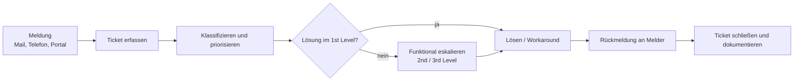

# P3 · IT-Service, Support und Qualität

> [!abstract] Überblick
> **Bereich:** [[Übersicht Projekt und Service]]
> **Dauer:** ca. 2 h · **Prüfungsrelevanz:** ★★☆ – Ticketsystem, Support-Level, SLA, Priorisierung, PDCA
> **Voraussetzungen:** [[P1 Projektmanagement und Vorgehensmodelle]]
> **Berufsschule:** GiD LF6 LS6.1 (IT-Service im Unternehmen – im 2. Lehrjahr)

## Lernziele
- [ ] Ich kann Incident, Problem, Service Request und Change unterscheiden.
- [ ] Ich kann Aufbau und Nutzen eines Ticketsystems sowie die Support-Level erklären.
- [ ] Ich kann Inhalte eines SLA (Servicezeit, Reaktions-, Wiederherstellungszeit, Verfügbarkeit) erklären und Verfügbarkeiten berechnen.
- [ ] Ich kann Tickets nach Auswirkung und Dringlichkeit bzw. mit der Eisenhower-Matrix priorisieren.
- [ ] Ich kann Qualitätsmanagement (PDCA, KVP, ISO 9001) auf IT-Prozesse anwenden.

## Worum geht es?
Montagmorgen: 14 neue Tickets. Der Drucker im 2. OG druckt nicht, die Geschäftsführerin kann keine Mails senden, ein Azubi braucht eine neue Maus, und die Warenwirtschaft ist für alle langsam. Womit fängst du an? Wer ist zuständig? Und was hat das Unternehmen dem Kunden eigentlich vertraglich zugesagt?

---

## 1. IT-Service-Management (ITSM)
**IT-Service-Management** plant, steuert und verbessert IT-Dienstleistungen so, dass sie die Anforderungen der Kunden erfüllen – Ziel ist **Kundenzufriedenheit** bei wirtschaftlichem Betrieb. Bekanntestes Rahmenwerk: **ITIL** (Sammlung bewährter Praktiken), Norm: **ISO/IEC 20000**.

| Begriff | Bedeutung | Ziel | Beispiel |
|---|---|---|---|
| **Incident** (Störung) | ungeplante Unterbrechung oder Qualitätsminderung eines Services | Betrieb **so schnell wie möglich** wiederherstellen – ein **Workaround** ist erlaubt | Drucker druckt nicht |
| **Problem** | (unbekannte) **Ursache** eines oder mehrerer Incidents | Ursache finden und **dauerhaft** beseitigen, Wiederholung verhindern | Druckertreiber verursacht wöchentliche Abstürze |
| **Service Request** | Standardanfrage, keine Störung | vereinbarte Leistung erbringen | neue Maus, Passwort zurücksetzen, Software installieren |
| **Change** | **geplante** Änderung an der IT | Risiko kontrollieren (Genehmigung, Test, Rückfallplan) | Firmware-Update aller Switches |

**Known Error:** Problem mit bekannter Ursache und dokumentiertem Workaround → **Wissensdatenbank (Knowledge Base)**.

## 2. Ticketsystem und Support-Level
Ein **Ticketsystem** erfasst jede Anfrage als **Ticket** mit eindeutiger Nummer – egal ob per Mail, Telefon, Portal oder Chat (**Single Point of Contact**: Service Desk).

**Inhalt eines Tickets:** Ticketnummer · Zeitpunkt · Melder und Kontakt · betroffenes System/Gerät · Beschreibung · **Kategorie** · **Priorität** · **Status** (neu, in Bearbeitung, wartend, gelöst, geschlossen) · Bearbeiter/Warteschlange · Verlauf aller Aktionen · Lösung.

**Vorteile:** nichts geht verloren · Nachvollziehbarkeit und Historie · Zuständigkeiten klar · Auswertungen/**Kennzahlen (KPI)** wie Anzahl, Lösungszeit, Erstlösungsquote · Wissensdatenbank · Nachweis der SLA-Einhaltung · einheitliches Auftreten gegenüber Kunden.

| Stufe | Zuständigkeit |
|---|---|
| **1st Level** (Service Desk/Helpdesk) | Annahme, Erfassung, Klassifizierung, Standardlösungen (Wissensdatenbank, Passwort-Reset), Weiterleitung – hohe **Erstlösungsquote** angestrebt |
| **2nd Level** | Fachspezialisten (Netzwerk, Server, Anwendungen) für tiefere Analyse |
| **3rd Level** | Hersteller, Entwickler, externe Dienstleister |

**Eskalation:** **funktional** = an eine höhere Supportstufe mit mehr Fachwissen · **hierarchisch** = an Vorgesetzte/Management, wenn Befugnisse oder Ressourcen fehlen oder Fristen gefährdet sind.

**Fernwartung:** Problem direkt am Bildschirm des Nutzers lösen – nur mit dessen **Zustimmung** und Protokollierung (Datenschutz).

<!-- abb:incident -->

*Abb.: Ablauf im Incident Management*

## 3. Priorisierung
**Priorität = Auswirkung (Impact) × Dringlichkeit (Urgency)**

| Auswirkung ↓ / Dringlichkeit → | hoch | mittel | niedrig |
|---|---|---|---|
| **hoch** (viele Nutzer / geschäftskritisch) | **1 – kritisch** | 2 – hoch | 3 – mittel |
| **mittel** (Abteilung) | 2 – hoch | 3 – mittel | 4 – niedrig |
| **niedrig** (eine Person, Workaround) | 3 – mittel | 4 – niedrig | 5 – planbar |

**Eisenhower-Matrix** (Zeitmanagement für eigene Aufgaben):

| | **dringend** | **nicht dringend** |
|---|---|---|
| **wichtig** | A: **sofort selbst erledigen** | B: **terminieren**, selbst erledigen |
| **nicht wichtig** | C: **delegieren** | D: **nicht bearbeiten** (Papierkorb) |

> [!example] Montagmorgen priorisiert
> 1. Warenwirtschaft für alle langsam → hohe Auswirkung, dringend → **Prio 1**
> 2. Geschäftsführerin kann keine Mails senden → eine Person, aber hohe Bedeutung/dringend → **Prio 2**
> 3. Drucker 2. OG → Abteilung, Workaround (anderer Drucker) → **Prio 3**
> 4. Neue Maus → Service Request, **Prio 4**

---

<!-- abb:eisenhower-matrix -->
![[eisenhower-matrix.svg]]
*Abb.: Eisenhower-Matrix*

## 4. Service Level Agreement (SLA)
Ein **SLA** ist eine Vereinbarung zwischen Dienstleister und Kunde über **messbare Servicequalität**. Rechtlich meist ein **Dienstvertrag** (Tätigkeit, kein Erfolg). Intern werden die Zusagen durch **OLAs** (Operational Level Agreements mit internen Abteilungen) und **Underpinning Contracts** (Verträge mit externen Zulieferern) abgesichert.

| Inhalt | Bedeutung |
|---|---|
| **Servicezeit** | wann der Support erreichbar ist (z. B. Mo–Fr 8–17 Uhr) |
| **Reaktionszeit** | Zeit bis zur ersten qualifizierten Bearbeitung |
| **Wiederherstellungszeit / Lösungszeit** | Zeit bis zur Wiederherstellung des Services |
| **Verfügbarkeit** | zugesicherter Prozentsatz, z. B. 99,5 % |
| **Prioritäten/Schweregrade** | Einteilung von Störungen mit jeweils eigenen Zeiten |
| **Eskalation, Ansprechpartner** | wer wann informiert wird |
| **Reporting** | regelmäßige Berichte über Kennzahlen |
| **Vertragsstrafen/Gutschriften** | bei Nichteinhaltung (Bonus-Malus) |

> [!example] Beispiel-SLA (fiktiv)
> | Priorität | Reaktionszeit | Wiederherstellung |
> |---|---|---|
> | 1 – kritisch (Produktivsystem steht) | 30 min | 4 h |
> | 2 – hoch (mehrere Nutzer, kein Workaround) | 1 h | 8 h |
> | 3 – mittel (Workaround vorhanden) | 4 h | 3 Arbeitstage |
> | 4 – niedrig | 1 Arbeitstag | nach Vereinbarung |
> Die Zeiten laufen nur **innerhalb der Servicezeit** – eine Meldung um 16:45 Uhr mit 30 min Reaktionszeit bei Servicezeit bis 17:00 Uhr muss spätestens am nächsten Morgen um 8:15 Uhr bearbeitet werden.

### Verfügbarkeit berechnen
**Verfügbarkeit = (vereinbarte Betriebszeit − Ausfallzeit) / vereinbarte Betriebszeit × 100 %**
Maximale Ausfallzeit = Betriebszeit × (1 − Verfügbarkeit)

| Verfügbarkeit | max. Ausfall pro Jahr (24/7 = 8 760 h) |
|---|---|
| 99 % | 87,6 h ≈ 3,65 Tage |
| 99,5 % | 43,8 h |
| 99,9 % | 8,76 h |
| 99,99 % | 52,6 min |

> [!example] Beispiel
> SLA 99,5 % im Monat (30 Tage, 24/7 = 720 h) → max. 720 × 0,005 = **3,6 h** Ausfall. Tatsächlich 5 h ausgefallen → Verfügbarkeit (720 − 5) / 720 = **99,31 %** → SLA verletzt.

**Change Request:** Änderungswünsche des Kunden (neue Funktionen) sind **kein** Teil des Supports laut SLA, sondern werden gesondert beauftragt und abgerechnet.

---

## 5. Qualitätsmanagement
**Qualität** = Grad, in dem die Merkmale eines Produkts/Services die **Anforderungen erfüllen**.
- **ISO 9001:** internationale Norm für **Qualitätsmanagementsysteme** (Kundenorientierung, Prozessorientierung, faktenbasierte Entscheidungen, kontinuierliche Verbesserung), zertifizierbar durch externe Audits
- **KVP** (kontinuierlicher Verbesserungsprozess), japanisch **Kaizen**: viele kleine Verbesserungen statt großer Sprünge, alle Mitarbeitenden beteiligt
- **TQM** (Total Quality Management): Qualität als Aufgabe des ganzen Unternehmens

### PDCA-Zyklus (Deming-Kreis)
| Phase | Inhalt | IT-Beispiel |
|---|---|---|
| **Plan** | Ist-Analyse, Ursachen, Ziele, Maßnahmen planen | Zu viele Passwort-Tickets → Self-Service-Portal planen |
| **Do** | Maßnahme im **kleinen Rahmen** umsetzen/testen | Pilot in einer Abteilung |
| **Check** | Ergebnis **messen** und mit dem Ziel vergleichen | Passwort-Tickets dort um 70 % gesunken? |
| **Act** | als **Standard** einführen (oder anpassen) → neuer Zyklus | Rollout für alle, Anleitung ins Intranet |

**Qualitätssicherung in IT-Projekten:** Checklisten, standardisierte Images, Testprotokolle, Vier-Augen-Prinzip, Abnahmeprotokolle, Dokumentation, Kundenzufriedenheitsumfragen nach Ticketabschluss.

**Ursachenanalyse:** **Ishikawa-Diagramm** (Fischgräten: Mensch, Maschine, Methode, Material, Mitwelt, Messung) · **5-Why-Methode** (fünfmal „Warum?“ fragen).

---

> [!warning] Typische Fehler in Prüfungen
> - Incident und Problem verwechseln (Incident = schnell wiederherstellen, Problem = Ursache beseitigen).
> - Ticket nach Workaround schließen, ohne das Problem zu verfolgen.
> - SLA-Zeiten außerhalb der Servicezeit weiterzählen.
> - Verfügbarkeit mit falscher Bezugszeit berechnen (24/7 vs. Servicezeit).
> - PDCA-Phasen nur aufzählen statt am Beispiel anwenden.

### Ergänzung: SOP
Eine **SOP** (Standard Operating Procedure) ist eine standardisierte, dokumentierte Arbeitsanweisung für wiederkehrende Abläufe (z. B. Neuen Mitarbeiter einrichten, Störung eskalieren). Sie sichert gleichbleibende Qualität und erleichtert die Einarbeitung.

### Ergänzung: Ursachen von Qualitätsmängeln systematisch finden
- **Ishikawa-Diagramm:** Ursachen nach Kategorien (Mensch, Maschine, Material, Methode, Umwelt) sammeln.
- **Pareto-Prinzip:** Wenige Ursachen (grob 20 %) verursachen den Großteil der Probleme (grob 80 %) – zuerst diese beseitigen.
- **5-Why-Methode:** Wiederholt „Warum?“ fragen, bis die eigentliche Ursache sichtbar ist.
- **PDCA – Plan:** Ist-Zustand ermitteln, Ziele festlegen. **Check:** Soll-Ist-Vergleich, z. B. 40 h geplant, 52 h angefallen → **+30 %**.
- **Dokumentation:** Benutzerdokumentation (Anleitung, Handbuch) für Anwender, Systemdokumentation (Konfiguration, Netzplan) für Administratoren – zielgruppengerecht, barrierefrei, aktuell.

## Verwandte Themen
- [[I3 Datensicherung]] – Wiederherstellungszeiten
- [[I1 Informationssicherheit und IT-Grundschutz]] – Verfügbarkeit als Schutzziel
- [[P4 Kommunikation und Kundenberatung]] – Gespräch mit dem Kunden

## Zusammenfassung
- Incident (Störung, schnell beheben), Problem (Ursache), Service Request (Standard), Change (geplante Änderung).
- Ticketsystem: Nummer, Kategorie, Priorität, Status, Historie, KPIs, Wissensdatenbank.
- 1st/2nd/3rd Level; funktionale vs. hierarchische Eskalation.
- Priorität = Auswirkung × Dringlichkeit; Eisenhower: sofort, terminieren, delegieren, weglassen.
- SLA: Servicezeit, Reaktions- und Wiederherstellungszeit, Verfügbarkeit; Dienstvertrag; OLA/UC.
- Verfügbarkeit = (Soll − Ausfall) / Soll; 99,9 % ≈ 8,76 h/Jahr.
- QM: ISO 9001, KVP, PDCA (Plan, Do, Check, Act).

## Direkt üben
```dataviewjs
await dv.view("AP1/99 System/views/trainer", { typen: ["verfuegbarkeit"] })
```

## Selbstcheck
```dataviewjs
await dv.view("AP1/99 System/views/quiz", { modul: "P3" })
```

**Weitere Aufgaben:** [[Aufgaben Projekt und Service#P3 IT-Service, Support und Qualität]] · **Karteikarten:** [[Karten Projekt und Service]]

## Einschätzung
```dataviewjs
await dv.view("AP1/99 System/views/selbstcheck")
```

---
← [[P2 Netzplan und Zeitplanung]] · Weiter: [[P4 Kommunikation und Kundenberatung]] →
