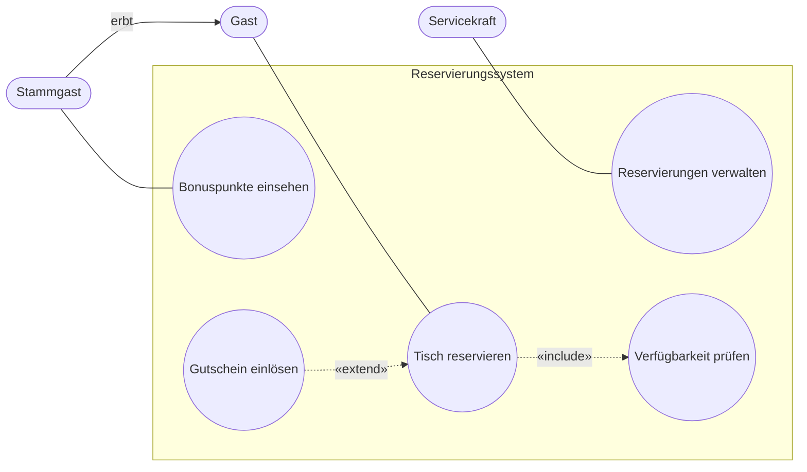

# FIAE-2 · Anforderungen und Use Cases

> [!abstract] Überblick
> **Bereich:** [[Übersicht FIAE Planen eines Softwareproduktes]]
> **Prüfung:** „Planen eines Softwareproduktes“
> **Dauer:** ca. 120 min · **Prüfungsrelevanz:** ★★★ – Use-Case-Diagramme mit include/extend und Akteursvererbung, funktionale vs. nichtfunktionale Anforderungen, Qualitätsmerkmale nach ISO 25010
> **Grundlagen aus AP1:** [[S8 UML und Softwareentwurf]] · [[P1 Projektmanagement und Vorgehensmodelle]]

## Lernziele
- [ ] Ich kann Lastenheft und Pflichtenheft abgrenzen und Anforderungen erheben.
- [ ] Ich kann funktionale und nichtfunktionale Anforderungen formulieren und unterscheiden.
- [ ] Ich kann Qualitätsmerkmale nach ISO/IEC 25010 beschreiben.
- [ ] Ich kann ein Use-Case-Diagramm mit Systemgrenze, Akteuren, Anwendungsfällen, include, extend und Generalisierung erstellen.
- [ ] Ich kann User Stories und Akzeptanzkriterien schreiben.

## So wird das geprüft
> [!info] Typische AP2-Aufgabentypen
> - **Use-Case-Diagramm erstellen:** Punkte gibt es je Akteur, je Anwendungsfall, je include/extend-Beziehung, je Assoziation – teilweise auch für die **Vererbung zwischen Akteuren**.
> - **Funktionale und nichtfunktionale Anforderungen** an eine App.
> - **Qualitätsmerkmale** (Effizienz, Änderbarkeit; Zuverlässigkeit + ein weiteres nach ISO 25010).
> - **Sicherheitsanforderungen** an eine Anwendung, **Vorteile der Lösung** für den Kunden.
> - **eRechnung:** Zweck, Anforderungen (digitaler Datensatz, maschinenlesbar).

---

## 1. Anforderungsdokumente

| | **Lastenheft** | **Pflichtenheft** |
|---|---|---|
| erstellt von | **Auftraggeber** | **Auftragnehmer** |
| beschreibt | **WAS** und **WOFÜR** – Anforderungen aus Kundensicht | **WIE** und **WOMIT** – konkrete technische Umsetzung |
| Norm | DIN 69901-5 | DIN 69901-5 |
| Rolle | Grundlage für Angebote | Grundlage für Umsetzung, Test und **Abnahme** |

**Anforderungen erheben:** Interviews, Workshops, Fragebögen, Beobachtung, Dokumentenanalyse, Prototypen, Analyse des Ist-Prozesses.
**Gute Anforderungen** sind eindeutig, vollständig, konsistent, **prüfbar** (messbar), realisierbar und priorisiert (z. B. MoSCoW: Must, Should, Could, Won't).

### Funktional und nichtfunktional
| **funktional** – *was* das System tut | **nichtfunktional** – *wie gut* es das tut |
|---|---|
| Benutzer anmelden (Authentifizierung) | Antwortzeit unter 2 s bei 500 gleichzeitigen Nutzern |
| Termin buchen, Rechnung erzeugen | Verfügbarkeit 99,5 % |
| Push-Benachrichtigung bei Fehlern | lauffähig auf iOS und Android ab Version X |
| Eingaben validieren | Bedienbarkeit (Usability), Barrierefreiheit |
| Schnittstelle zum ERP bereitstellen | Datenschutz nach DSGVO, Verschlüsselung |
| Export als CSV | Wartbarkeit, Fehlertoleranz, Datenintegrität |

---

## 2. Softwarequalität nach ISO/IEC 25010

Die Prüfungen verwenden das bekannte Modell mit acht Merkmalen (Fassung 2011). Die Neufassung ISO/IEC 25010:2023 benennt einige Merkmale um (z. B. Interaktionsfähigkeit statt Benutzbarkeit, Flexibilität statt Übertragbarkeit) und ergänzt die Betriebssicherheit (Safety).


| Merkmal | Bedeutung |
|---|---|
| **Funktionale Eignung** | vollständig, korrekt, angemessen |
| **Leistungseffizienz** (Effizienz) | Zeitverhalten, Ressourcenverbrauch, Kapazität – mit wenig Rechenleistung zum Ergebnis |
| **Kompatibilität** | Koexistenz, Interoperabilität mit anderen Systemen |
| **Benutzbarkeit** (Usability) | erlernbar, bedienbar, Schutz vor Fehlbedienung, ansprechend, **barrierefrei** |
| **Zuverlässigkeit** | Reife, **Verfügbarkeit**, **Fehlertoleranz**, Wiederherstellbarkeit – das System funktioniert unter festgelegten Bedingungen über einen Zeitraum korrekt |
| **Sicherheit** | Vertraulichkeit, Integrität, Nachweisbarkeit, Authentizität |
| **Wartbarkeit** (Änderbarkeit) | modular, wiederverwendbar, analysierbar, **änderbar**, testbar – gut strukturierter Code lässt sich leicht anpassen |
| **Übertragbarkeit** (Portabilität) | anpassbar, installierbar, austauschbar |

---

## 3. Use-Case-Diagramm

**Elemente:**
- **Systemgrenze** (Rechteck mit Systemname) – alles innerhalb gehört zum System
- **Akteure** (Strichmännchen, außerhalb) – Rollen von Personen oder externe Systeme
- **Anwendungsfälle** (Ellipsen, innerhalb) – Funktionen mit Nutzen für einen Akteur, als **Verb + Objekt** („Termin buchen“)
- **Assoziation** (Linie) – Akteur ist an einem Anwendungsfall beteiligt
- **«include»** (gestrichelter Pfeil **zum inkludierten** Fall) – der Basisfall führt den inkludierten Fall **immer** aus („Bestellen“ «include» „Anmelden“)
- **«extend»** (gestrichelter Pfeil **zum Basisfall**) – optionale Erweiterung **unter einer Bedingung** (Extension Point), z. B. „Gutschein einlösen“ «extend» „Bezahlen“
- **Generalisierung** (Pfeil mit leerem Dreieck) – zwischen Akteuren (Administrator **ist ein** Benutzer, erbt dessen Anwendungsfälle) oder Anwendungsfällen



> [!tip] Punkte holen
> Jede Beziehung ist ein Punkt: Akteure **außerhalb** der Systemgrenze, Fälle **innerhalb**, Pfeilrichtungen von include (Basis → inkludiert) und extend (Erweiterung → Basis) richtig, Stereotyp beschriften, Akteursvererbung mit Dreieck.

### Anwendungsfallbeschreibung
Name · Akteur · Vorbedingung · **Standardablauf** (nummerierte Schritte) · alternative Abläufe/Ausnahmen · Nachbedingung · Häufigkeit.

### User Stories
„**Als** ‹Rolle› **möchte ich** ‹Funktion›, **damit** ‹Nutzen›.“ Mit **Akzeptanzkriterien** (Given – When – Then) und Schätzung in Story Points. Kriterien guter Stories: **INVEST** (independent, negotiable, valuable, estimable, small, testable).

---

## 4. Beispiel eRechnung

Seit 2025 müssen Unternehmen in Deutschland **E-Rechnungen** empfangen können (B2B, schrittweise Ausstellungspflicht). Eine E-Rechnung ist ein **strukturierter digitaler Datensatz** (XRechnung, ZUGFeRD ab Version 2.0.1 außer den Profilen MINIMUM und BASIC-WL), der **maschinell verarbeitet** werden kann – eine PDF-Datei allein ist keine E-Rechnung. Das Hauptziel ist die **automatische Verarbeitung**; die menschenlesbare Darstellung ist zweitrangig.
Anforderungen an eine Software: Formate erzeugen und validieren (XSD-Schema, Schematron), Pflichtangaben, Archivierung (GoBD), Schnittstellen zu Buchhaltung/ERP. Testen mit **zertifizierten Validatoren**, Unit-Tests und **nicht realen Testdaten**; eine Schemavalidierung prüft nur die **Struktur**, keine Rechenlogik (z. B. Brutto statt Netto summiert) – dafür braucht es zusätzliche Tests (→ [[FIAE-11 Testen und Qualitätssicherung]]).

---

> [!warning] Typische Fehler in Prüfungen
> - include- und extend-Pfeile in die falsche Richtung.
> - Akteure innerhalb der Systemgrenze zeichnen.
> - Anwendungsfälle als Oberflächenschritte („Button klicken“) statt als Funktionen mit Nutzen.
> - Nichtfunktionale Anforderungen ohne Messgröße („schnell“) formulieren.
> - Lastenheft und Pflichtenheft vertauschen.

## Verwandte Themen
- [[FIAE-1 Projektmanagement in der Softwareentwicklung]] – Projektrahmen
- [[FIAE-3 UML Aktivität, Sequenz und Zustand]] – Verhalten modellieren
- [[FIAE-6 Benutzeroberflächen, Barrierefreiheit und Usability]] – Usability als Qualitätsmerkmal
- [[S8 UML und Softwareentwurf]] – Grundlagen aus AP1

## Zusammenfassung
- ==🔴Lastenheft (Auftraggeber: was/wofür) vs. Pflichtenheft (Auftragnehmer: wie/womit)==.
- ==🟡Funktional = was, nichtfunktional = wie gut (messbar!)==.
- ISO 25010: funktionale Eignung, Effizienz, Kompatibilität, Benutzbarkeit, Zuverlässigkeit, Sicherheit, Wartbarkeit, Übertragbarkeit.
- Use Case: Systemgrenze, Akteure außen, Fälle innen; ==🟢include = immer (Basis → inkludiert), extend = optional (Erweiterung → Basis)==, Generalisierung mit Dreieck.
- User Story: Als … möchte ich … damit … + Akzeptanzkriterien.

## Selbstcheck
```dataviewjs
await dv.view("AP2/99 System/views/quiz", { modul: "FIAE-2" })
```

**Weitere Aufgaben:** [[Aufgaben Planen eines Softwareproduktes#FIAE-2 Anforderungen und Use Cases]] · **Karteikarten:** [[Karten Planen eines Softwareproduktes]]

## Einschätzung
```dataviewjs
await dv.view("AP2/99 System/views/selbstcheck")
```

---
← [[FIAE-1 Projektmanagement in der Softwareentwicklung]] · Weiter: [[FIAE-3 UML Aktivität, Sequenz und Zustand]] →
