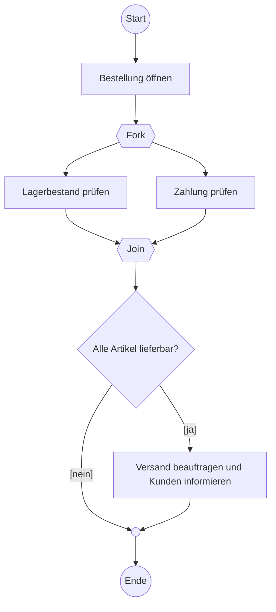
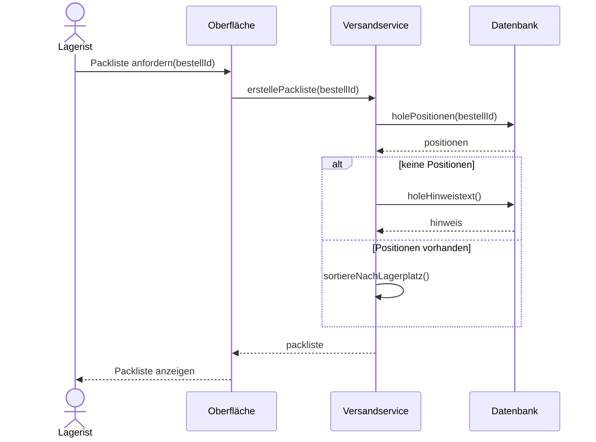
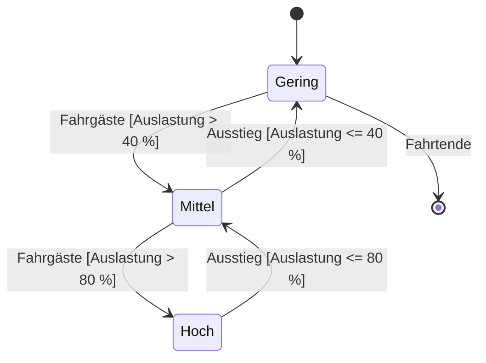

# FIAE-3 · UML Aktivität, Sequenz und Zustand

> [!abstract] Überblick
> **Bereich:** [[Übersicht FIAE Planen eines Softwareproduktes]]
> **Prüfung:** beide FIAE-Teile – Diagramme bringen oft 20–29 Punkte am Stück
> **Dauer:** ca. 150 min · **Prüfungsrelevanz:** ★★★ – Aktivitätsdiagramm mit Parallelität, Sequenzdiagramm mit alt/opt, Zustandsdiagramm
> **Grundlagen aus AP1:** [[S8 UML und Softwareentwurf]] · [[S3 Algorithmen, Darstellung und Testen]]

## Lernziele
- [ ] Ich kann ein Aktivitätsdiagramm mit Start, Ende, Aktionen, Verzweigung, Zusammenführung, Parallelisierung und Synchronisation zeichnen.
- [ ] Ich kann ein Sequenzdiagramm mit Lebenslinien, synchronen/asynchronen Nachrichten, Antworten und Fragmenten (alt, opt, loop) ergänzen.
- [ ] Ich kann ein Zustandsdiagramm mit Zuständen, Übergängen, Ereignissen und Bedingungen erstellen.
- [ ] Ich kann einen Ist-Prozess analysieren und Digitalisierungspotenzial begründen.

## So wird das geprüft
> [!info] Typische AP2-Aufgabentypen
> - **Aktivitätsdiagramm** aus einem beschriebenen Ablauf: Punkte je Aktivität, für das Ende, **2 Punkte für die Synchronisation** und je Verzweigung; vorgegebene Aktivitäten an die richtige Stelle setzen (z. B. Bewässerungssteuerung).
> - **Sequenzdiagramm ergänzen:** Pfeile mit Beschriftung, Alternativfragment mit Bedingungen, Abläufe mit **opt** oder **alt**.
> - **Zustandsdiagramm:** Start- und Endpunkt, Zustände, Übergänge mit Bedingung.
> - **Prozess analysieren:** Probleme im Ist-Ablauf benennen und Digitalisierung begründen.

---

## 1. Aktivitätsdiagramm

Zeigt einen **Ablauf** (Algorithmus, Geschäftsprozess) – die Standarddarstellung für Abläufe, seit PAP und Struktogramm aus dem Prüfungskatalog gestrichen sind.

| Element | Symbol | Bedeutung |
|---|---|---|
| **Startknoten** | ● gefüllter Kreis | Beginn |
| **Endknoten** | ◉ Kreis mit Punkt | Ende der **gesamten** Aktivität |
| Ablaufende | ⊗ | Ende **eines** Zweiges |
| **Aktion** | Rechteck mit runden Ecken | ein Schritt („Lagerbestand prüfen“) |
| **Verzweigung / Zusammenführung** | ◇ Raute | Entscheidung mit **Bedingungen in eckigen Klammern** `[Betrag > 500]` / Zweige wieder zusammenführen |
| **Gabelung (Fork) / Vereinigung (Join)** | dicker Balken | Zweige laufen **parallel** / Warten, bis **alle** parallelen Zweige fertig sind (**Synchronisation**) |
| Objektfluss | Rechteck zwischen Aktionen | Daten/Dokument wird weitergegeben |
| Schwimmbahnen (Partitionen) | Spalten | wer führt die Aktion aus (Vertrieb, Lager, System) |



**Regeln:** Jede Verzweigung braucht **vollständige, sich ausschließende Bedingungen**; parallele Zweige werden **mit einem Join synchronisiert**, bevor es weitergeht; genau ein Startknoten.

### Ist-Prozess analysieren
Schwachstellen erkennen: **manuelle Übertragungen** (fehleranfällig, Zeitverlust), Medienbrüche (Papier → System), fehlende Priorisierung, Informationen erreichen Beteiligte zu spät, Entscheidungen nur aus Erfahrung. Digitalisierung begründen mit Zeitersparnis, weniger Fehlern, Automatisierung (Geräte und Systeme liefern Daten direkt), Vorschlägen aus Daten.

---

## 2. Sequenzdiagramm

Zeigt den **zeitlichen Nachrichtenaustausch** zwischen Objekten (von oben nach unten).

| Element | Darstellung |
|---|---|
| **Lebenslinie** | Objekt `name : Klasse` oben, gestrichelte Linie nach unten |
| **Aktivierungsbalken** | schmales Rechteck: Objekt ist aktiv |
| **synchrone Nachricht** | durchgezogener Pfeil mit **gefüllter** Spitze – Sender wartet auf Antwort |
| **asynchrone Nachricht** | durchgezogener Pfeil mit **offener** Spitze – Sender wartet nicht |
| **Antwort** | **gestrichelter** Pfeil zurück (Rückgabewert) |
| Objekterzeugung | Pfeil auf den Objektkopf, «create» |
| **alt** | Alternativen mit Bedingungen `[gefunden]` / `[else]` (wie if-else) |
| **opt** | optionaler Teil, nur wenn Bedingung gilt (wie if ohne else) |
| **loop** | Wiederholung `loop [für jede Position]` |
| par | parallele Abschnitte |



**Vom Code zum Diagramm:** jede Methodenaufruf-Zeile ist ein Pfeil vom aufrufenden zum aufgerufenen Objekt; `if` ohne `else` → **opt**, `if/else` → **alt**, Schleife → **loop**; Rückgabewerte als gestrichelte Antwort.

---

## 3. Zustandsdiagramm

Zeigt die **Zustände eines Objekts** und die **Übergänge** dazwischen – ideal für Status (Auftrag, Ampel, Auslastung, Ticket).

| Element | Darstellung |
|---|---|
| Startzustand | ● |
| Endzustand | ◉ |
| Zustand | Rechteck mit runden Ecken, optional `entry / do / exit`-Aktionen |
| **Transition** | Pfeil, beschriftet mit `Ereignis [Bedingung] / Aktion` |



Ein Zustand wird nur über eine **Transition** verlassen; zu jedem Zustand gehört mindestens ein ein- und (außer Endzustand) ein ausgehender Übergang.

---

> [!warning] Typische Fehler in Prüfungen
> - Parallele Zweige ohne **Join** zusammenlaufen lassen (oder mit einer Raute statt eines Balkens).
> - Bedingungen ohne eckige Klammern oder nicht vollständig (`[> 500]` ohne `[<= 500]`).
> - Im Sequenzdiagramm Antworten als durchgezogene Pfeile zeichnen.
> - `opt` und `alt` verwechseln: **opt = nur ein Zweig**, **alt = mehrere Alternativen**.
> - Im Zustandsdiagramm Aktionen statt Zustände modellieren („Messen“ statt „Hohe Auslastung“).

## Verwandte Themen
- [[FIAE-2 Anforderungen und Use Cases]] – Anwendungsfälle
- [[FIAE-4 Objektorientierter Entwurf und Entwurfsmuster]] – Klassendiagramme
- [[FIAE-9 Algorithmen in Pseudocode]] – vom Diagramm zum Code
- [[S8 UML und Softwareentwurf]] – Grundlagen aus AP1

## Zusammenfassung
- Aktivität: Start ●, Aktionen, Raute mit `[Bedingungen]`, Fork/Join-Balken für Parallelität und Synchronisation, Ende ◉.
- Sequenz: Lebenslinien, ==🟡synchron (gefüllte Spitze), asynchron (offen), Antwort gestrichelt==; Fragmente alt, opt, loop.
- Zustand: Zustände, Transitionen `Ereignis [Bedingung] / Aktion`, Start und Ende.
- Ist-Prozess: ==🟢Medienbrüche und manuelle Übertragungen sind Digitalisierungspotenzial==.

## Selbstcheck
```dataviewjs
await dv.view("AP2/99 System/views/quiz", { modul: "FIAE-3" })
```

**Weitere Aufgaben:** [[Aufgaben Planen eines Softwareproduktes#FIAE-3 UML Aktivität, Sequenz und Zustand]] · **Karteikarten:** [[Karten Planen eines Softwareproduktes]]

## Einschätzung
```dataviewjs
await dv.view("AP2/99 System/views/selbstcheck")
```

---
← [[FIAE-2 Anforderungen und Use Cases]] · Weiter: [[FIAE-4 Objektorientierter Entwurf und Entwurfsmuster]] →
