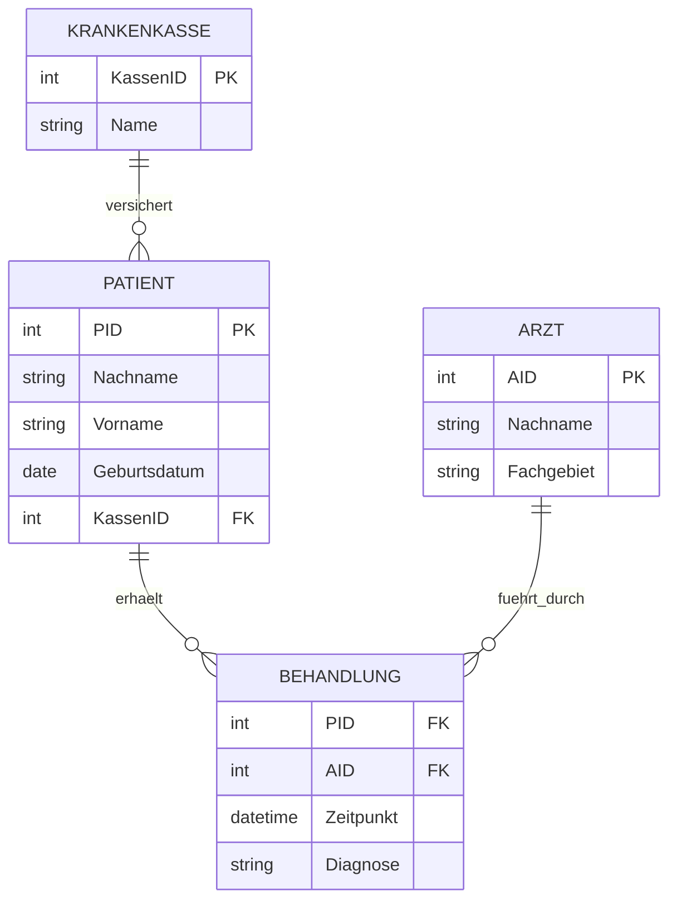

# FIAE-5 · Datenmodellierung und Normalisierung

> [!abstract] Überblick
> **Bereich:** [[Übersicht FIAE Planen eines Softwareproduktes]]
> **Prüfung:** beide FIAE-Teile – ER-Modelle bringen 20–27 Punkte
> **Dauer:** ca. 150 min · **Prüfungsrelevanz:** ★★★ – ER-Modell aus Anforderungen, Tabellenmodell mit Schlüsseln und Kardinalitäten, Redundanz und Anomalien, Datenqualität beim Import
> **Prüfungskatalog:** Datenbanken und SQL sind seit dem Katalog 2025 AP2-Stoff.
> **Grundlagen aus AP1:** [[S7 Datenbanken]]

## Lernziele
- [ ] Ich kann aus einer Beschreibung Entitätstypen, Attribute, Schlüssel und Beziehungen mit Kardinalitäten modellieren.
- [ ] Ich kann ein ER-Modell in Tabellen überführen und n:m-Beziehungen auflösen.
- [ ] Ich kann Redundanz, Einfüge-, Änderungs- und Löschanomalien an Beispielen erklären und bis zur 3. Normalform normalisieren.
- [ ] Ich kann Probleme der Datenqualität erkennen und Lösungen vorschlagen.
- [ ] Ich kann NoSQL-Vorteile und den Speicherbedarf großer Datenmengen abschätzen.

## So wird das geprüft
> [!info] Typische AP2-Aufgabentypen
> - **ER-Modell erstellen:** Punkte je Entitätstyp, Attribut, Primärschlüssel und je Beziehung mit Kardinalität; Attribute an einer n:m-Beziehung.
> - **Tabellenmodell mit Primärschlüssel und Beziehungen**.
> - **Redundanz erklären, Anomalien mit Beispiel** aus einer gegebenen Tabelle.
> - **Datenqualität beim Import** alter Daten: uneinheitliche Formate, Namen statt IDs, fehlende Werte.
> - **NoSQL-Vorteile**, **Speicherbedarf** großer Bilddatenmengen in TiB.

---

## 1. ER-Modell

| Element | Chen-Notation | Bedeutung |
|---|---|---|
| **Entitätstyp** | Rechteck | Klasse gleichartiger Objekte (Patient, Arzt) |
| **Attribut** | Oval, **Schlüssel unterstrichen** | Eigenschaft (Name, Geburtsdatum) |
| **Beziehungstyp** | Raute | Zusammenhang (behandelt) |
| **Kardinalität** | 1, n, m an den Linien | wie viele Entitäten beteiligt sind |

**Kardinalitäten:**
- **1:1** – Patient hat eine Krankenakte
- **1:n** – eine Station hat viele Patienten, ein Patient liegt auf einer Station
- **n:m** – Ärzte behandeln viele Patienten, Patienten werden von mehreren Ärzten behandelt; **Attribute der Beziehung** (Datum, Diagnose) gehören an die Raute bzw. in die Zwischentabelle
In der **Min-Max-Notation** bzw. Krähenfuß-Notation wird zusätzlich angegeben, ob eine Beziehung optional (0) oder verpflichtend (1) ist.



### ER-Modell in Tabellen überführen
1. Jeder **Entitätstyp** wird eine Tabelle mit **Primärschlüssel**.
2. **1:n:** Der Primärschlüssel der 1-Seite wird als **Fremdschlüssel** in die n-Tabelle aufgenommen.
3. **n:m:** **Zwischentabelle** mit beiden Fremdschlüsseln (zusammen oft der Primärschlüssel) plus Beziehungsattribute.
4. **1:1:** Fremdschlüssel in eine der beiden Tabellen (mit UNIQUE) oder zusammenlegen.

**Schlüssel:** **Primärschlüssel** (eindeutig, nicht NULL, am besten **künstlich** wie eine ID statt Name), **Fremdschlüssel**, **zusammengesetzter Schlüssel**, **Kandidatenschlüssel** (möglicher Primärschlüssel).

---

## 2. Redundanz, Anomalien, Normalisierung

**Redundanz** = dieselbe Information wird **mehrfach** gespeichert (z. B. die kompletten Kontaktdaten eines Gastes bei jedem Besuch). Folgen: Speicherverschwendung, **Inkonsistenzen** und Anomalien.

| Anomalie | Erklärung | Beispiel (Tabelle Besuch mit Gast- und Leistungsdaten) |
|---|---|---|
| **Änderungsanomalie** | eine Änderung muss in **vielen** Zeilen erfolgen, sonst widersprüchliche Daten | Umbenennung „Caesar Salat“ in jeder Besuchszeile |
| **Einfügeanomalie** | neue Information lässt sich nur mit leeren oder erfundenen Feldern einfügen | neuer Gast ohne Besuch → Besuchsfelder leer |
| **Löschanomalie** | beim Löschen gehen **andere, einmalige** Informationen verloren | letzter Besuch mit „Tiramisu“ gelöscht → Leistung Tiramisu ist weg |

**Normalformen:**
| Normalform | Regel | typische Maßnahme |
|---|---|---|
| **1. NF** | alle Attribute **atomar** (keine Listen, keine zusammengesetzten Werte), keine Wiederholungsgruppen | „Name“ in Vorname/Nachname, Adresse in Straße/PLZ/Ort teilen; Mehrfachwerte in eigene Zeilen |
| **2. NF** | 1. NF + jedes Nichtschlüsselattribut hängt vom **ganzen** (zusammengesetzten) Schlüssel ab | Attribute, die nur von einem Teil des Schlüssels abhängen, auslagern |
| **3. NF** | 2. NF + **keine transitiven Abhängigkeiten** (Nichtschlüsselattribut hängt nicht von einem anderen Nichtschlüsselattribut ab) | PLZ → Ort in eigene Tabelle; Kassenname über KassenID |

Normalisierung vermeidet Anomalien, kostet aber mehr Tabellen und Joins; in Auswertungssystemen wird bewusst **denormalisiert**.

---

## 3. Datenqualität

Beim **Import von Altdaten** (z. B. Excel-Listen) typische Mängel:
- **uneinheitliche Formate** (2023-4-13 vs. 31.7.23) → Import bricht ab oder muss aufwendig umwandeln
- **ungültige Werte** (31.4.)
- **Namen statt IDs**, unterschiedliche Schreibweisen (Müller/Mueller) → Dubletten, falsche Zuordnung
- **Freitext** für gleiche Sachverhalte → Auswertungen („wie oft kein Ticket?“) unmöglich
- **fehlende Pflichtwerte** → Nachvollziehbarkeit geht verloren
Lösungen: Daten **bereinigen** (manuell oder per Skript), Importprogramm mit **Validierung und Fehlerbehandlung**, Mappingtabellen, künftig **Auswahllisten und Pflichtfelder** in der Eingabemaske. Abwägen: Lohnt sich der Aufwand im Verhältnis zum Wert der Daten?

---

## 4. NoSQL und große Datenmengen

### Open Data und verknüpfte Daten

**Open Data** sind Daten, die unter einer offenen Lizenz so bereitgestellt werden, dass sie weiterverwendet werden dürfen. Ein öffentlich erreichbares Portal allein macht Daten noch nicht „offen“: Lizenz, Nutzungsbedingungen und erforderliche Namensnennung müssen geprüft werden. Vor dem Zusammenführen sind außerdem Datenqualität, Erhebungszeitraum, Definitionen, Herkunft und Personenbezug zu klären.

**Fünf Sterne für Linked Open Data (Berners-Lee):** ★ offene Lizenz im Web · ★★ strukturierte, maschinenlesbare Daten · ★★★ offenes Format wie CSV statt proprietärem Tabellenformat · ★★★★ stabile HTTP-URIs für Datensätze und Dinge · ★★★★★ Verknüpfungen zu anderen Datensätzen. Die Stufen bauen aufeinander auf. Bei vier und fünf Sternen kommen Identifikatoren und Verknüpfungen hinzu; die Daten müssen weiterhin offen lizenziert sein. [W3C: 5-Star Linked Data](https://www.w3.org/2011/gld/wiki/5_Star_Linked_Data)

**Heterogene Daten** liegen in unterschiedlichen Formaten oder mit abweichender Struktur vor, etwa Messwerte als CSV, Stationsbeschreibungen als XML und Geräteinformationen als JSON. Gleiche Namen reichen nicht als sicherer Schlüssel. Eine Verknüpfung (Record Linkage) braucht nachvollziehbare Schlüssel oder eine dokumentierte Zuordnungsregel, zum Beispiel Stations-ID + Messzeitpunkt für einen Messwert. Stationsbeschreibungen werden über die Stations-ID angebunden; abweichende Stationsnamen müssen zunächst auf stabile IDs abgebildet werden. Doppelte, nicht zugeordnete und widersprüchliche Datensätze werden protokolliert und fachlich geprüft, statt stillschweigend verworfen.

Ein **Metadatensatz** hält zum Beispiel Titel, Herausgeber, Erstellungszeitraum, Aktualisierungsdatum, Format, Lizenz, Felddefinitionen und Herkunft fest. Für wiederverwendbare Daten dokumentiert er auch Maßeinheiten, Zeitzone, fehlende Werte und stabile Kennungen.

**NoSQL-Vorteile:** **flexibles Schema** (neue Felder ohne Migration), schnellere Umsetzung neuer Funktionen, gute **horizontale Skalierung**, schnelle Abfragen bei komplexen oder verschachtelten Strukturen, Datenstruktur passt zum Programm (Dokumente = Objekte). Arten: Dokument (MongoDB), Key-Value (Redis), Spalten (Cassandra), Graph (Neo4j).

### Speicherbedarf abschätzen
Bildgröße = Breite × Höhe × Farbtiefe ÷ 8 (unkomprimiert) · × Anzahl Bilder je Aufnahmeserie × Serien pro Woche × 52 Wochen → in TiB umrechnen (÷ 1 024⁴).
> Beispiel: 4 000 × 3 000 Pixel × 24 Bit = 36 000 000 Byte ≈ 34,33 MiB je Bild; 500 Bilder × 3 Serien × 52 Wochen = 78 000 Bilder → 2 808 000 000 000 Byte ≈ **2,55 TiB** pro Jahr.

---

> [!warning] Typische Fehler in Prüfungen
> - n:m direkt mit Fremdschlüssel lösen statt mit **Zwischentabelle**.
> - Fremdschlüssel auf der falschen Seite einer 1:n-Beziehung (er gehört auf die **n-Seite**).
> - Attribute einer Beziehung (Datum der Behandlung) an eine der Entitäten hängen.
> - Anomalien nur definieren statt **am Beispiel der Tabelle** zu erklären.
> - Namen als Primärschlüssel verwenden.

### Ergänzung: Datentypen für Medien und Koordinaten
**BLOB** für Binärdaten (Fotos, PDFs), **DECIMAL(9,6)** oder ein Geodatentyp für Koordinaten, **DECIMAL(10,2)** für Geldbeträge.

## Verwandte Themen
- [[FIAE-12 SQL für Entwickler]] – das Modell mit SQL anlegen und abfragen
- [[FIAE-4 Objektorientierter Entwurf und Entwurfsmuster]] – Klassenmodell
- [[FISI-8 Datenbanken und Modellierung]] – Betrieb von Datenbanken
- [[S7 Datenbanken]] – Grundlagen aus AP1

## Zusammenfassung
- ER: Entität (Rechteck), Attribut (Oval, Schlüssel unterstrichen), Beziehung (Raute), Kardinalität 1:1, 1:n, n:m.
- Tabellen: je Entität eine Tabelle; ==🟢1:n → FK auf n-Seite; n:m → Zwischentabelle== (+ Beziehungsattribute).
- Redundanz → Änderungs-, Einfüge-, Löschanomalie. ==🟢1. NF atomar, 2. NF voll abhängig, 3. NF keine transitiven Abhängigkeiten==.
- Datenqualität: Formate, Dubletten, Freitext, fehlende Werte → bereinigen, validieren, Auswahllisten. Open Data braucht eine offene Lizenz und brauchbare Metadaten; heterogene Daten über stabile Schlüssel und dokumentierte Zuordnungsregeln verbinden.
- Fünf Sterne: offene Lizenz → strukturiert → offenes Format → URIs → Verknüpfungen mit anderen Datensätzen.
- NoSQL: flexibel, skalierbar. Speicher: ==🔵Pixel × Bit ÷ 8 × Anzahl → TiB==.

## Direkt üben
```dataviewjs
await dv.view("AP2/99 System/views/trainer", { typen: ["datenmenge", "speicherbedarf", "einheiten"] })
```

## Selbstcheck
```dataviewjs
await dv.view("AP2/99 System/views/quiz", { modul: "FIAE-5" })
```

**Weitere Aufgaben:** [[Aufgaben Planen eines Softwareproduktes#FIAE-5 Datenmodellierung und Normalisierung]] · **Karteikarten:** [[Karten Planen eines Softwareproduktes]]

## Einschätzung
```dataviewjs
await dv.view("AP2/99 System/views/selbstcheck")
```

---
← [[FIAE-4 Objektorientierter Entwurf und Entwurfsmuster]] · Weiter: [[FIAE-6 Benutzeroberflächen, Barrierefreiheit und Usability]] →
