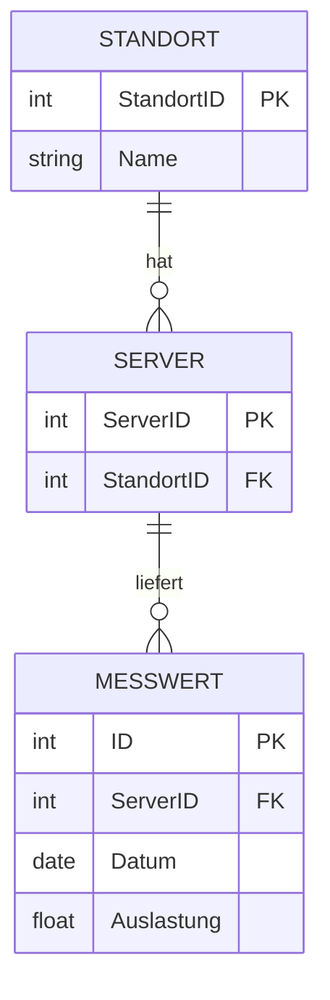

# FISI-8 · Datenbanken und Modellierung

> [!abstract] Überblick
> **Bereich:** [[Übersicht FISI Konzeption und Administration]]
> **Prüfung:** „Konzeption und Administration von IT-Systemen“
> **Dauer:** ca. 120 min · **Prüfungsrelevanz:** ★★☆ – SQL, ER-Modelle und UML-Diagrammarten sowie Aggregation und Komposition verstehen und anwenden.
> **Prüfungskatalog:** SQL ist seit dem Katalog 2025 **ausdrücklich AP2-Stoff** (in AP1 gestrichen).
> **Grundlagen aus AP1:** [[S7 Datenbanken]] · [[S8 UML und Softwareentwurf]]

## Lernziele
- [ ] Ich kann Datentypen für Spalten begründet wählen (CHAR vs. VARCHAR, INT, DATE, BOOLEAN).
- [ ] Ich kann Tabellen mit Primär- und Fremdschlüssel anlegen (`CREATE TABLE`).
- [ ] Ich schreibe einfache Abfragen mit `WHERE`, `COUNT`, `JOIN`, `LIKE`, `GROUP BY`, `ORDER BY`.
- [ ] Ich kann ein ER-Modell mit Kardinalitäten lesen und ergänzen und referenzielle Integrität erklären.
- [ ] Ich kenne NoSQL-Arten, Indizes und Sperrmechanismen und kann eine Datenbank absichern und überwachen.
- [ ] Ich kann UML-Diagramme statisch/dynamisch zuordnen und Aggregation von Komposition unterscheiden.

## So wird das geprüft
> [!info] Typische AP2-Aufgabentypen
> - **Datentypen zuordnen** (`INT`, `VARCHAR`, `CHAR`, `DECIMAL`, `DATE`, `BOOLEAN`).
> - **`CREATE TABLE` mit PRIMARY KEY und FOREIGN KEY** ergänzen.
> - **Abfragen:** `COUNT(*)` mit `WHERE`, **`INNER JOIN` mit `LIKE`** und Datumsvergleich, Top-3-Werte.
> - **Kardinalitäten** (1:n) und **referenzielle Integrität** gegen Anomalien, **ER-Modell** mit Kardinalitäten und Primärschlüsseln.
> - **NoSQL-Arten** nennen, **Indexierung und Locking** für Performance, DB-Anforderungen: Datenschutzbeauftragter, Berechtigungen, Logging, Replikation/Cluster, Monitoring.
> - **UML:** Diagramme der statischen und dynamischen Sicht, Zugriff auf ein Attribut mit dem Punktoperator, **Aggregation und Komposition mit Beispiel**.

---

## 1. Relationale Datenbanken

Eine **Tabelle (Relation)** besteht aus **Zeilen (Datensätzen/Tupeln)** und **Spalten (Attributen)**.
- **Primärschlüssel (PK):** identifiziert jede Zeile eindeutig, nie leer.
- **Fremdschlüssel (FK):** verweist auf den Primärschlüssel einer anderen Tabelle und bildet so die Beziehung.
- **Referenzielle Integrität:** Das DBMS stellt sicher, dass ein Fremdschlüssel nur auf **existierende** Datensätze zeigt – kein Auftrag für einen gelöschten Kunden. Verhindert inkonsistente Zustände (Einfüge-, Lösch- und Änderungsanomalien).

### Datentypen wählen
| Datentyp | wann | Beispiel |
|---|---|---|
| `INT` | ganze Zahlen, IDs | KundenNr 12345 |
| `DECIMAL(10,2)` | Geldbeträge (exakt) | 1 299,90 |
| `CHAR(n)` | **feste Länge** | PLZ `CHAR(5)`, IBAN `CHAR(22)` |
| `VARCHAR(n)` | **variable Länge**, sinnvoll begrenzt | Name `VARCHAR(50)`, Telefon `VARCHAR(16)` |
| `DATE` / `DATETIME` | Datum, Zeitpunkt | 2022-05-11 |
| `BOOLEAN` | wahr/falsch | Kunde_Aktiv |

> [!tip] PLZ ist kein INT
> Postleitzahlen haben führende Nullen (01234) und es wird nicht mit ihnen gerechnet → `CHAR(5)`.

---

## 2. SQL-Abfragen lesen

**Reihenfolge der Auswertung:** `FROM` → `WHERE` → `GROUP BY` → `HAVING` → `SELECT` → `ORDER BY`.

```sql
CREATE TABLE Newsletter (
  NewsletterID  INT NOT NULL,
  Thema         VARCHAR(50),
  Versanddatum  DATE,
  KundenNr      INT,
  PRIMARY KEY (NewsletterID),
  FOREIGN KEY (KundenNr) REFERENCES Kunde(KundenNr)
);
```

| Aufgabe | SQL |
|---|---|
| Anzahl aktiver Kunden in Bonn | `SELECT COUNT(*) FROM Kunde WHERE Ort = 'Bonn' AND Kunde_Aktiv = TRUE;` |
| Server eines Standorts zählen | `SELECT COUNT(*) FROM Server WHERE StandortID = 102;` |
| Kunden mit PLZ 5…, vor 2025 angeschrieben | `SELECT COUNT(*) FROM Kunde INNER JOIN Newsletter ON Kunde.KundenNr = Newsletter.KundenNr WHERE Kunde.PLZ LIKE '5%' AND Versanddatum < '2025-01-01';` |
| drei höchste Messwerte | `SELECT Wert FROM Messwert ORDER BY Wert DESC LIMIT 3;` (SQL Server: `SELECT TOP 3 …`) |
| Anzahl je Ort | `SELECT Ort, COUNT(*) FROM Kunde GROUP BY Ort;` |
| nur Orte mit mehr als 10 Kunden | `… GROUP BY Ort HAVING COUNT(*) > 10;` |

- `WHERE` filtert **Zeilen vor** der Gruppierung, `HAVING` filtert **Gruppen danach**.
- `LIKE '8%'`: `%` = beliebig viele Zeichen, `_` = genau ein Zeichen.
- Texte und Datumswerte in **einfachen Anführungszeichen**.
- `INNER JOIN` liefert nur Zeilen mit Partner in beiden Tabellen; `LEFT JOIN` behält alle Zeilen der linken Tabelle.

Mehr SQL (INSERT, UPDATE, DELETE, GRANT, Unterabfragen): [[FIAE-12 SQL für Entwickler]].

---

## 3. ER-Modell

**Entitätstypen** (Rechteck), **Attribute** (Oval, Schlüssel unterstrichen), **Beziehungen** (Raute) mit **Kardinalitäten**:
- **1:1** – ein Mitarbeiter hat einen Dienstwagen
- **1:n** – ein Standort hat viele Server; ein Server liefert viele Messwerte
- **n:m** – Kunden bestellen viele Artikel, Artikel werden von vielen Kunden bestellt → wird in der Datenbank über eine **Zwischentabelle** mit zwei Fremdschlüsseln aufgelöst



**Normalisierung** (Kurzform): 1. NF – atomare Werte; 2. NF – alle Nichtschlüsselattribute hängen vom **ganzen** Schlüssel ab; 3. NF – keine Abhängigkeiten zwischen Nichtschlüsselattributen. Ziel: Redundanz und Anomalien vermeiden. Details: [[FIAE-5 Datenmodellierung und Normalisierung]].

---

## 4. Betrieb von Datenbanken

**Performance:**
- **Index:** sortierte Zusatzstruktur (B-Baum) auf häufig gesuchten Spalten → Abfragen werden erheblich schneller; kostet Speicher und verlangsamt Schreibvorgänge.
- **Locking (Sperren):** verhindert Konflikte, wenn mehrere Benutzer gleichzeitig dieselben Daten ändern; **feingranulare** Sperren (Zeile statt Tabelle) erhöhen die Parallelität.
- **Transaktionen** nach **ACID**: Atomarität, Konsistenz, Isolation, Dauerhaftigkeit.

**Sicherheit und Datenschutz:** Datenschutzbeauftragten einbinden, Benutzerverwaltung mit Rollen und minimalen Rechten (`GRANT`/`REVOKE`), **Logging** von Änderungen, Verschlüsselung, SQL-Injection durch **Prepared Statements** verhindern, Backups (Dump, Transaktionslogs).
**Verfügbarkeit:** Replikation, Datenbankcluster, Load Balancing.
**Monitoring:** Abfrageleistung (langsame Queries), Datenbankwachstum und Plattenauslastung, Anzahl Verbindungen, Größe der Transaktionslogs, Sperren/Deadlocks.

### NoSQL
| Art | Prinzip | Beispiel |
|---|---|---|
| **Dokumentdatenbank** | JSON-ähnliche Dokumente, flexibles Schema | MongoDB |
| **Key-Value** | Schlüssel → Wert, sehr schnell | Redis |
| **Spaltenorientiert** | Daten spaltenweise, riesige Datenmengen | Cassandra |
| **Graphdatenbank** | Knoten und Kanten (Beziehungen) | Neo4j |
| **Zeitreihen-DB** | Messwerte mit Zeitstempel | InfluxDB |

Vorteile: flexibles Datenmodell, horizontale Skalierung, schnelle Abfragen bei komplexen oder sehr großen Datenmengen. Nachteile: oft keine vollständigen ACID-Garantien, keine einheitliche Abfragesprache.

---

## 5. UML für Admins

| Sicht | Diagramme |
|---|---|
| **statisch** (Struktur) | Klassen-, Objekt-, Paket-, Komponenten-, Verteilungsdiagramm |
| **dynamisch** (Verhalten) | Aktivitäts-, Sequenz-, Zustands-, Anwendungsfall-, Kommunikationsdiagramm |

**Zugriff auf Attribute** eines Objekts mit dem **Punktoperator**: `disk2[0].wert`.

**Beziehungen im Klassendiagramm:**
- **Assoziation:** Klassen kennen sich (Linie).
- **Aggregation** (leere Raute ◇): „**hat**“ – Teil-Ganzes, das Teil kann **ohne** das Ganze existieren (Gebäude – Mieter; Abteilung – Mitarbeiter).
- **Komposition** (gefüllte Raute ◆): Teil-Ganzes, das Teil ist **existenzabhängig** (Gebäude – Raum: ohne Gebäude kein Raum).
- **Vererbung** (Dreieckspfeil): „ist ein“.

Ausführlich: [[FIAE-4 Objektorientierter Entwurf und Entwurfsmuster]].

---

> [!warning] Typische Fehler in Prüfungen
> - `HAVING` und `WHERE` vertauschen.
> - Text ohne Anführungszeichen vergleichen oder `"…"` statt `'…'` verwenden (je nach DBMS falsch).
> - Beim `JOIN` die Verknüpfungsbedingung (`ON …`) vergessen – das ergibt ein Kreuzprodukt.
> - Aggregation und Komposition vertauschen: **gefüllte Raute = Komposition = existenzabhängig**.

### Ergänzung: Data Lake
Ein **Data Lake** sammelt Rohdaten aus vielen Quellen und Formaten (CSV, XML, JSON, Sensorwerte) zunächst unverändert; das Schema wird erst bei der Auswertung angewendet. Austauschformate: CSV (einfach, nicht genormt), JSON, XML (verschachtelt, mit Schema prüfbar).

## Verwandte Themen
- [[FISI-7 Programmierung und Skripte für Admins]] – Algorithmen in derselben Prüfung
- [[FIAE-12 SQL für Entwickler]] – SQL in voller Tiefe
- [[S7 Datenbanken]] · [[S8 UML und Softwareentwurf]] – Grundlagen aus AP1

## Zusammenfassung
- PK eindeutig, FK verweist auf PK, referenzielle Integrität verhindert Waisen und Anomalien.
- ==🟡CHAR für feste Länge (PLZ, IBAN), VARCHAR begrenzt, DECIMAL für Geld==.
- ==🟢SQL: FROM → WHERE → GROUP BY → HAVING → SELECT → ORDER BY==; JOIN mit ON; LIKE mit %.
- ER: 1:1, 1:n, n:m (Zwischentabelle). Index = schnell lesen, Locking = parallele Zugriffe.
- NoSQL: Dokument, Key-Value, Spalten, Graph. UML statisch/dynamisch; ==🔴Aggregation ◇ vs. Komposition ◆==.

## Direkt üben
```dataviewjs
await dv.view("AP2/99 System/views/trainer", { typen: ["sql-ergebnis"] })
```

## Selbstcheck
```dataviewjs
await dv.view("AP2/99 System/views/quiz", { modul: "FISI-8" })
```

**Weitere Aufgaben:** [[Aufgaben Konzeption und Administration#FISI-8 Datenbanken und Modellierung]] · **Karteikarten:** [[Karten Konzeption und Administration]]

## Einschätzung
```dataviewjs
await dv.view("AP2/99 System/views/selbstcheck")
```

---
← [[FISI-7 Programmierung und Skripte für Admins]] · Weiter: [[Übersicht FISI Netzwerke]] →
