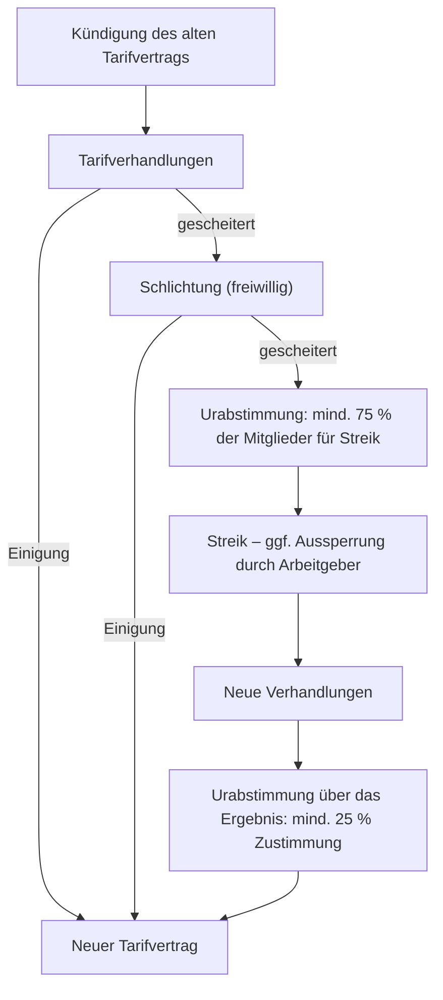

# WISO-3 · Mitbestimmung und Tarifrecht

> [!abstract] Überblick
> **Bereich:** [[Übersicht WiSo und Projektarbeit]]
> **Prüfung:** Wirtschafts- und Sozialkunde
> **Dauer:** ca. 75 min · **Prüfungsrelevanz:** ★★★ – Betriebsrat, JAV, Betriebsvereinbarung und der Ablauf von Tarifverhandlungen machen in manchen Prüfungen ein Viertel der Aufgaben aus
> **Grundlagen aus AP1:** [[W5 Unternehmen und Ausbildung]]

## Lernziele
- [ ] Ich kenne Wahl, Größe, Amtszeit und Rechte des Betriebsrats (Information bis Mitbestimmung).
- [ ] Ich kenne Voraussetzungen, Wahlrecht und Aufgaben der Jugend- und Auszubildendenvertretung (JAV).
- [ ] Ich kann Betriebsvereinbarung, Tarifvertrag und Arbeitsvertrag voneinander abgrenzen (Günstigkeitsprinzip).
- [ ] Ich kann den Ablauf von Tarifverhandlungen mit Schlichtung, Urabstimmung und Arbeitskampf erklären.

## So wird das geprüft
> [!info] Typische AP2-Aufgabentypen
> - **Passives Wahlrecht** zum Betriebsrat (ab 18, 6 Monate im Betrieb).
> - **Aussagen zu Gewerkschaften** bewerten (Rechtsbeistand für Mitglieder).
> - **Ablaufschema einer Tarifrunde**: vertauschte Schritte finden.
> - **Abweichung vom Tarifvertrag** nur zugunsten der Arbeitnehmer (Günstigkeitsprinzip).
> - **Betriebsvereinbarung** wird zwischen Geschäftsleitung und Betriebsrat geschlossen.
> - **JAV:** Amtszeit, Wahlrecht, Voraussetzung eines Betriebsrats, Kandidatur (nicht zugleich Betriebsratsmitglied).

---

## 1. Betriebsrat

Gesetzliche Grundlage: **Betriebsverfassungsgesetz (BetrVG)**. Er vertritt die Interessen der Belegschaft gegenüber dem Arbeitgeber – im Grundsatz der **vertrauensvollen Zusammenarbeit**. Gilt nicht für den öffentlichen Dienst (dort Personalrat).

| Regel | Inhalt |
|---|---|
| **Voraussetzung** | Betrieb mit mindestens **5 wahlberechtigten** Arbeitnehmern, davon **3 wählbar** |
| **aktives Wahlrecht** (wählen) | alle Arbeitnehmer ab **16 Jahren** (einschließlich Azubis, Leiharbeitnehmer bei einem vorgesehenen Einsatz von länger als 3 Monaten) |
| **passives Wahlrecht** (gewählt werden) | Wahlberechtigte ab **18 Jahren**, die **mindestens 6 Monate** dem Betrieb angehören |
| **Amtszeit** | **4 Jahre**, regelmäßige Wahlen alle 4 Jahre im Frühjahr |
| **Größe** | 5–20 wahlberechtigte Arbeitnehmer: 1 Mitglied · 21–50 Wahlberechtigte: 3 · 51–100 Arbeitnehmer: 5 · 101–200 Arbeitnehmer: 7 … |
| **Schutz** | besonderer Kündigungsschutz, Freistellung für BR-Arbeit, Kosten trägt der Arbeitgeber |

**Rechte – von schwach nach stark:**
| Stufe | Bedeutung | Beispiele |
|---|---|---|
| **Informationsrecht** | Arbeitgeber muss rechtzeitig unterrichten | Personalplanung, neue Technik |
| **Anhörungsrecht** | Betriebsrat muss gehört werden | **vor jeder Kündigung** (§ 102) – sonst unwirksam |
| **Beratungsrecht** | gemeinsame Beratung | Arbeitsplatzgestaltung, Betriebsänderungen |
| **Mitwirkung / Widerspruch** | kann Zustimmung verweigern | Einstellung, Versetzung, Eingruppierung (§ 99) |
| **Mitbestimmung** (echt) | ohne Zustimmung keine Umsetzung; bei Streit entscheidet die **Einigungsstelle** | **soziale Angelegenheiten (§ 87):** Beginn/Ende der Arbeitszeit, Pausen, Überstunden, Urlaubsplan, **technische Einrichtungen zur Leistungs- oder Verhaltenskontrolle** (z. B. Zeiterfassung, Ticketsystem, Videoüberwachung), Entlohnungsgrundsätze, Arbeitsschutz, Betriebsordnung |

Weitere Organe: **Betriebsversammlung** (vierteljährlich, Bericht des Betriebsrats), **Wirtschaftsausschuss** (in Unternehmen mit in der Regel mehr als 100 ständig Beschäftigten), **Gesamt- und Konzernbetriebsrat**. In großen Kapitalgesellschaften gibt es außerdem die **Unternehmensmitbestimmung** im Aufsichtsrat (grundsätzlich bei mehr als 500 bzw. mehr als 2 000 Beschäftigten; Rechtsform und gesetzliche Ausnahmen beachten).

### Betriebsvereinbarung
Schriftlicher Vertrag zwischen **Arbeitgeber (Geschäftsleitung) und Betriebsrat** über betriebliche Regeln (Gleitzeit, Homeoffice, IT-Nutzung, Urlaubsgrundsätze). Gilt **unmittelbar** für alle Beschäftigten des Betriebs. Darf nichts regeln, was üblicherweise im **Tarifvertrag** geregelt ist (Lohnhöhe), außer der Tarifvertrag erlaubt es.

---

## 2. Jugend- und Auszubildendenvertretung (JAV)

| Regel | Inhalt |
|---|---|
| **Voraussetzung** | in der Regel mindestens **5** Arbeitnehmer **unter 18** oder **Auszubildende (ohne Altersgrenze)** – **und ein bestehender Betriebsrat** (§ 60 BetrVG) |
| aktives Wahlrecht | Arbeitnehmer **unter 18** und **alle Auszubildenden** – die frühere Altersgrenze 25 für Azubis ist seit dem Betriebsrätemodernisierungsgesetz 2021 entfallen |
| passives Wahlrecht | Arbeitnehmer **unter 25** sowie **alle Auszubildenden**; **nicht** gleichzeitig Mitglied des Betriebsrats (§ 61 Abs. 2 BetrVG) |
| Amtszeit | **2 Jahre** (wer währenddessen 25 wird, bleibt bis zum Ende im Amt) |
| Aufgaben | Interessen der Jugendlichen und Azubis vertreten, Anregungen an den Betriebsrat, Einhaltung von JArbSchG/BBiG/Tarifverträgen überwachen, Übernahme nach der Ausbildung fördern |
| Rechte | nimmt an Betriebsratssitzungen teil, Stimmrecht bei Beschlüssen, die überwiegend Jugendliche/Azubis betreffen; eigene Jugend- und Auszubildendenversammlung |

Die JAV handelt **über den Betriebsrat** – sie kann nicht selbst mit dem Arbeitgeber Vereinbarungen schließen.

---

## 3. Tarifrecht

**Tarifautonomie** (Art. 9 Abs. 3 GG): Gewerkschaften und Arbeitgeber(verbände) handeln Arbeitsbedingungen **ohne staatliche Einmischung** aus.
**Tarifparteien:** **Gewerkschaften** (z. B. ver.di, IG Metall) und **Arbeitgeberverbände** oder ein einzelner Arbeitgeber (Haus-/Firmentarifvertrag).

| Tarifvertrag | Inhalt | Laufzeit |
|---|---|---|
| **Manteltarifvertrag** (Rahmentarif) | allgemeine Bedingungen: Arbeitszeit, Urlaub, Kündigungsfristen, Zuschläge | mehrere Jahre |
| **Entgelt-/Lohn- und Gehaltstarifvertrag** | Höhe der Entgelte je Entgeltgruppe | meist 1–2 Jahre |
| Entgeltrahmentarifvertrag | Eingruppierung (Tätigkeitsmerkmale der Gruppen) | lang |

**Grundsätze:**
- **Tarifbindung:** Der Tarifvertrag gilt unmittelbar für **Gewerkschaftsmitglieder** bei **tarifgebundenen Arbeitgebern** – in der Praxis wenden Arbeitgeber ihn meist auf alle an. **Allgemeinverbindlich** erklärt gilt er für die ganze Branche.
- **Günstigkeitsprinzip:** Abweichende einzelvertragliche Regelungen sind zulässig, soweit sie **zugunsten der Arbeitnehmer** wirken oder der Tarifvertrag sie erlaubt (§ 4 Abs. 3 TVG). Für Betriebsvereinbarungen gilt zusätzlich die **Tarifsperre** nach § 77 Abs. 3 BetrVG; günstiger allein genügt dort nicht.
- **Friedenspflicht:** Während der Laufzeit eines Tarifvertrags sind Streiks über dessen Inhalte verboten.
- **Rangfolge:** Gesetz → Tarifvertrag → Betriebsvereinbarung → Arbeitsvertrag (die höhere Ebene setzt Mindeststandards).

### Ablauf einer Tarifrunde
> [!info] Annahmen für das folgende Ablaufbeispiel
> Schlichtung und Abstimmungsregeln hängen von Vereinbarungen und Gewerkschaftssatzung ab. Hier werden eine vereinbarte Schlichtung sowie Quoten von mindestens 75 % für den Streik und mindestens 25 % für die Ergebnisannahme angenommen. Das sind keine allgemeinen gesetzlichen Vorgaben.


**Warnstreiks** sind schon während der Verhandlungen nach Ende der Friedenspflicht möglich. Streikende erhalten **Streikgeld** von der Gewerkschaft (nur Mitglieder), kein Arbeitsentgelt.

**Aufgaben der Gewerkschaften:** Tarifverhandlungen, Arbeitskampf, **Rechtsberatung und Rechtsschutz für Mitglieder** (Arbeitsgericht), Mitwirkung in Gremien (Sozialversicherung, Arbeitsgerichte), Bildungsarbeit. Sie **kontrollieren nicht** die Betriebsratswahl und schließen **keine Betriebsvereinbarungen**.

---

> [!warning] Typische Fehler in Prüfungen
> - Betriebsvereinbarung „zwischen Gewerkschaft und Arbeitgeber“ – nein, **Betriebsrat und Arbeitgeber**.
> - Passives Wahlrecht Betriebsrat „ab 16“ – aktives ab 16, **passives ab 18 und 6 Monate Betrieb**.
> - JAV ohne Betriebsrat für möglich halten.
> - Mitbestimmung und Mitwirkung verwechseln – **echte Mitbestimmung** gibt es vor allem bei sozialen Angelegenheiten (§ 87).
> - Im dargestellten Übungsmodell die Urabstimmungsquoten vertauschen: **75 % für Streik**, **25 % für die Annahme** des Ergebnisses.

## Verwandte Themen
- [[WISO-1 Ausbildung und Jugendarbeitsschutz]] – Rechte der Azubis
- [[WISO-2 Arbeitsvertrag, Kündigung und Arbeitsschutz]] – Anhörung bei Kündigung
- [[FISI-6 Datenschutz, Geräteverwaltung und Lizenzen]] – Mitbestimmung bei Überwachungstechnik
- [[P6 Teamarbeit, Verhandlung und Veränderung]] – Betriebsrat bei neuer Software (AP1)

## Zusammenfassung
- ==🔵Betriebsrat ab 5 Wahlberechtigten, aktiv ab 16, passiv ab 18 + 6 Monate, Amtszeit 4 Jahre==.
- Rechte: ==🟢Information < Anhörung (Kündigung) < Beratung < Mitwirkung (Einstellung) < Mitbestimmung== (§ 87, z. B. Überwachungstechnik).
- Betriebsvereinbarung = Arbeitgeber + Betriebsrat.
- JAV: ≥ 5 Jugendliche unter 18 oder Azubis (jedes Alters) + Betriebsrat; wählbar < 25 oder Azubi, nicht BR-Mitglied; Amtszeit 2 Jahre.
- Tarifautonomie, Manteltarif vs. Entgelttarif, Günstigkeitsprinzip, Friedenspflicht. Beispiel einer Tarifrunde mit vereinbarter Schlichtung und den hier angenommenen Quoten: Kündigung → Verhandlung → Schlichtung → Urabstimmung 75 % → Streik → Verhandlung → Urabstimmung 25 % → neuer Vertrag.

## Selbstcheck
```dataviewjs
await dv.view("AP2/99 System/views/quiz", { modul: "WISO-3" })
```

**Weitere Aufgaben:** [[Aufgaben WiSo#WISO-3 Mitbestimmung und Tarifrecht]] · **Karteikarten:** [[Karten WiSo]] · **Prüfungssimulation:** [[WiSo-Quiz]]

## Einschätzung
```dataviewjs
await dv.view("AP2/99 System/views/selbstcheck")
```

---
← [[WISO-2 Arbeitsvertrag, Kündigung und Arbeitsschutz]] · Weiter: [[WISO-4 Sozialversicherung und Entgelt]] →
